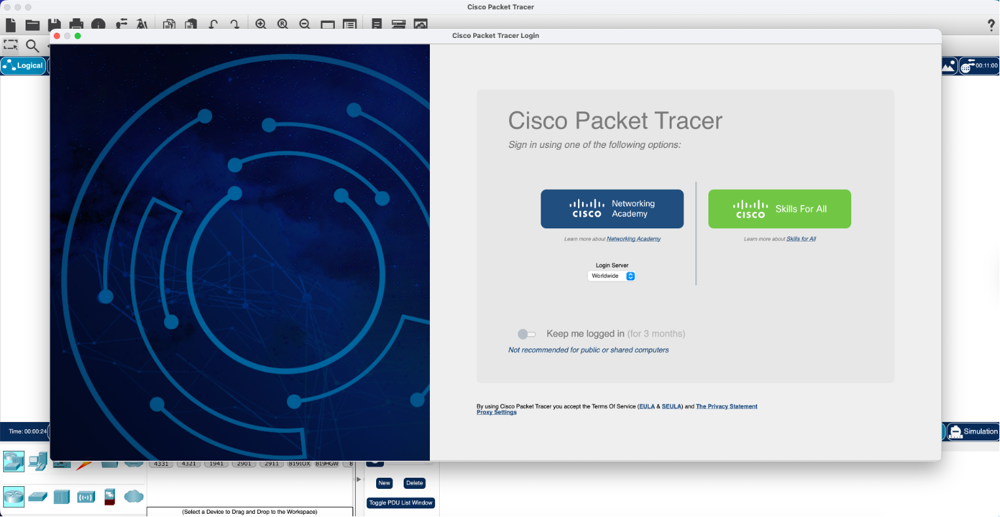
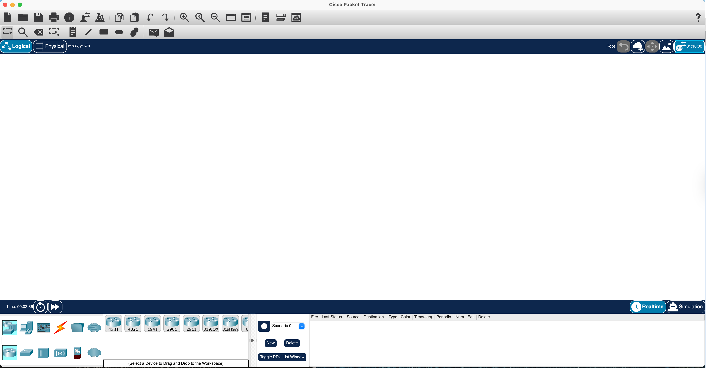
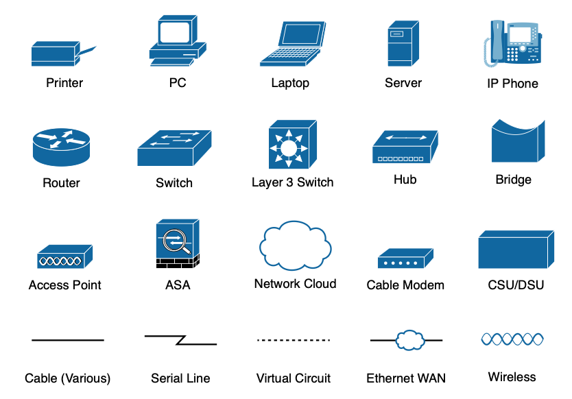
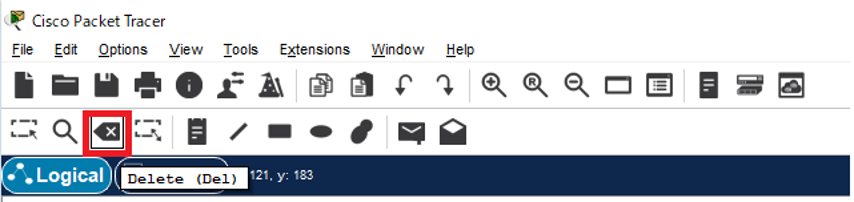
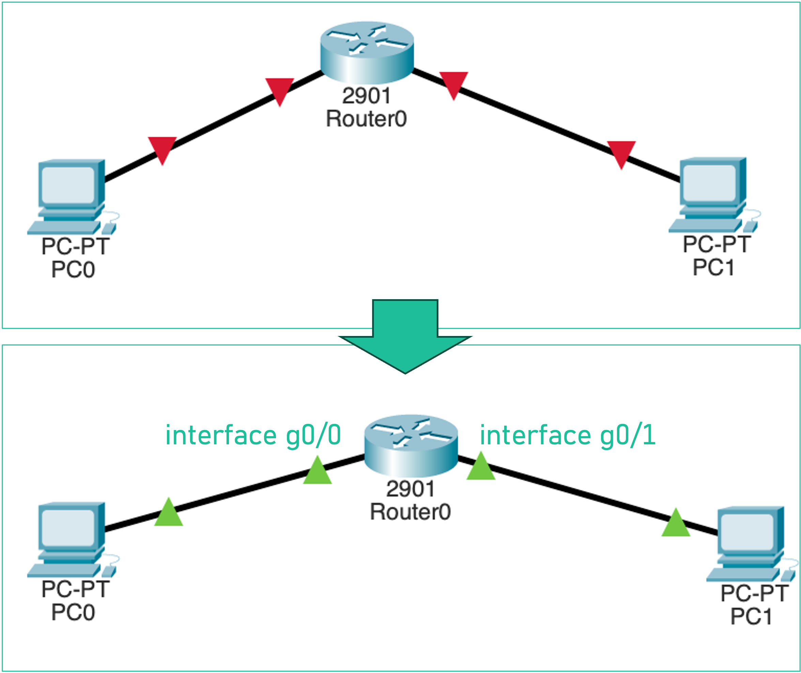
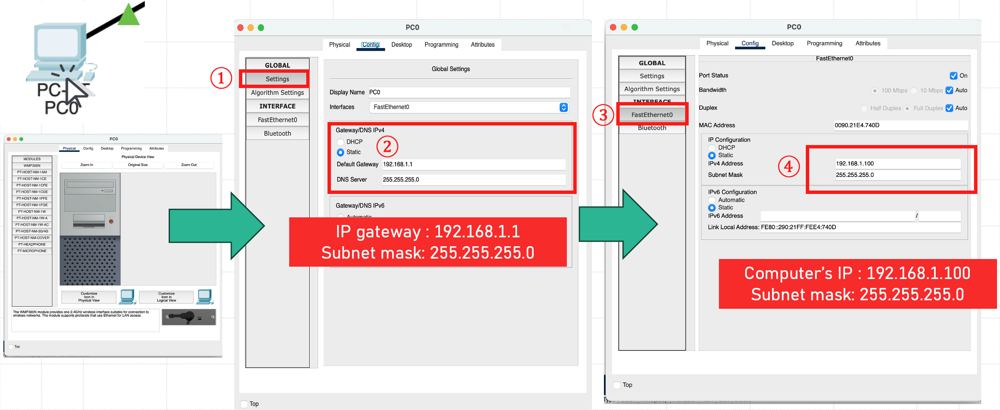
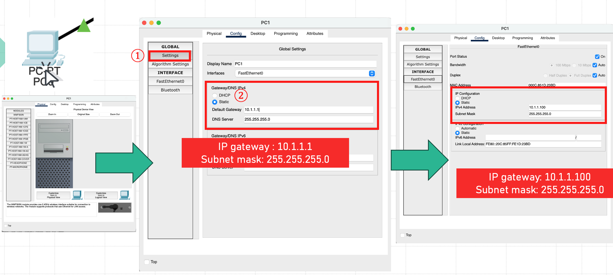
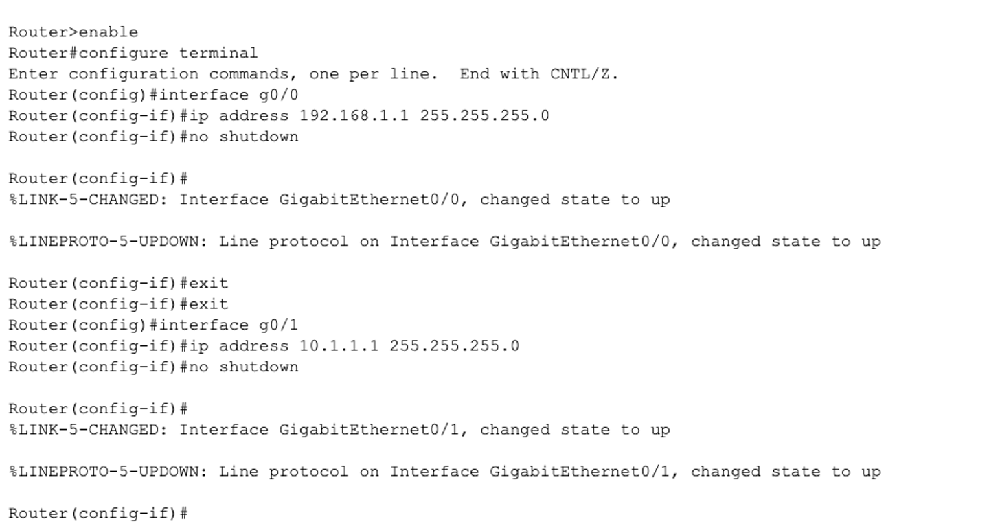
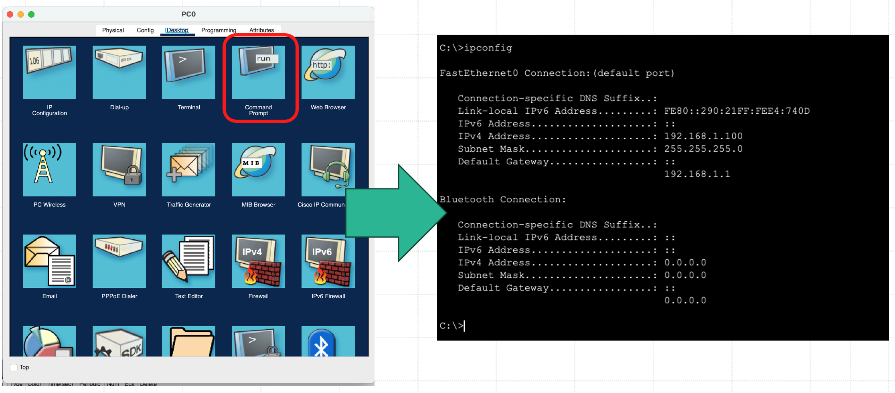
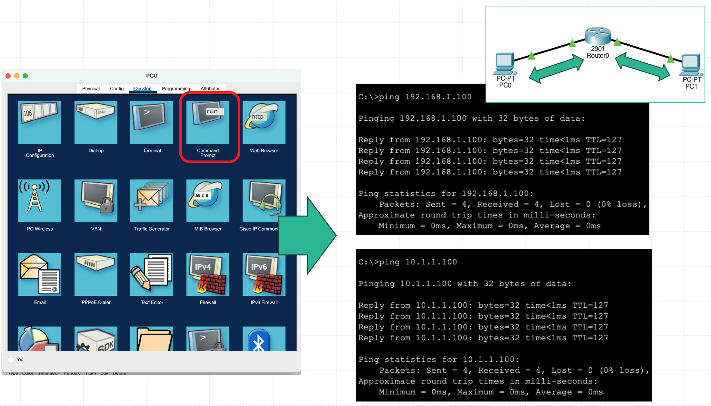

## Cisco Packet Tracer — Getting Started & Lab 2

> Companion guide to [Session 1 — Introduction to Network Analysis & The OSI Model](./README.md).
> Read this **before** doing **Lab B — Cisco Packet Tracer: Build Your First Network** in the [README](./README.md#hands-on-lab).
> Pairs with the [Wireshark — Getting Started & Lab 1 guide](./WIRESHARK_GUIDE.md).

---

- [Cisco Packet Tracer — Getting Started \& Lab 2](#cisco-packet-tracer--getting-started--lab-2)
  - [📦 What is Cisco Packet Tracer?](#-what-is-cisco-packet-tracer)
  - [⬇️ Installing Packet Tracer](#️-installing-packet-tracer)
  - [🧭 A Tour of the Packet Tracer Window](#-a-tour-of-the-packet-tracer-window)
  - [🧱 Device Icons You'll Use](#-device-icons-youll-use)
  - [🗑️ Deleting a Device or Cable](#️-deleting-a-device-or-cable)
  - [🎯 What We're Building](#-what-were-building)
  - [🧪 Lab 2 — Build a Routed Two-Subnet Network](#-lab-2--build-a-routed-two-subnet-network)
    - [Step 1 — Drop the devices](#step-1--drop-the-devices)
    - [Step 2 — Cable the devices](#step-2--cable-the-devices)
    - [Step 3 — Configure PC0](#step-3--configure-pc0)
    - [Step 4 — Configure PC1](#step-4--configure-pc1)
    - [Step 5 — Configure the Router](#step-5--configure-the-router)
    - [Step 6 — Verify the addressing](#step-6--verify-the-addressing)
    - [Step 7 — Test connectivity with `ping`](#step-7--test-connectivity-with-ping)
  - [📝 Lab 2 Questions](#-lab-2-questions)
  - [➡️ Next Steps](#️-next-steps)

---

### 📦 What is Cisco Packet Tracer?

**Cisco Packet Tracer** is a free network **simulator** from Cisco's Networking Academy. It lets you drag-and-drop routers, switches, PCs and servers onto a canvas, cable them together, configure them, and then send real-looking traffic between them — all in software, with no physical hardware required.

Where **Wireshark** lets you *observe* the traffic on a real network, **Packet Tracer** lets you *build* a network and watch packets flow through it. Its **Simulation Mode** even animates a single packet hop-by-hop and shows how each device encapsulates/de-encapsulates it at every OSI layer — making it the perfect companion to the [Session 1 OSI lecture](./README.md#-lecture).

---

### ⬇️ Installing Packet Tracer

Packet Tracer is distributed free through the **Cisco Networking Academy "Resource Hub"**. You need a (free) Cisco account to download it.

1. **Sign in / create an account.** Go to the Cisco SkillsForAll / Networking Academy site and log in. If you have a **Google account you can use it to sign in directly** — that's the quickest path.

   <p align="center">
     <br>
     <em>Fig. 1 — Sign in; using a Google account is the quickest option.</em>
   </p>

2. **Open the Resource Hub and download the installer** for your operating system (Windows / macOS / Linux). Pick the build that matches your platform.

   <p align="center">
     <br>
     <em>Fig. 2 — Download the installer for your OS from the Resource Hub.</em>
   </p>

3. **Install and launch.** The first time you open Packet Tracer you must **sign in again with the same account** (or choose *Skills for All* / *Networking Academy*). You can tick **"Keep me logged in"** so it doesn't ask every time.

   <p align="center">
     <br>
     <em>Fig. 3 — Sign in again on first launch (tick "Keep me logged in").</em>
   </p>

---

### 🧭 A Tour of the Packet Tracer Window

Once you're in, you'll see the main workspace:

<p align="center">
  <br>
  <em>Fig. 4 — The Packet Tracer workspace and its main areas.</em>
</p>

| Area | Where | What it does |
| :--- | :--- | :--- |
| **Menu & top toolbar** | Top | File/Edit/Options, plus tools: select, move, **delete**, zoom, etc. |
| **Logical / Physical tabs** | Top-left | Stay on **Logical** for this lab (the abstract topology view). |
| **Workspace** | Center (white) | The canvas where you drop and wire up devices. |
| **Device-type selector** | Bottom-left | Categories of hardware: Routers, Switches, End Devices, Connections… |
| **Device list** | Bottom, next to selector | The specific models in the chosen category (e.g. the `2901` router). |
| **Realtime / Simulation toggle** | Bottom-right | **Realtime** runs traffic instantly; **Simulation** lets you step through packets hop-by-hop. |

---

### 🧱 Device Icons You'll Use

Packet Tracer uses Cisco's standard network iconography. The ones relevant to this lab are **PC**, **Router**, and the **Cable (Various)** connector.

<p align="center">
  <br>
  <em>Fig. 5 — Standard Cisco device icons; you'll use PC, Router, and Cable.</em>
</p>

---

### 🗑️ Deleting a Device or Cable

Made a mistake? Click the **Delete** tool in the top toolbar (the box with an ✕, shortcut **Del**), then click the device or cable you want to remove.

<p align="center">
  <br>
  <em>Fig. 6 — The Delete tool (shortcut: <code>Del</code>) removes a device or cable.</em>
</p>

---

### 🎯 What We're Building

We'll connect **two PCs on two *different* subnets** through a **router**. A router is required here because the two PCs live on different networks — a switch alone could not move traffic between them.

<p align="center">
  <br>
  <em>Fig. 7 — The two PCs connect to a Cisco <strong>2901</strong> router. Interface <strong>g0/0</strong> faces PC0's network; <strong>g0/1</strong> faces PC1's network. Green triangles mean the interfaces are up.</em>
</p>

| Device | Interface | IP Address | Subnet Mask | Default Gateway |
| :--- | :--- | :--- | :--- | :--- |
| **PC0** | FastEthernet0 | `192.168.1.100` | `255.255.255.0` | `192.168.1.1` |
| **PC1** | FastEthernet0 | `10.1.1.100` | `255.255.255.0` | `10.1.1.1` |
| **Router0** | g0/0 | `192.168.1.1` | `255.255.255.0` | — |
| **Router0** | g0/1 | `10.1.1.1` | `255.255.255.0` | — |

> Each PC's **default gateway is the router interface on its own subnet**. That's the address a host sends packets to when the destination is *not* on its local network.

---

### 🧪 Lab 2 — Build a Routed Two-Subnet Network

#### Step 1 — Drop the devices

* From the bottom-left selector choose **End Devices**, then drag **two `PC`** icons onto the workspace. They'll be named `PC0` and `PC1`.
* Choose **Routers**, then drag a **`2901`** router to the center. It'll be named `Router0`.

#### Step 2 — Cable the devices

* Choose **Connections** (the lightning-bolt category) and pick **Copper Straight-Through** (the plain solid line, *Cable (Various)*).
* Click **`PC0`** → choose **`FastEthernet0`**. Then click **`Router0`** → choose **`GigabitEthernet0/0`**.
* Click **`PC1`** → choose **`FastEthernet0`**. Then click **`Router0`** → choose **`GigabitEthernet0/1`**.
* The link dots start **red/amber** and turn **green** once the interfaces are up (you'll bring the router interfaces up in Step 5).

#### Step 3 — Configure PC0

Click **`PC0`** → **Config** tab (or **Desktop → IP Configuration**) and set:

* **IPv4 Address:** `192.168.1.100`
* **Subnet Mask:** `255.255.255.0`
* **Default Gateway:** `192.168.1.1`

<p align="center">
  <br>
  <em>Fig. 8 — PC0: IP <code>192.168.1.100</code>, mask <code>255.255.255.0</code>, gateway <code>192.168.1.1</code>.</em>
</p>

#### Step 4 — Configure PC1

Click **`PC1`** → **Config** tab (or **Desktop → IP Configuration**) and set:

* **IPv4 Address:** `10.1.1.100`
* **Subnet Mask:** `255.255.255.0`
* **Default Gateway:** `10.1.1.1`

<p align="center">
  <br>
  <em>Fig. 9 — PC1: IP <code>10.1.1.100</code>, mask <code>255.255.255.0</code>, gateway <code>10.1.1.1</code>.</em>
</p>

#### Step 5 — Configure the Router

A router's interfaces are **shut down with no IP by default**. Click **`Router0`** → **CLI** tab and type the following. This assigns each interface its gateway IP and brings it up with `no shutdown`:

```ios
Router> enable
Router# configure terminal
Router(config)# interface g0/0
Router(config-if)# ip address 192.168.1.1 255.255.255.0
Router(config-if)# no shutdown
Router(config-if)# exit
Router(config)# interface g0/1
Router(config-if)# ip address 10.1.1.1 255.255.255.0
Router(config-if)# no shutdown
```

**Understanding the CLI prompts (Cisco IOS command modes).** A Cisco router doesn't let you change everything from everywhere — you move through nested *modes*, and **the prompt symbol tells you which mode you're in**. The first two commands are how you climb from "just looking" to "allowed to configure":

| Command | Prompt it gives you | Mode | What it means |
| :--- | :--- | :--- | :--- |
| *(just connected)* | `Router>` | **User EXEC** | The lowest, read-only mode. You can look at basic status but **cannot change anything**. The `>` marks it. |
| **`enable`** | `Router#` | **Privileged EXEC** | "Enable" the powerful commands. The `#` ("enable mode") lets you view full config, save, reload — but still not *edit* the config yet. Think of it as *administrator* rights. |
| **`configure terminal`** | `Router(config)#` | **Global Configuration** | Enter config-editing mode *from your terminal*. Now you can change settings that affect the whole device. `(config)` confirms you're editing. |
| `interface g0/0` | `Router(config-if)#` | **Interface Config** | Drill into one specific interface. `(config-if)` means the commands you type now (like `ip address` and `no shutdown`) apply **only to that interface**. |

So the flow is: **`enable`** (get admin rights) → **`configure terminal`** (start editing the config) → **`interface g0/0`** (zoom into one port) → set its IP and turn it on. Type **`exit`** to step back out one mode at a time (e.g. from `(config-if)` back to `(config)`), or **`end`** / **`Ctrl+Z`** to jump straight back to privileged EXEC (`Router#`).

> 💡 Stuck or unsure what you can type? Enter **`?`** at any prompt and IOS lists every command available in that mode.

<p align="center">
  <br>
  <em>Fig. 10 — Assigning each interface its IP and bringing it up with <code>no shutdown</code>.</em>
</p>

Watch for the `%LINK-5-CHANGED ... changed state to up` messages — that's each interface coming online (and the link dots turning green).

#### Step 6 — Verify the addressing

Click **`PC0`** → **Desktop** tab → **Command Prompt**, and run `ipconfig`. Confirm the IPv4 address, subnet mask, and default gateway match what you set.

```text
PC> ipconfig
   IPv4 Address.........: 192.168.1.100
   Subnet Mask..........: 255.255.255.0
   Default Gateway......: 192.168.1.1
```

<p align="center">
  <br>
  <em>Fig. 11 — Open <strong>Desktop → Command Prompt</strong> and run <code>ipconfig</code> to confirm the address.</em>
</p>

#### Step 7 — Test connectivity with `ping`

Still in PC0's **Command Prompt**:

* **Ping itself / its own subnet:** `ping 192.168.1.100`
* **Ping across the router to PC1's subnet:** `ping 10.1.1.100`

Both should return **4 successful replies** with `TTL=127`. Reaching `10.1.1.100` proves the **router is forwarding packets between the two subnets**.

<p align="center">
  <br>
  <em>Fig. 12 — Both pings return 4 replies; the router forwards traffic between the two subnets.</em>
</p>

> 🔬 **Try Simulation Mode:** switch to **Simulation** (bottom-right), run a `ping` again, and click the travelling envelope at each hop. The **In Layers / Out Layers** tabs show exactly how the packet is encapsulated and de-encapsulated at PC0 → Router0 → PC1 — the OSI model in motion.

---

### 📝 Lab 2 Questions

**Try each one first, then click "Show answer".**

**Q1.** **Why did `ping 10.1.1.100` succeed** even though PC0 (`192.168.1.x`) and PC1 (`10.1.1.x`) are on **different subnets**? What device made it possible?

<details>
<summary>💡 Show answer</summary>

Because the **router (Router0)** sits between the two subnets and **forwards (routes)** packets from one to the other. PC0 sees that `10.1.1.100` is *not* on its own `192.168.1.0/24` network, so it sends the packet to its **default gateway** (`192.168.1.1`, the router's g0/0). The router then forwards it out **g0/1** onto the `10.1.1.0/24` network to PC1. A plain switch could not do this — it only moves frames *within* a single subnet.
</details>

**Q2.** What would happen to `ping 10.1.1.100` if you **removed the default gateway** from PC0's configuration? Why?

<details>
<summary>💡 Show answer</summary>

The ping would **fail** ("Destination host unreachable" / request timed out). Without a default gateway, PC0 has nowhere to send packets destined for a *different* subnet — it only knows how to reach hosts on its own `192.168.1.0/24` network. The gateway is the "exit door" to everything off-subnet.
</details>

**Q3.** In the `ping` output, the reply shows **`TTL=127`**. The sender started it at 128 — what does the decrement tell you about how many **hops** the packet took? *(See the [README ping deep-dive](./README.md#-deep-dive-the-ping-command--options).)*

<details>
<summary>💡 Show answer</summary>

**One hop.** TTL (Time To Live) is decremented by **1 at every router** the packet crosses. Starting at 128 and arriving with 127 means it passed through exactly **one router** — our Router0. (TTL prevents packets from looping forever: if it ever hits 0, the packet is discarded.)
</details>

**Q4.** What is the role of the **`no shutdown`** command on the router interfaces? What state are interfaces in before you issue it?

<details>
<summary>💡 Show answer</summary>

By default a router's interfaces are **administratively down** (shut down). **`no shutdown`** turns the interface **on**, which is why you see the `%LINK-5-CHANGED ... changed state to up` message and the link dot turns **green**. Assigning an IP address alone is *not* enough — the interface must also be enabled.
</details>

**Q5.** Switch to **Simulation Mode** and ping across the router. At **Router0**, which OSI layers appear in the **In Layers** vs **Out Layers** tabs, and why does the **Layer-2 (MAC) header change** while the **Layer-3 (IP) addresses stay the same**?

<details>
<summary>💡 Show answer</summary>

At the router the packet comes **in** and is processed **up** to **Layer 3 (IP)** — the router reads the destination IP to decide where to send it — then it's re-built going **out** back down to Layer 2. The **Layer-3 source/destination IP addresses stay the same** end-to-end (PC0 → PC1) because they identify the *original sender and final receiver*. But the **Layer-2 MAC addresses are rewritten at every hop**: on the way out, the source MAC becomes the router's **g0/1** MAC and the destination MAC becomes **PC1's** MAC, because MAC addresses only identify devices on the *current* physical link. This "IP stays, MAC changes per hop" behaviour is the heart of how routing works.
</details>

---

### ➡️ Next Steps

- Re-run the ping in **Simulation Mode** and map each animation step to the **encapsulation/de-encapsulation** walkthrough from the [Session 1 lecture](./README.md#-lecture).
- Back in the [Wireshark guide](./WIRESHARK_GUIDE.md), compare what a *simulated* packet looks like here versus a *real* captured packet in Wireshark.
- Complete the [Session 1 Homework](./README.md#-homework).
