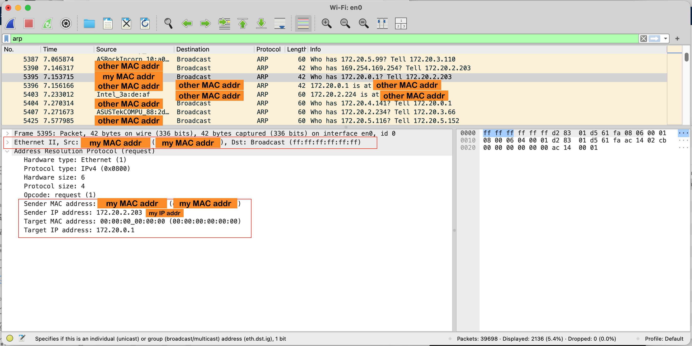
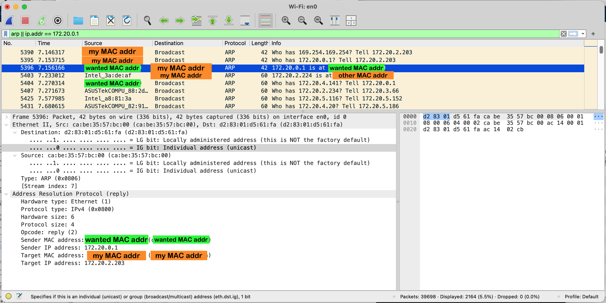

## Wireshark — Getting Started & Lab 1

> Companion guide to [Session 1 — Introduction to Network Analysis & The OSI Model](./README.md).
> Read this **before** doing **Lab A — Wireshark: First Capture** in the [README](./README.md#hands-on-lab).
>
> *Adapted from "Wireshark Lab: Getting Started v9.0", a supplement to* Computer Networking: A Top-Down Approach, 9th ed.*, J.F. Kurose and K.W. Ross.*

---

- [Wireshark — Getting Started \& Lab 1](#wireshark--getting-started--lab-1)
  - [What is Wireshark?](#what-is-wireshark)
  - [How a Packet Sniffer Works](#how-a-packet-sniffer-works)
  - [Installing Wireshark](#installing-wireshark)
  - [Before You Capture: Pre-flight Checklist](#before-you-capture-pre-flight-checklist)
  - [The Wireshark Start Screen](#the-wireshark-start-screen)
  - [The Five Parts of the Wireshark Window](#the-five-parts-of-the-wireshark-window)
  - [A Quick Word on HTTP (the traffic we'll capture)](#a-quick-word-on-http-the-traffic-well-capture)
  - [Lab 1 — Taking Wireshark for a Test Run](#lab-1--taking-wireshark-for-a-test-run)
  - [Lab 1 Questions](#lab-1-questions)
  - [Activity 2 — Deep Packet Inspection (Layer by Layer)](#activity-2--deep-packet-inspection-layer-by-layer)
    - [Activity 2 Questions](#activity-2-questions)
  - [Activity 3 — ARP: Who Has This IP?](#activity-3--arp-who-has-this-ip)
    - [How ARP Works (the Mechanics)](#how-arp-works-the-mechanics)
    - [Capture an ARP Exchange](#capture-an-arp-exchange)
    - [Reading the ARP Packet Fields](#reading-the-arp-packet-fields)
    - [Activity 3 Questions](#activity-3-questions)
  - [Practice Exercises](#practice-exercises)
  - [Next Steps](#next-steps)

---

### What is Wireshark?

**Wireshark** is the world's most popular **packet sniffer** (also called a *packet analyzer* or *protocol analyzer*). It is a free, open-source tool that lets you *see* the network protocols running on your computer "in action" — observing the actual sequence of messages exchanged between protocol entities, drilling down into the details of each protocol field, and watching how your actions (like loading a web page) cause protocols to send and receive messages.

> *"Tell me and I forget. Show me and I remember. Involve me and I understand."* — Chinese proverb

A packet sniffer is **passive**. It only *observes* messages sent and received by applications and protocols running on your computer — it never sends packets of its own, and packets are never explicitly addressed to it. Instead, it receives a **copy** of every frame that passes through your network interface.

---

### How a Packet Sniffer Works

<p align="center">
  <br>
  <em>Fig. 1 — Structure of a packet sniffer.</em>
</p>

A packet sniffer (the dashed rectangle above) is an addition to the normal networking software on your computer, and it has **two parts**:

1. **Packet capture library (`pcap`)** — receives a *copy* of every **link-layer frame** sent or received over a given interface (Ethernet or Wi-Fi). Because *all* higher-layer messages — HTTP, DNS, TCP, UDP, IP — are eventually encapsulated into link-layer frames, capturing every frame gives you **every message** sent/received by **every** protocol and application on your machine.
2. **Packet analyzer** — understands the structure of the captured frames and the protocols nested inside them. It decodes and displays the contents of each protocol field (Ethernet → IP → TCP/UDP → HTTP, etc.) in a readable form.

This maps directly onto the **OSI / TCP-IP encapsulation** you learned in the [Session 1 lecture](./README.md#lecture): the capture library grabs the raw **Layer 2 frame**, and the analyzer peels back **Layer 3 (IP)**, **Layer 4 (TCP/UDP)**, and **Layer 7 (application)** for you.

---

### Installing Wireshark

Download Wireshark for your operating system from the official site:

| Platform | How to install |
| :--- | :--- |
| **Windows** | Download the installer from [wireshark.org/download.html](https://www.wireshark.org/download.html). Accept installing **Npcap** when prompted (this is the capture driver). |
| **macOS** | Download the `.dmg` from the site, **or** run `brew install --cask wireshark`. Install **ChmodBPF** when prompted so capturing works without `sudo`. |
| **Linux** | `sudo apt install wireshark` (Debian/Ubuntu) or `sudo dnf install wireshark` (Fedora). Answer **Yes** to "allow non-superusers to capture packets", then add yourself: `sudo usermod -aG wireshark $USER` and log back in. |

There is also a short official intro video: <https://youtu.be/kCwd2YoJcvg>

---

### Before You Capture: Pre-flight Checklist

These settings make sure your traffic is **readable plaintext** instead of encrypted noise:

- [ ] **Turn off any VPN.** A VPN encrypts upper-layer (HTTP/TCP) information, hiding it from Wireshark.
- [ ] **Disable HTTP/3 and QUIC in your browser.** As of 2025 most browsers use these by default, and they encrypt upper-layer information. (Guide: <https://techysnoop.com/disable-quic-protocol-in-chrome-edge-firefox/>)
- [ ] **Use `http://` URLs, not `https://`.** HTTPS encrypts the frame contents.
- [ ] **Turn off browser privacy/anti-tracking features** that might block or reroute traffic.
- [ ] **Clear your browser cache and history** so the page is actually fetched over the network (not served from cache).

---

### The Wireshark Start Screen

When you launch Wireshark, you'll see a startup screen like the one below. **Don't panic if yours looks a little different** — Wireshark runs on many platforms and toolkits, but the functionality is the same.

<p align="center">
  <br>
  <em>Fig. 2 — The initial Wireshark screen.</em>
</p>

The key area is the **Capture** section, which lists your network **interfaces**. The Mac in this screenshot has its **`Wi-Fi: en0`** interface highlighted in blue — every packet to/from this computer passes through it, so that's where we capture.

> 💡 **Which interface is mine?** The active interface usually shows a **moving line-graph (sparkline)** of live traffic next to its name. **Double-click** it to start capturing immediately. On other machines, pick whichever interface gives you Internet connectivity (typically Wi-Fi or Ethernet).

You can also start a capture via the **Capture → Options** menu (Mac) or **Capture → Interfaces** (Windows), then select the interface and click **Start**.

---

### The Five Parts of the Wireshark Window

Once capturing, the window looks like Fig. 3. It has **five major components**:

<p align="center">
  <br>
  <em>Fig. 3 — The Wireshark window, during and after a capture.</em>
</p>

1. **Command menus** (top) — standard pulldown menus. The two you'll use most now are **File** (save/open capture files, exit) and **Capture** (start/stop capturing).
2. **Display filter field** — type a protocol name or expression here to show only the packets you care about (e.g. `http`). Filtering is covered in depth in the [README's Display Filters deep-dive](./README.md#deep-dive-wireshark-display-filters).
3. **Packet-listing window** — one line per packet: the Wireshark packet **number**, **time**, **source** and **destination IP**, highest-level **protocol**, and a short **info** summary. Click any column header to sort.
4. **Packet-header details window** — a tree of the selected packet's protocol layers. Expand/collapse each layer (Frame → Ethernet → IP → TCP/UDP → application) with the ▸/▾ triangles. This is where you *see encapsulation* layer by layer.
5. **Packet-contents window** — the entire raw frame in **hexadecimal and ASCII**.

> Components 3, 4 and 5 are linked: select a packet in the listing (3), and its layers appear in the details (4) and its raw bytes in the contents (5).

---

### A Quick Word on HTTP (the traffic we'll capture)

In the lab below you'll load a web page, so the traffic you capture will be **HTTP** — the protocol web browsers and servers use. At its core, HTTP is a simple **request → reply** conversation between a browser (the *client*) and a web server:

<p align="center">
  <br>
  <em>Fig. 4 — The browser ("Bob") asks the server ("Larry") for a page; the server sends the file back.</em>
</p>

Looking a little closer, each message carries an **HTTP header** describing it. The browser sends a **`GET`** request naming the file it wants; the server replies with a status (**`200 OK`**) header followed by the file's data, which may span several messages:

<p align="center">
  <br>
  <em>Fig. 5 — An HTTP <code>GET</code> request, the <code>200 OK</code> reply, and a follow-on data message.</em>
</p>

These are exactly the messages you'll hunt for in Wireshark: the **`GET`** your browser sends, and the **`200 OK`** the server sends back. Keep this picture in mind as you do the capture.

---

### Lab 1 — Taking Wireshark for a Test Run

The best way to learn the tool is to use it. This lab captures a real HTTP page download and finds the `GET` request inside it.

1. **Start your web browser** (incognito/private mode recommended).
2. **Start Wireshark.** You'll see the start screen (Fig. 2) — no packets are being captured yet.
3. **Begin capturing.** Double-click your active interface (e.g. `Wi-Fi: en0`), or use **Capture → Options → Start**. The window now fills with live packets (Fig. 3).
4. **Generate traffic.** In your browser, enter this URL and load it:
   ```text
   http://gaia.cs.umass.edu/wireshark-labs/INTRO-wireshark-file1.html
   ```
   Your browser contacts the HTTP server at `gaia.cs.umass.edu`, exchanges HTTP messages, and downloads a one-line "congratulations" page. Those frames (and lots of others) are now captured.
5. **Stop the capture.** Click the red square **🟥 Stop** button, or use **Capture → Stop**. Notice how many *other* protocols showed up (DNS, TCP, TLS, QUIC…) even though you only loaded one page — there's always more going on than meets the eye.
6. **Apply a display filter.** In the filter field type `http` (lower-case — *all* protocol names in Wireshark are lower-case) and press **Enter / Apply**. Only HTTP messages remain visible. A **green** filter bar means the syntax is valid:

   <p align="center">
     <br>
     <em>Fig. 6 — The <code>http</code> display filter in the green (valid) filter bar.</em>
   </p>
7. **Find the HTTP `GET`.** In the packet listing, look for the line whose Info shows **`GET`** followed by the `gaia.cs.umass.edu` URL. Click it.
8. **Explore the layers (OSI in action).** In the **packet-header details** pane, collapse the **Frame**, **Ethernet II**, **Internet Protocol**, and **Transmission Control Protocol** sections (▸), and **expand the Hypertext Transfer Protocol** section (▾). You can now read the raw HTTP `GET` request — its `Host`, `User-Agent`, and `Accept` headers.

   <p align="center">
     <br>
     <em>Fig. 7 — The selected <code>GET</code> packet. Note the destination IP <code>128.119.245.12</code> (gaia), <strong>Dest Port: 80</strong>, and the <code>Host</code> / <code>User-Agent</code> headers inside the expanded HTTP layer.</em>
   </p>
9. **See the server's reply.** Click the **`HTTP/1.1 200 OK`** packet that comes back from the server. Expand the **Hypertext Transfer Protocol** layer and look at the **Packet Bytes** pane — you can read the actual page text the server sent.

   <p align="center">
     <br>
     <em>Fig. 8 — The <code>200 OK</code> reply. The bytes pane shows the page content: "Congratulations! You've downloaded the first Wireshark lab file!"</em>
   </p>
10. **Exit Wireshark.** 🎉 **Congratulations — you've completed your first Wireshark lab!**

> 💾 To keep your capture for later, use **File → Export Specified Packets…** (or **File → Save As…**) and save it as a `.pcap` / `.pcapng` file — e.g. `my_first_capture.pcap`.

---

### Lab 1 Questions

Answer these from your own capture (or from a downloaded trace file, if you couldn't capture live). **Try each one first, then click "Show answer".**

**Q1.** **Which of these protocols appear** in the *Protocol* column of your trace: TCP, QUIC, HTTP, DNS, UDP, TLSv1.2?

<details>
<summary>💡 Show answer</summary>

All six can show up. Loading the page itself uses **DNS** (to resolve `gaia.cs.umass.edu`), then **TCP** + **HTTP** (to fetch it). The rest — **UDP**, **QUIC**, and **TLSv1.2** — come from *background* traffic other apps on your computer generate while you capture. (Exactly which appear depends on your machine; the essential three for this page are **DNS, TCP, HTTP**.)
</details>

**Q2.** **How long** did it take from when the HTTP `GET` was sent until the HTTP `200 OK` reply was received? *(The Time column defaults to seconds since the trace began. To switch to clock time: **View → Time Display Format → Time-of-day**.)*

<details>
<summary>💡 Show answer</summary>

Subtract the **Time** value of the `GET` packet from the **Time** value of the `200 OK` packet. This is the round-trip time to the server and is typically a small fraction of a second (often **~0.02–0.3 s**, depending on your distance to the server and network conditions). Example: OK at `1.452 s` − GET at `1.410 s` = **0.042 s (42 ms)**.
</details>

**Q3.** **What is the IP address of `gaia.cs.umass.edu`** (a.k.a. `www-net.cs.umass.edu`)? **And the IP address of your own computer** (the host that sent the `GET`)?

<details>
<summary>💡 Show answer</summary>

`gaia.cs.umass.edu` resolves to **`128.119.245.12`** — you can read it as the **Destination IP** of your `GET` packet (or the **Source IP** of the `200 OK`). See it in the IPv4 layer in **Fig. 7**. **Your computer's IP** is the **Source IP** of the `GET` — a private address (e.g. `172.20.2.203` in Fig. 7, but yours may be `192.168.x.x` or `10.x.x.x`).
</details>

**Q4.** Select the TCP packet that carries the HTTP `GET`. **What type of web browser** issued the request? *(Read the value after the `User-Agent:` field in the expanded HTTP section.)*

<details>
<summary>💡 Show answer</summary>

Whatever browser you used — the **`User-Agent:`** header names it. In **Fig. 7** the header reads `…AppleWebKit/537.36 (KHTML, like Gecko) Chrome/140…`, i.e. **Chrome**. (Yours might say `Firefox/…`, `Safari/…`, or `Edg/…`.) This is exactly how a web server learns which browser is contacting it.
</details>

**Q5.** Expand the **Transmission Control Protocol** section of that same packet. **What is the destination port number** (after `Dest Port:`) the HTTP request was sent to?

<details>
<summary>💡 Show answer</summary>

**`80`** — the well-known port for HTTP, shown as **Dest Port: 80** in the TCP layer (see **Fig. 7**). (Your browser's own **source** port is a random high number, e.g. `54321`.)
</details>

**Q6.** **Print the two HTTP messages** (`GET` and `200 OK`): **File → Print**, choose **"Selected Packet Only"** and **"Print as displayed"**, then **OK**.

<details>
<summary>💡 Show answer</summary>

This is a hands-on step, not a fact to look up. Select the `GET` packet, **File → Print**, tick **"Selected Packet Only"** and **"Print as displayed"**, click **OK**; then repeat for the `200 OK` packet. Tip: you can print to PDF to hand it in electronically.
</details>

---

### Activity 2 — Deep Packet Inspection (Layer by Layer)

A single packet on the wire is really a set of **nested headers** — each layer of the stack wraps the data from the layer above it (**encapsulation**). Wireshark's **packet-details pane** lets you peel those wrappers back **one layer at a time**; that's *deep packet inspection*. Here we dissect a single **TCP SYN** packet (the first packet of a TCP handshake) from the outermost wrapper to the innermost.

> Select the packet in the list, then click the ▸ triangles in the details pane to expand each layer. We go top-to-bottom — **Frame → Ethernet II → IP → TCP** — which is also outermost-to-innermost on the wire.

1. **Frame — Wireshark's capture metadata (not a real header).** The outermost item isn't a protocol that travelled on the wire; it's Wireshark's own record *about* the capture: the **frame number**, **arrival time**, total **length** (74 bytes), and the protocol stack it detected (`eth:ethertype:ip:tcp`). Think of it as the label Wireshark sticks on the packet.

   <p align="center">
     <br>
     <em>Fig. 9 — The <strong>Frame</strong> layer: capture metadata (number, time, length, detected protocols <code>eth:ethertype:ip:tcp</code>).</em>
   </p>
2. **Ethernet II — Layer 2 (Data Link).** The frame header carries the **Source** and **Destination MAC** addresses for *this hop*, plus a **Type** field (`IPv4, 0x0800`) that says what's wrapped inside. This is the only layer rewritten at every hop.

   <p align="center">
     <br>
     <em>Fig. 10 — The <strong>Ethernet II</strong> header (Layer 2): Source/Destination <strong>MAC</strong> and Type <code>IPv4 (0x0800)</code>.</em>
   </p>
3. **Internet Protocol Version 4 — Layer 3 (Network).** The IP header carries the **end-to-end** Source (`172.21.224.2`) and Destination (`142.250.1.139`) **IP** addresses, the **TTL** (`64`), the **Protocol** field (`TCP (6)` — what's nested next), the total length, and a header checksum.

   <p align="center">
     <br>
     <em>Fig. 11 — The <strong>IPv4</strong> header (Layer 3): Source/Destination <strong>IP</strong>, <strong>TTL 64</strong>, Protocol <code>TCP (6)</code>.</em>
   </p>
4. **Transmission Control Protocol — Layer 4 (Transport).** The TCP header carries the **Source Port** (`49652`) and **Destination Port** (`80` = HTTP), **Sequence/Acknowledgement** numbers, and the **Flags** — here `0x002 (SYN)`, which marks this as the **first packet of the 3-way handshake**. Options include MSS, SACK, timestamps, and window scale.

   <p align="center">
     <br>
     <em>Fig. 12 — The <strong>TCP</strong> header (Layer 4): Source/Destination <strong>Port</strong>, Sequence number, and Flags <code>0x002 (SYN)</code>.</em>
   </p>

Putting the four layers together shows the whole stack inside one packet — and which address each layer uses:

| Details-pane layer | OSI layer | Key fields | Addresses by |
| :--- | :--- | :--- | :--- |
| **Frame** | — (Wireshark metadata) | frame #, time, length, protocol list | — |
| **Ethernet II** | L2 — Data Link | Src/Dst MAC, Type | **MAC** (per hop) |
| **Internet Protocol v4** | L3 — Network | Src/Dst IP, TTL, Protocol | **IP** (end-to-end) |
| **Transmission Control Protocol** | L4 — Transport | Src/Dst Port, Seq/Ack, Flags | **Port** |
| *(HTTP, when present)* | L7 — Application | the request/data itself | — |

> This is **encapsulation in reverse**: the app data was wrapped in TCP, then IP, then Ethernet, then put on the wire — and Wireshark unwraps it for you, outermost first. Each layer's **Type/Protocol** field is the breadcrumb that tells the receiver how to parse the next layer in (`Ethernet Type 0x0800 → IPv4`, `IP Protocol 6 → TCP`).

#### Activity 2 Questions

**Try each one first, then click "Show answer".**

**Q1.** The **Frame** section sits at the top of the tree — but it never travelled on the network. What is it?

<details>
<summary>💡 Show answer</summary>

It's **Wireshark's own metadata** about the captured packet — frame number, arrival timestamp, captured length, and the list of protocols it detected. It's added by the capture tool, not sent by any host, so it has no bytes "on the wire."
</details>

**Q2.** Which layer holds **MAC** addresses, and which holds **IP** addresses? Which one changes at every hop?

<details>
<summary>💡 Show answer</summary>

**Ethernet II (Layer 2)** holds **MAC** addresses; **IPv4 (Layer 3)** holds **IP** addresses. The **MAC** addresses are rewritten at **every router hop** (link by link), while the **IP** addresses stay the same end-to-end — the "IP stays, MAC changes per hop" rule.
</details>

**Q3.** The TCP **Flags** field reads `0x002 (SYN)`. What does that tell you about this packet?

<details>
<summary>💡 Show answer</summary>

It's the **first packet of the TCP 3-way handshake** — a client opening a connection ("can we talk?"). You'll capture the full `SYN → SYN-ACK → ACK` exchange in **[Session 2](../S2/WIRESHARK_GUIDE.md)**.
</details>

**Q4.** The IPv4 header's **Protocol** field says `TCP (6)`. Why does that field matter to Wireshark (and to the receiving host)?

<details>
<summary>💡 Show answer</summary>

It tells the receiver **what's nested inside** the IP payload, so it knows to parse the next layer as **TCP** (not UDP or ICMP). Each layer has such a "what's inside" field — Ethernet's **Type `0x0800`** likewise said "IPv4 is inside." That's how a decoder walks down the stack.
</details>

---

### Activity 3 — ARP: Who Has This IP?

Every time your computer sends a packet on the local network, it needs the **MAC address** of the next device (a LAN host, or your gateway). It already knows the *IP*, so it asks: *"Who has this IP? Tell me your MAC."* That question-and-answer is **ARP (Address Resolution Protocol)** — the glue between **Layer 3 (IP)** and **Layer 2 (MAC)**. This activity makes ARP visible and explains what's happening under the hood.

#### How ARP Works (the Mechanics)

A computer actually carries **two** addresses, and they live at different layers:

In this example, **your computer is `172.20.2.203`** and you want to reach **`172.20.0.1`** (the gateway) — but you only know its *IP*, not its *MAC*. A computer actually carries **two** addresses, and they live at different layers:

| | Address | Example (this lab) | Layer | Scope | Assigned by |
| :--- | :--- | :--- | :--- | :--- | :--- |
| **Logical** | IP | `172.20.2.203` (yours) · `172.20.0.1` (target) | Layer 3 | end-to-end, across the whole internet | DHCP / config |
| **Physical** | MAC | `a4:83:e7:1c:09:5b` | Layer 2 | one local link only | burned into the NIC |

Routing and applications work with **IP** addresses, but a frame can only physically be delivered on the wire to a **MAC** address. ARP is the lookup that turns "I want to reach IP X" into "send the frame to MAC Y." Here's the full cycle:

1. **Check the cache first.** Your OS keeps an **ARP cache** (`arp -a`) of recently-learned IP→MAC pairs. If the IP is already there, no ARP traffic is needed.
2. **Ask the whole segment (broadcast).** If it's a miss, your host broadcasts an **ARP Request** to `ff:ff:ff:ff:ff:ff` — *every* device on the local link receives it: *"Who has `172.20.0.1`? Tell `172.20.2.203`."*
3. **Only the owner answers (unicast).** The device that owns that IP (`172.20.0.1`) sends an **ARP Reply** straight back to you: *"`172.20.0.1` is at `a4:83:e7:1c:09:5b`."* Everyone else stays silent.
4. **Cache and reuse.** Both sides store the mapping so they don't have to ask again. Entries **age out** after a few minutes (or if the device goes quiet), keeping the table fresh.

<p align="center">
  <br>
  <em>Fig. 13 — How ARP resolves an IP to a MAC: the request is flooded to everyone; only the owner replies.</em>
</p>

> [!NOTE]
> **ARP never leaves the local link.** Because the request is a broadcast and **routers don't forward broadcasts**, ARP is confined to a single subnet / broadcast domain. That's the key to the cross-subnet question below. (ARP is IPv4-only; IPv6 does the same job with **NDP — Neighbor Discovery Protocol**.)

> [!TIP]
> A **gratuitous ARP** is an *unsolicited* reply a host sends about **its own** IP (target IP = sender IP). It's used to pre-populate neighbours' caches, announce a new device, or **detect IP conflicts** — if someone else answers, two machines share an IP. It's also the mechanism abused in **ARP spoofing** (covered in Session 3), because ARP has **no authentication** — any host can claim any IP.

#### Capture an ARP Exchange

1. **Look at your ARP cache.** In a terminal, run `arp -a` to see the IP→MAC mappings your computer already knows. To force fresh ARP traffic, flush it first:
   ```sh
   # macOS / Linux
   sudo arp -d -a
   # Windows (Admin)
   arp -d *
   ```
2. **Capture and filter.** Start a capture, then type **`arp`** in the filter bar and press **Enter**.
3. **Generate an ARP exchange.** `ping` your gateway or another device on your LAN (here, `ping 172.20.0.1`). Your computer must resolve that IP's MAC before the ping can go out — so an ARP request/reply appears *just before* the first ICMP echo.
4. **Examine the request.** Click the **broadcast** ARP packet and expand **Address Resolution Protocol**. Note **Opcode `request (1)`**, the **Ethernet Destination = `ff:ff:ff:ff:ff:ff`** (broadcast), your own **Sender MAC/IP**, and — crucially — the **Target MAC = `00:00:00:00:00:00`** (the blank to be filled). The Info column reads *"Who has 172.20.0.1? Tell 172.20.2.203."*

   <p align="center">
     <br>
     <em>Fig. 14 — the ARP <strong>request</strong>. Sent to the broadcast MAC; the Sender is <em>my</em> MAC/IP, and the <strong>Target MAC is all zeros</strong> because that's exactly what's being asked.</em>
   </p>
5. **Examine the reply.** Click the matching **unicast** ARP packet. Now **Opcode = `reply (2)`**, and the **Sender MAC** is the answer you wanted (the owner of `172.20.0.1`), with the **Target MAC/IP** set to *your* address. Info reads *"172.20.0.1 is at `<wanted MAC>`."*

   <p align="center">
     <br>
     <em>Fig. 15 — the ARP <strong>reply</strong>. The <strong>wanted MAC</strong> now fills the Sender MAC field, addressed straight back to <em>my</em> MAC (unicast).</em>
   </p>
6. **Confirm the cache.** Run `arp -a` again — the IP you pinged now has a MAC stored, so your computer won't need to ask again until the entry ages out.

#### Reading the ARP Packet Fields

When you expand **Address Resolution Protocol**, every ARP message — request or reply — carries these fields. The trick is to compare them between the two packets (**Fig. 14** request vs **Fig. 15** reply):

| Field | In the **Request** | In the **Reply** | What it means |
| :--- | :--- | :--- | :--- |
| **Hardware type** | `Ethernet (1)` | `Ethernet (1)` | the Layer-2 medium being used |
| **Protocol type** | `IPv4 (0x0800)` | `IPv4 (0x0800)` | the Layer-3 address being resolved |
| **Opcode** | `request (1)` | `reply (2)` | question vs. answer — same packet format either way |
| **Sender MAC** | your MAC | the **answerer's** MAC ← *the prize* | who sent this ARP message |
| **Sender IP** | `172.20.2.203` (yours) | `172.20.0.1` (the IP you asked about) | the sender's IP |
| **Target MAC** | `00:00:00:00:00:00` *(unknown!)* | your MAC | the field being filled in |
| **Target IP** | `172.20.0.1` (the IP you're asking about) | `172.20.2.203` (yours) | who the message is about |

> The all-zero **Target MAC** in the request (Fig. 14) is the visual "fill in the blank" — that empty field is the entire reason ARP exists. The reply (Fig. 15) arrives with it (and the Sender MAC) filled in, and that's the IP→MAC mapping your computer caches.

#### Activity 3 Questions

**Try each one first, then click "Show answer".**

**Q1.** What **destination MAC** does an ARP *request* use, and why?

<details>
<summary>💡 Show answer</summary>

The **broadcast** address `ff:ff:ff:ff:ff:ff`. The sender doesn't yet know the target's MAC (that's the whole point of asking), so it must send the question to **every** device on the local segment — only the owner of that IP answers.
</details>

**Q2.** What are the **Opcode** values for an ARP request versus a reply?

<details>
<summary>💡 Show answer</summary>

**Request = `1`**, **Reply = `2`**. Same packet format — the opcode is what distinguishes the question from the answer.
</details>

**Q3.** Which **two layers** does ARP bridge, and why is that needed?

<details>
<summary>💡 Show answer</summary>

ARP maps a **Layer-3 IP address** to a **Layer-2 MAC address**. You address packets by IP, but the actual local delivery (the Ethernet/Wi-Fi frame) needs a MAC — ARP fills that gap on each local link.
</details>

**Q4.** If you `ping` a host on a **different subnet**, whose MAC does ARP resolve — the remote host's, or something else?

<details>
<summary>💡 Show answer</summary>

Your **default gateway's** MAC, *not* the remote host's. ARP only works on the **local link**; a remote host's MAC is meaningless to you. So your computer ARPs for the gateway and hands the packet to it — the router then forwards it onward (and ARPs on the next link). This is the same "IP stays, MAC changes per hop" idea behind routing.
</details>

**Q5.** In the ARP **request**, the **Target MAC** field is all zeros (`00:00:00:00:00:00`). Why?

<details>
<summary>💡 Show answer</summary>

Because the target's MAC is **exactly what the sender doesn't know yet** — it's the blank the request is trying to fill. The sender knows the *target IP*, so it fills that in and leaves the Target MAC empty; the reply comes back with that field (and the Sender MAC) populated.
</details>

**Q6.** ARP has **no authentication** — any host can answer for any IP. What attack does this enable, and where is it covered?

<details>
<summary>💡 Show answer</summary>

**ARP spoofing / poisoning** — an attacker sends forged (often gratuitous) ARP replies claiming the gateway's IP belongs to *their* MAC, so victims send traffic to the attacker (a man-in-the-middle). The defence is **Dynamic ARP Inspection (DAI)** on the switch, which drops ARP replies that don't match a trusted IP↔MAC binding.
</details>

---

### Practice Exercises

Work through these on your own to lock in the skills from this guide. **Tick each box** as you finish it, and save a screenshot or note of the result.

- [ ] **1. Capture & identify.** Capture a fresh load of `http://example.com`, apply the `http` filter, and find both the `GET` request and the `200 OK` reply. *Record:* the server's IP address and the time gap between the two packets.
- [ ] **2. Filter drill.** On that same capture, apply `dns`, then `icmp`, then `arp` one at a time. *Record:* how many packets each filter shows (the count appears in the bottom status bar as "Displayed").
- [ ] **3. ARP your gateway.** Flush the ARP cache (`arp -d`), filter `arp`, then `ping` your default gateway. *Record:* the gateway's MAC address from the ARP **reply**, and confirm it now appears in `arp -a`.
- [ ] **4. Local vs. remote ARP.** While filtering `arp`, run `ping 8.8.8.8` (an off-subnet host). *Record:* which IP your computer actually ARPs for — and explain in one line why it is **not** `8.8.8.8`.
- [ ] **5. Follow the stream.** Right-click your HTTP `GET` → **Follow → TCP Stream**. *Record:* your ephemeral **source port**, the server's **destination port** (`80`), and one request header you can read in the stream.
- [ ] **Stretch — Protocol mix.** Open **Statistics → Protocol Hierarchy** on a 30-second capture. *Record:* the top three protocols by packet count, and one protocol you didn't expect to see.

> [!TIP]
> Treat the *Record* line as your deliverable — together these six checkmarks prove you can capture, filter, follow a conversation, and read ARP without hand-holding.

---

### Next Steps

- Apply the [Display Filter recipes](./README.md#2-essential-filter-recipes-for-network-analysis) from the README (`dns`, `icmp`, `ip.addr == …`, `tcp.port == 80`) to the *same* capture and see how the listing changes.
- Complete the [Session 1 Homework](./README.md#homework): read the Wireshark User Guide (Ch. 1 & 3) and download a sample capture from `wiki.wireshark.org/SampleCaptures` to identify three protocols.