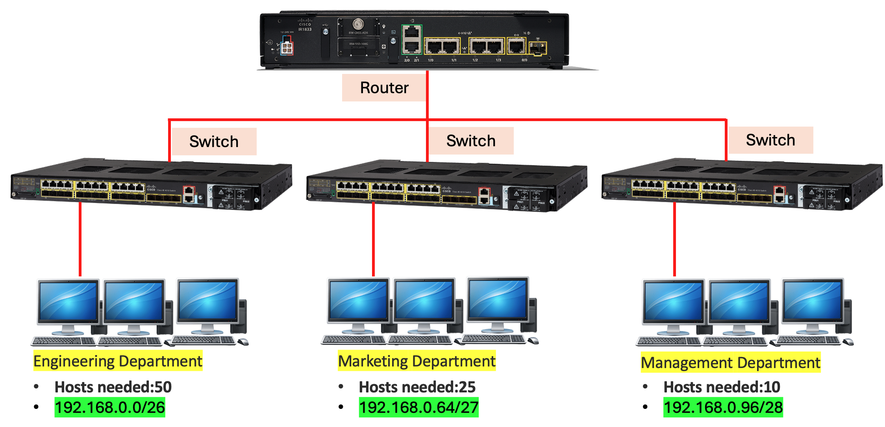
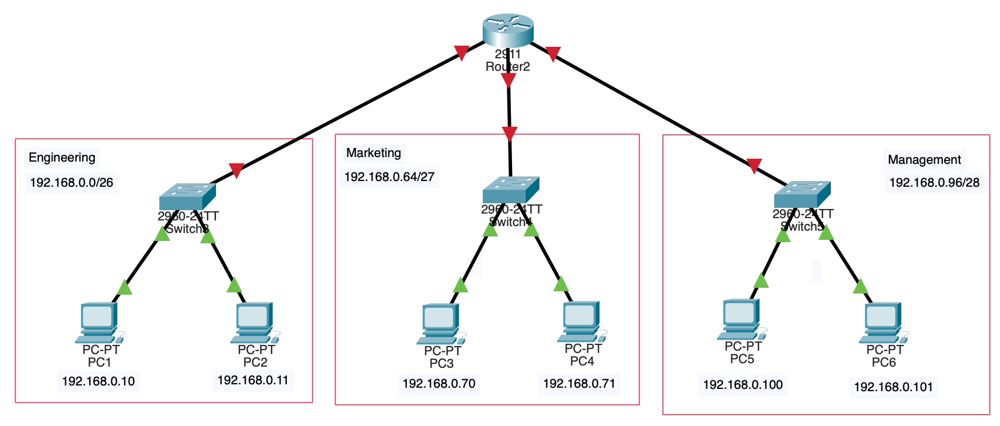
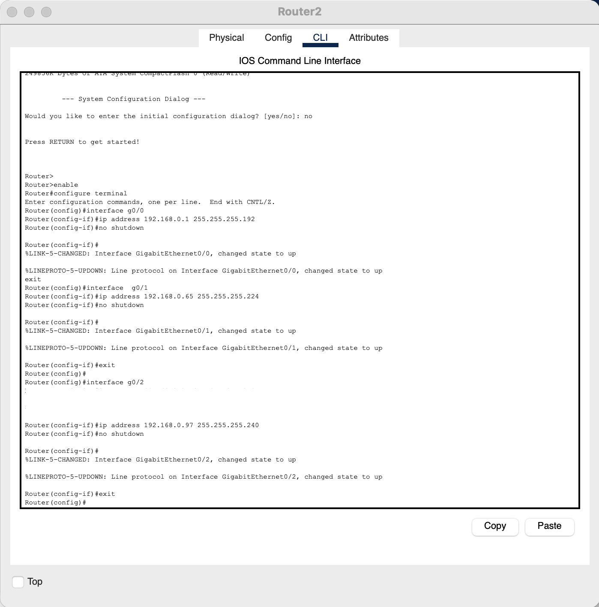
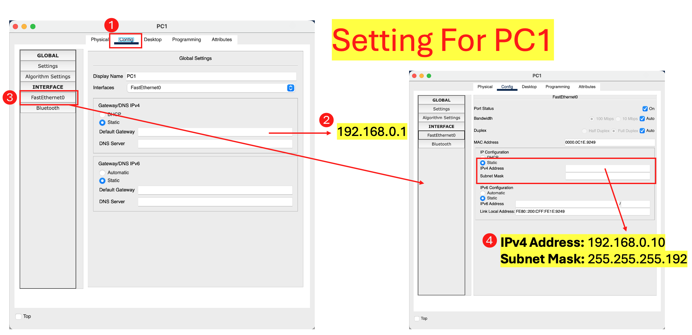
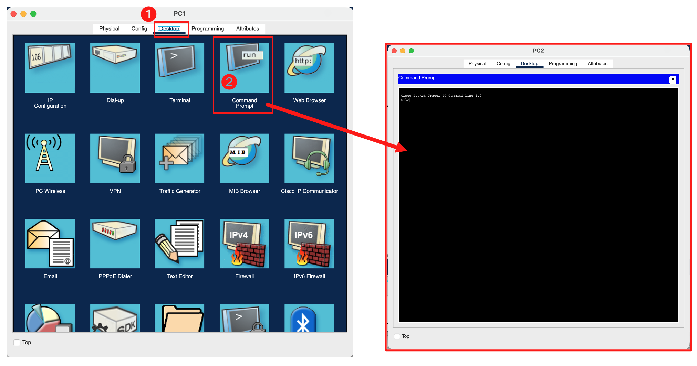
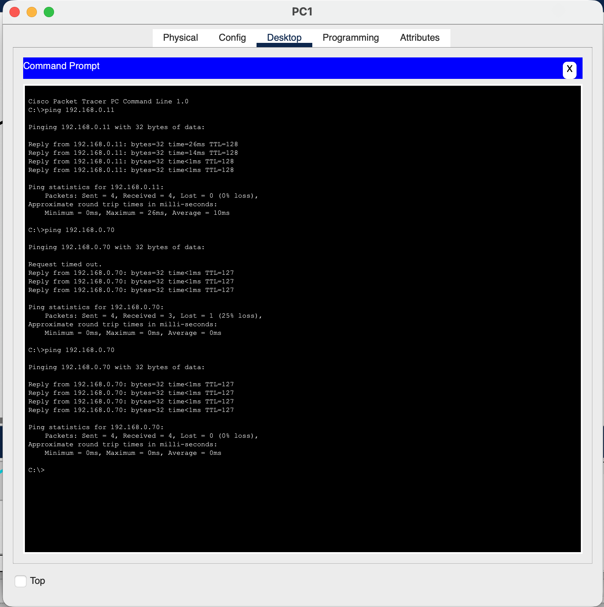
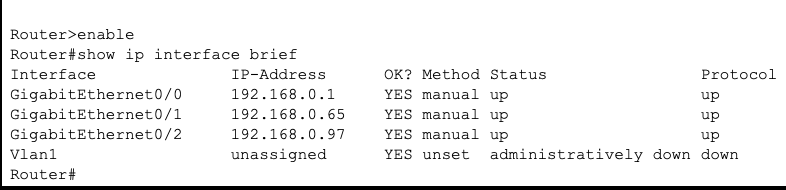

## Cisco Packet Tracer — Lab B: Multi-Subnet IP Design Build

> 🌐 **English** | [日本語](./PACKET_TRACER_GUIDE.ja.md)

> Companion guide to [Session 2 — The Protocol Stack Deep Dive](./README.md).
> Read this **before** doing **Lab B** in the [README](./README.md#hands-on-lab).
> New to Packet Tracer? Start with the [Session 1 Packet Tracer guide](../S1/PACKET_TRACER_GUIDE.md) for installation, the window tour, and CLI basics.

---

- [Cisco Packet Tracer — Lab B: Multi-Subnet IP Design Build](#cisco-packet-tracer--lab-b-multi-subnet-ip-design-build)
- [Lab B — Multi-Subnet IP Design Build](#lab-b--multi-subnet-ip-design-build)
  - [Group Work — build Lab B in teams](#group-work--build-lab-b-in-teams)
  - [Step B1 — Subnet on paper (do this first!)](#step-b1--subnet-on-paper-do-this-first)
  - [Step B2 — Build the topology](#step-b2--build-the-topology)
  - [Step B3 — Configure the router](#step-b3--configure-the-router)
  - [Step B4 — Assign PC IPs](#step-b4--assign-pc-ips)
  - [Step B5 — Verify connectivity](#step-b5--verify-connectivity)
  - [Step B6 — Break it on purpose](#step-b6--break-it-on-purpose)
  - [Lab B Questions](#lab-b-questions)
- [Group Project — Design & Build a New Network (in teams)](#group-project--design--build-a-new-network-in-teams)
- [Practice Exercises](#practice-exercises)
- [Next Steps](#next-steps)

---

## Lab B — Multi-Subnet IP Design Build

**⏱️ ~40 min · Objective:** design an IP scheme **from scratch** and build a routed, multi-subnet network. *This is the foundation lab for every later session.*

**Scenario:** one company, base network `192.168.0.0/24`, three departments:
**Engineering** (50 hosts), **Marketing** (25 hosts), **Management** (10 hosts).

### Step B1 — Subnet on paper (do this first!)

Pick the smallest subnet that fits each department (size = next power of two **above** *hosts + 2*, to leave room for the network and broadcast addresses).

| Dept | Hosts needed | CIDR | Mask | Network | Usable Range | Broadcast | Gateway |
|:---|:---:|:---:|:---|:---|:---|:---|:---|
| Engineering | 50 | `/26` | `255.255.255.192` | `192.168.0.0` | `.1 – .62` | `.63` | `192.168.0.1` |
| Marketing | 25 | `/27` | `255.255.255.224` | `192.168.0.64` | `.65 – .94` | `.95` | `192.168.0.65` |
| Management | 10 | `/28` | `255.255.255.240` | `192.168.0.96` | `.97 – .110` | `.111` | `192.168.0.97` |

> 💡 Check your math with the [quick formula](./README.md#how-to-subnet-step-by-step): `/26` → size `256 / 2² = 64`, usable `64 − 2 = 62`. ✅

**Why these particular blocks?** Work **largest department first** and lay each subnet down **immediately after** the previous one, so nothing overlaps and nothing is wasted:

- **Engineering** (50 hosts) → first `/26` block: `192.168.0.0` – `.63`.
- **Marketing** (25 hosts) → starts at the *next free address* `.64` as a `/27`: `.64` – `.95`.
- **Management** (10 hosts) → starts at `.96` as a `/28`: `.96` – `.111`.

Each block's size is the **next power of two ≥ (hosts + 2)** — the **+2** reserves the **network address** (all host bits `0`) and the **broadcast address** (all host bits `1`), which can never be assigned to a PC. The leftover `.112` – `.255` stays free for future growth.

<p align="center">
  <br>
  <em>Fig. 1 — The subnet plan: each department gets a right-sized block out of <code>192.168.0.0/24</code> — Engineering <code>/26</code> (50 hosts), Marketing <code>/27</code> (25), Management <code>/28</code> (10).</em>
</p>

### Step B2 — Build the topology

Drag these **exact devices** from the bottom-left device panel onto the workspace:

| Qty | Device | Packet Tracer model | Where to find it | Name it |
|:---:|:---|:---|:---|:---|
| 6 | **PC** | `PC-PT` | **End Devices → End Devices → PC** | `PC1`–`PC6` |
| 3 | **Switch** | Cisco **`2960`** (`2960-24TT`) | **Network Devices → Switches → 2960** | `SW-Eng`, `SW-Mkt`, `SW-Mgt` |
| 1 | **Router** | Cisco **`2911`** | **Network Devices → Routers → 2911** | `Router0` |

> 💡 Use the **`2911`** router specifically — it has **three on-board GigabitEthernet ports** (`g0/0`, `g0/1`, `g0/2`), one per department subnet. The default `2901` only has two, and the `2960` is a *switch* (Layer 2) — it can't route between subnets. The **`2960`** switch is the standard access switch and is plenty for the two PCs in each department.

Cable everything with **Copper Straight-Through**. Connect each department's two PCs to its own switch, then connect **each switch to its own router port**:

| Link | From | To |
|:---|:---|:---|
| Engineering | `SW-Eng` `Fa0/24` | `Router0` `g0/0` |
| Marketing | `SW-Mkt` `Fa0/24` | `Router0` `g0/1` |
| Management | `SW-Mgt` `Fa0/24` | `Router0` `g0/2` |

```text
[ENG]  PC1 PC2 ── SW-Eng (2960) ─┐ g0/0
[MKT]  PC3 PC4 ── SW-Mkt (2960) ─┼─ Router0 (2911)
[MGT]  PC5 PC6 ── SW-Mgt (2960) ─┘ g0/2
```

> 💡 **Watch the link lights.** A new link shows a **red triangle** (down) at each end. The PC–switch links go **green** almost immediately; the **switch–router** links stay **red until you give the router interface an IP and `no shutdown`** it in Step B3. Red switch–router links *after* configuring usually mean you cabled the wrong router port.

<p align="center">
  <br>
  <em>Fig. 2 — The built topology: <strong>Router2 (2911)</strong> with one <strong>2960-24TT</strong> switch per department, each department on its own subnet. Each PC is labelled with the address you'll assign in Step B4.</em>
</p>

### Step B3 — Configure the router

Give the router **one physical interface per subnet** — each becomes that department's **gateway**. This keeps the focus on *subnetting*: one interface, one network, one gateway IP. Assign each department's gateway address and bring the interface up with `no shutdown`:

```ios
Router> enable
Router# configure terminal

! Engineering — 192.168.0.0/26
Router(config)# interface g0/0
Router(config-if)# ip address 192.168.0.1 255.255.255.192
Router(config-if)# no shutdown
Router(config-if)# exit

! Marketing — 192.168.0.64/27
Router(config)# interface g0/1
Router(config-if)# ip address 192.168.0.65 255.255.255.224
Router(config-if)# no shutdown
Router(config-if)# exit

! Management — 192.168.0.96/28
Router(config)# interface g0/2
Router(config-if)# ip address 192.168.0.97 255.255.255.240
Router(config-if)# no shutdown
Router(config-if)# end
```

> [!NOTE]
> Notice each interface's **mask matches its department's subnet size** (`/26`, `/27`, `/28`) — the same numbers from your Step B1 plan. No VLANs or trunking here; that's a Session 4 topic. One subnet = one router port = one gateway.

**Read the CLI feedback.** After each `no shutdown`, the router prints two lines:

```text
%LINK-5-CHANGED: Interface GigabitEthernet0/0, changed state to up
%LINEPROTO-5-UPDOWN: Line protocol on Interface GigabitEthernet0/0, changed state to up
```

The first means **Layer 1 is up** (the cable/port is live); the second means **Layer 2 is up** (the line protocol is working). Seeing *both* for all three interfaces is your confirmation the router side is fully ready — and it's exactly why the red switch–router triangles from Step B2 turn **green** now.

<p align="center">
  <br>
  <em>Fig. 3 — The router CLI: each interface (<code>g0/0</code>, <code>g0/1</code>, <code>g0/2</code>) given its subnet's gateway IP + mask and brought up, with the "changed state to up" confirmations.</em>
</p>

### Step B4 — Assign PC IPs

On each PC, open the **`Config`** tab (or **Desktop → IP Configuration**), choose **Static**, and fill in three fields — an address **inside its subnet's usable range**, the **matching mask**, and the **gateway = its router interface's IP**:

| PC | Dept | IP | Mask | Gateway |
|:---|:---:|:---|:---|:---|
| PC1 | ENG | `192.168.0.10` | `255.255.255.192` | `192.168.0.1` |
| PC2 | ENG | `192.168.0.11` | `255.255.255.192` | `192.168.0.1` |
| PC3 | MKT | `192.168.0.70` | `255.255.255.224` | `192.168.0.65` |
| PC4 | MKT | `192.168.0.71` | `255.255.255.224` | `192.168.0.65` |
| PC5 | MGT | `192.168.0.100` | `255.255.255.240` | `192.168.0.97` |
| PC6 | MGT | `192.168.0.101` | `255.255.255.240` | `192.168.0.97` |

> [!NOTE]
> **Two things must line up or cross-subnet pings will fail:** (1) the **mask must match the department's** (e.g. `/26` = `255.255.255.192` for Engineering — *not* the default `/24`); and (2) the **gateway must equal the router interface IP on that same subnet** (PC1's gateway is `192.168.0.1`, which is `g0/0`). A wrong mask or gateway is the #1 cause of "it pings locally but not across" — which you'll prove on purpose in Step B6.

<p align="center">
  <br>
  <em>Fig. 4 — Configuring <strong>PC1</strong>: the <code>Config</code> tab (①), <strong>Default Gateway</strong> <code>192.168.0.1</code> (②), the <code>FastEthernet0</code> interface (③), and the static <strong>IPv4 Address</strong> <code>192.168.0.10</code> / mask <code>255.255.255.192</code> (④).</em>
</p>

### Step B5 — Verify connectivity

**Open the test console.** Click a PC → the **Desktop** tab → **Command Prompt**. This is a mini DOS-style shell where `ping` and `ipconfig` work just like on a real machine.

<p align="center">
  <br>
  <em>Fig. 5 — Open the test console: on the PC, click <strong>Desktop</strong> (①) → <strong>Command Prompt</strong> (②).</em>
</p>

**Run two pings** from PC1 — one *inside* its subnet, one *across* the router:

1. **Same subnet** — `ping 192.168.0.11` (PC2, also Engineering) → replies **immediately**; this stays on the local switch, no router involved.
2. **Across subnets** — `ping 192.168.0.70` (PC3, Marketing) → replies **via Router2**.

> 💡 **The first cross-subnet ping often shows `Request timed out`, then succeeds.** That's normal: before PC1 can send, it must **ARP** for its gateway's MAC, and the very first echo can expire while that resolution happens. Packets 2–4 then get through — so "1 lost, 3 received" on the *first* run is a success, not a fault. Run it again and all four reply.

<p align="center">
  <br>
  <em>Fig. 6 — PC1's pings: <code>192.168.0.11</code> (same subnet) replies at once; <code>192.168.0.70</code> (across the router) times out once while ARP resolves the gateway, then replies.</em>
</p>

**Confirm the router side.** On **Router2 → CLI**, list the interfaces:

```ios
Router> enable
Router# show ip interface brief
```

Every interface you configured should read **`up` / `up`** (Status / Protocol). Read the columns:

| Column | Healthy value | What it means |
|:---|:---|:---|
| **IP-Address** | the gateway you set | the address hosts point at |
| **Status** | `up` | Layer 1 — the port/cable is live |
| **Protocol** | `up` | Layer 2 — the line protocol is working |

> The unused **`Vlan1`** line showing `administratively down` is **normal** — it's a built-in virtual interface you never enabled, not an error. If a *GigabitEthernet* line shows `administratively down`, you forgot its **`no shutdown`**; `up / down` usually means a cabling or speed/duplex mismatch.

<p align="center">
  <br>
  <em>Fig. 7 — <code>show ip interface brief</code>: <code>g0/0</code>/<code>g0/1</code>/<code>g0/2</code> all <strong>up/up</strong> with their gateway IPs; <code>Vlan1</code> is unused (administratively down) — that's expected.</em>
</p>

### Step B6 — Break it on purpose

Failures teach faster than successes — reproduce these two, watch them fail, then fix them:

1. **Wrong mask.** On PC1, change the mask from `255.255.255.192` (`/26`) to `255.255.255.0` (`/24`) and re-ping Marketing (`192.168.0.70`).
   - **What happens:** the ping **fails**. With a `/24` mask PC1 now believes the *entire* `192.168.0.x` range — including Marketing — is its **own local subnet**, so it tries to reach `.70` **directly with ARP** instead of handing the packet to its gateway. Nothing on the Engineering switch answers for `.70`, so it times out.
   - **The lesson:** the **mask**, not the IP, decides "local vs. remote." Restore `/26` and the ping works again.
2. **IP conflict.** Give PC2 the *same* address as PC1 (`192.168.0.10`).
   - **What happens:** Packet Tracer pops an **IP-address-conflict** warning, and traffic to `.10` becomes unreliable (two NICs answer for one address).
   - **The lesson:** every address must be unique — this is why real networks track allocations with **IPAM** (IP Address Management) instead of assigning addresses by hand-memory. Set PC2 back to `192.168.0.11`.

> [!IMPORTANT]
> **Save your `.pkt` file** — you'll extend this topology in Session 3 (DHCP/DNS) and Session 4 (routing/VLANs).

### Lab B Questions

**Try each one first, then click "Show answer".**

**Q1.** Engineering needs **50 hosts**. Why is `/26` the right choice and not `/27` or `/25`?

<details>
<summary>💡 Show answer</summary>

A subnet loses 2 addresses (network + broadcast), so usable = size − 2. **`/27`** = 32 addresses → only **30 usable** — too few for 50. **`/26`** = 64 addresses → **62 usable** — fits 50 with room to grow. **`/25`** = 126 usable would also fit, but it **wastes** addresses and would overlap the space the other departments need. `/26` is the smallest block that fits — the efficient choice.
</details>

**Q2.** After setting PC1's mask to `255.255.255.0` (Step B6), why did the ping to Marketing **fail**?

<details>
<summary>💡 Show answer</summary>

With a `/24` mask, PC1 believes the **whole `192.168.0.0/24`** is its *local* subnet — including Marketing's `192.168.0.70`. So instead of sending the packet to its **gateway** (the router) to be routed, it tries to reach Marketing **directly with ARP** on its own segment. Nothing answers (Marketing is physically on a different switch/subnet), so the ping fails. The mask, not the IP, is what told PC1 "this is local."
</details>

**Q3.** What does `show ip interface brief` tell you, and what should the **Status / Protocol** columns read for a working link?

<details>
<summary>💡 Show answer</summary>

It lists every router interface with its **IP address** and two state columns. A healthy, configured interface shows **`up / up`** (line protocol up, layer-1 up). `administratively down` means you forgot **`no shutdown`**; `up / down` usually means a cabling or encapsulation mismatch.
</details>

**Q4.** Why is doing the subnet table **on paper before building** strongly recommended?

<details>
<summary>💡 Show answer</summary>

Because the addressing plan drives **everything** — gateway IPs, masks, and which PC belongs where. Designing it first prevents overlapping subnets and mid-build rework; in Packet Tracer (and real life) fixing an address scheme *after* you've configured 10 devices is far more painful than getting the table right up front. It's the same discipline real network engineers use (IPAM).
</details>

---

## Group Project — Design & Build a New Network (in teams)

Now that you've finished Lab B individually, do it again as a **team — on a brand-new problem**. Lab B walked you through one solved company network; here your group designs the IP scheme **from scratch**, builds it in Packet Tracer, and proves it works. No answer table is given — that's the point.

### Teams

**Class composition:** 25 students total — 20 Thai (TH) + 5 Japanese (JP).

**Grouping rule:** each group has **4 TH + 1 JP = 5 students**, giving **5 groups** total. The single JP member in each group acts as the **liaison/note-taker**, so the JP students are spread evenly across all teams rather than clustered.

| Group | Thai (TH) | Japanese (JP) | Size |
|:---|:---|:---|:---:|
| Group 1 | TH-01, TH-02, TH-03, TH-04 | JP-01 | 5 |
| Group 2 | TH-05, TH-06, TH-07, TH-08 | JP-02 | 5 |
| Group 3 | TH-09, TH-10, TH-11, TH-12 | JP-03 | 5 |
| Group 4 | TH-13, TH-14, TH-15, TH-16 | JP-04 | 5 |
| Group 5 | TH-17, TH-18, TH-19, TH-20 | JP-05 | 5 |
| **Total** | **20** | **5** | **25** |

### The new problem — "Campus" network

> A small school campus uses the base network **`172.16.10.0/24`**. It has **four** areas that must each be their own subnet:
>
> | Area | Hosts needed |
> |:---|:---:|
> | **Library** | 60 |
> | **Classrooms** | 28 |
> | **Staff Office** | 12 |
> | **Server Room** | 6 |
>
> Design an addressing plan that fits all four areas inside `172.16.10.0/24` with **no overlap and no wasted blocks**, build it in Packet Tracer, and verify a host in **every** area can reach a host in every other area.

> [!NOTE]
> This is a **different base network, different department count, and different host counts** from Lab B — so you can't copy the Lab B table. Use the same *method* (largest area first, next-power-of-two ≥ hosts + 2, lay each block immediately after the previous one).

### What the team must do

1. **Design together (on paper first).** Produce the subnet table — for each area: CIDR, mask, network, usable range, broadcast, and gateway. *(Hint: 60 hosts → `/26`; 28 → `/27`; 12 → `/28`; 6 → `/29`.)*
2. **Split the build.** Assign one area per member (the 5th member takes the **router config** + overall wiring). Use one **`2911`**-class router (it has 3 on-board ports — add an extra NIC module, e.g. an `HWIC`/`NIM` Gig port, for the 4th area), one `2960` switch per area, and at least one PC per area.
3. **Configure.** Give each router interface its area's gateway IP + matching mask and `no shutdown` it; give each PC a static IP, the right mask, and the correct gateway.
4. **Verify as a team.** From a Library PC, `ping` a host in **each** other area, and run `show ip interface brief` to confirm every interface is `up/up`.
5. **Diagnose.** Deliberately break **one** area with a wrong mask, observe the cross-subnet failure, explain it in one sentence, then fix it.

### Deliverable

The **JP liaison** collects and submits, on behalf of the group:
- the completed subnet **design table** (all four areas),
- a screenshot of `show ip interface brief` with all interfaces **up/up**,
- a screenshot of a successful **cross-area ping**, and
- the saved **`.pkt`** file.

> [!TIP]
> Everyone in the group should be able to *explain* the whole design, not just the part they built — the instructor may ask any member why a particular mask or gateway was chosen.

---

## Practice Exercises

Work through these to lock in subnetting and building a routed network. **Tick each box** as you finish it, and save a screenshot or note of the result (e.g. into `S2/img/`).

- [ ] **1. Build & address.** Construct the three-department network exactly as in the tables (3 × `2960` switches, 1 × `2911` router, 6 PCs). *Record:* a `show ip interface brief` with `g0/0`, `g0/1`, `g0/2` all **up/up**.
- [ ] **2. Prove routing.** From an Engineering PC, ping a PC in **each** other department. *Record:* the replies (and note the first cross-subnet packet may time out while ARP resolves the gateway).
- [ ] **3. Trace the path.** From PC1 run `tracert 192.168.0.100` (Management). *Record:* the hop(s) — confirm the packet leaves via the gateway `192.168.0.1`.
- [ ] **4. Break the mask.** Set PC1's mask to `255.255.255.0` and re-ping Marketing. *Record:* the failure, and explain in one line why the **mask** (not the IP) caused it. Then restore `/26`.
- [ ] **5. Cause a conflict.** Give two PCs the same IP. *Record:* the conflict warning, and how you'd prevent it at scale (**IPAM**).
- [ ] **Stretch — Add a 4th department.** Add **HR (5 hosts)** to your plan: pick the next free block after Management (`192.168.0.112/28`), wire a 4th switch to a spare router port, address a PC, and verify a cross-subnet ping.

> [!TIP]
> Treat each *Record* line as your deliverable — together they prove you can **design** an IP scheme, **build** it, **verify** routing, and **diagnose** the two most common addressing faults.

---

## Next Steps

- **Homework (from the README):** complete the [`10.0.0.0/16` 5-department design](./README.md#homework) and build it in Packet Tracer — this is the subnetting *repetition* that turns the one-off Lab B into fluency.
- Keep your `.pkt` file; later sessions extend this multi-subnet topology with DHCP/DNS (Session 3) and routing/VLANs (Session 4).
- Revisit the [Wireshark guide](./WIRESHARK_GUIDE.md) and capture a **TCP teardown** (`tcp.flags.fin == 1`) for a complete picture of a connection's life cycle.
