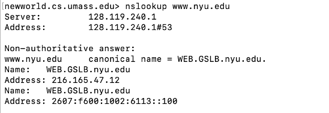

## Wireshark — ラボA：TCP と UDP の実際

> 🌐 [English](./WIRESHARK_GUIDE.md) | **日本語**

> [セッション2 — プロトコルスタック詳解](./README.ja.md) のコンパニオンガイド。
> [README](./README.ja.md#ハンズオンラボ) の **ラボA** に取り組む**前**に読んでください。
> Wireshark が初めて？ インストールと基礎は [セッション1 Wireshark ガイド](../S1/WIRESHARK_GUIDE.ja.md) から。
>
> ⏱️ **約25分** · **目的:** **実際のTCP接続**（3ウェイハンドシェイク*と*大きなファイルのアップロード）をキャプチャし、シーケンス/ACK番号を読み、グラフで輻輳制御を観察 — そしてコネクションレスの **UDP**（DNS）のやり取りと対比する。
>
> *「Wireshark Lab: TCP v9」「Wireshark Lab: UDP v9」（* Computer Networking: A Top-Down Approach, 9th ed.*, J.F. Kurose・K.W. Ross の補足）を基に翻案。*

---

- [Wireshark — ラボA：TCP と UDP の実際](#wireshark--ラボatcp-と-udp-の実際)
  - [TCP 3ウェイハンドシェイクとは？](#tcp-3ウェイハンドシェイクとは)
  - [始める前に](#始める前に)
  - [第1部 — TCP接続をキャプチャする（alice.txt アップロード）](#第1部--tcp接続をキャプチャするalicetxt-アップロード)
    - [ステップ1 — ファイルを入手してアップロードページを開く](#ステップ1--ファイルを入手してアップロードページを開く)
    - [ステップ2 — アップロードをキャプチャ](#ステップ2--アップロードをキャプチャ)
    - [ステップ3 — 1つの POST、多数の TCP セグメント](#ステップ3--1つの-post多数の-tcp-セグメント)
    - [ステップ4 — `tcp` でフィルタしてハンドシェイクを探す](#ステップ4--tcp-でフィルタしてハンドシェイクを探す)
    - [ステップ5 — SYN / SYN-ACK / ACK を読む](#ステップ5--syn--syn-ack--ack-を読む)
    - [ステップ6 — 輻輳制御を見る（Stevens グラフ）](#ステップ6--輻輳制御を見るstevens-グラフ)
  - [第2部 — UDP をキャプチャ（nslookup / DNS）](#第2部--udp-をキャプチャnslookup--dns)
    - [`nslookup` とは何か、なぜ UDP を使うのか](#nslookup-とは何かなぜ-udp-を使うのか)
    - [`nslookup` 出力の読み方](#nslookup-出力の読み方)
  - [ラボA 設問](#ラボa-設問)
  - [演習問題](#演習問題)
  - [次のステップ](#次のステップ)

---

### TCP 3ウェイハンドシェイクとは？

**TCP（Transmission Control Protocol）** は**コネクション指向**です。データをやり取りする前に、2つのホストは3つの小さな制御セグメントを交換して話す合意をします。これが **3ウェイハンドシェイク** で、TCPヘッダの **フラグ** のうち **`SYN`**（同期）と **`ACK`**（確認応答）を使います:

| # | 方向 | フラグ | 意味 |
|:---:|:---|:---:|:---|
| 1 | 自分 → サーバ | **`SYN`** | 「話せますか？ これが私の開始シーケンス番号です。」 |
| 2 | サーバ → 自分 | **`SYN, ACK`** | 「はい — これが*私の*シーケンス番号、あなたのを確認しました。」 |
| 3 | 自分 → サーバ | **`ACK`** | 「確認。始めましょう。」 |

この3パケットの後、接続は**確立**され実データが流れます — このラボでは HTTP `POST` でアップロードする150KBのファイル（`alice.txt`）。各側が**初期シーケンス番号（ISN）**を選び、ハンドシェイクがそれらを同期します — `SYN` の文字通りの意味です。

対照的に、**UDP（User Datagram Protocol）** は**コネクションレス** — ハンドシェイクは*ありません*。ホストはデータグラム（DNSクエリなど）を撃ち、応答を期待するだけです。このラボで両方の振る舞いを見ます。

---

### 始める前に

- [ ] **Wireshark をインストール済み** — まだなら [セッション1のインストール手順](../S1/WIRESHARK_GUIDE.ja.md#wireshark-のインストール) を参照。
- [ ] [README の講義](./README.ja.md#講義) の **TCP/UDP ヘッダ** フィールド（ポート、シーケンス/ACK番号、フラグ、スライディングウィンドウ）を復習。
- [ ] **VPN オフ**、ブラウザキャッシュをクリア（セッション1と同じ [事前チェックリスト](../S1/WIRESHARK_GUIDE.ja.md#キャプチャ前のチェックリスト)）。
- [ ] ライブできない？ 著者のトレース **`tcp-wireshark-trace1-1`** を `gaia.cs.umass.edu/wireshark-labs/wireshark-traces-9e.zip` からダウンロードして開く。

---

### 第1部 — TCP接続をキャプチャする（alice.txt アップロード）

HTTP `POST` でWebサーバに**ファイルをアップロード**して実際のTCP転送をキャプチャします — ハンドシェイク・シーケンス番号・輻輳制御をすべて1つのトレースに見せるのに十分大きい転送です。

#### ステップ1 — ファイルを入手してアップロードページを開く

1. ブラウザで `http://gaia.cs.umass.edu/wireshark-labs/alice.txt` を開き、`.txt` ファイルとして**保存**。
2. `http://gaia.cs.umass.edu/wireshark-labs/TCP-wireshark-file1.html`（下のアップロードページ）へ。
3. **Browse…** をクリックし、保存した `alice.txt` を選択。**まだ Upload は押さない。**

<p align="center">
  <br>
  <em>図1 — アップロードページ。**Browse…** で <code>alice.txt</code> を選ぶが、Wireshark がキャプチャを始めるまで Upload は押さない。</em>
</p>

#### ステップ2 — アップロードをキャプチャ

1. アクティブなインターフェイスで **Wireshark のキャプチャを開始**。
2. ブラウザに戻り **"Upload alice.txt file"** をクリック。短い congratulations メッセージを待つ。
3. キャプチャを**停止**。トレースに `gaia.cs.umass.edu` とのTCP会話全体が含まれます。

<p align="center">
  <br>
  <em>図2 — アップロード完了、パケットトレースをキャプチャ — TCP転送を解析する準備が整いました。</em>
</p>

#### ステップ3 — 1つの POST、多数の TCP セグメント

一覧で **`HTTP POST`** メッセージを見つけて展開。ファイルは約152KB — 1つのTCPセグメントには大きすぎ — なので POST は**約106個のTCPセグメントにまたがります**。Wireshark がそれを示します（POSTの開始がどのパケットにあるかも）。

<p align="center">
  <br>
  <em>図3 — <code>alice.txt</code> を運ぶ HTTP <code>POST</code> は約106個のTCPセグメントから再構成 — バイトストリームがネットワークに合わせて刻まれた。</em>
</p>

#### ステップ4 — `tcp` でフィルタしてハンドシェイクを探す

フィルタ欄に **`tcp`** と入力して Enter。一覧がHTTP表示の代わりに**TCPセグメント**を表示します。上の方に接続確立 — **SYN**、gaia からの **SYN-ACK**、続いてデータセグメント（POSTを運ぶ最初のものがハンドシェイクの後）が見えます。

<p align="center">
  <br>
  <em>図4 — TCPセグメント: **SYN**、gaia の **SYN-ACK**、<code>POST</code> を運ぶ最初のデータセグメント。クライアント <code>192.168.86.68</code> ↔ gaia <code>128.119.245.12 : 80</code>。</em>
</p>

#### ステップ5 — SYN / SYN-ACK / ACK を読む

各ハンドシェイクパケットをクリックし **Transmission Control Protocol → Flags** を展開して、何が各々を特徴づけるか確認:

| # | セグメント | 立っているフラグビット | 何が識別するか |
|:---:|:---|:---|:---|
| 1 | **SYN** | `SYN = 1`, `ACK = 0` | 接続を開くクライアント |
| 2 | **SYN-ACK** | `SYN = 1`, `ACK = 1` | gaia が同意し*かつ*あなたのSYNを確認 |
| 3 | **ACK** | `SYN = 0`, `ACK = 1` | クライアントが確認 — 接続確立 |

> 💡 SYN の**生のシーケンス番号**が各側のISNです。SYN-ACK の**確認応答番号 = あなたのSYNのシーケンス番号 + 1**（SYNフラグが1つシーケンス番号を「消費」する）。既定で Wireshark は0始まりの*相対*番号を表示するので、ACK番号は通常 `1` と表示されます。

#### ステップ6 — 輻輳制御を見る（Stevens グラフ）

アップロードは大きなデータなので、TCPが時間とともに送信レートを管理する様子を*見られます*。クライアント→gaia のTCPセグメントを選び、**Statistics → TCP Stream Graphs → Time-Sequence-Graph (Stevens)**。

**軸の読み方。** グラフは**クライアントが送った全データセグメント**を点として描きます:

- **X軸 = 時間**（接続開始からの秒）。
- **Y軸 = シーケンス番号** — つまりこれまでに**ネットワークへ渡した累積バイト数**。`(0.05秒, 12000)` の点は「0.05秒までに12,000バイト送信済み」の意味。

シーケンス番号は*増えるだけ*なので、曲線は常に左から右へ上昇します。**その上昇の形がTCPの物語**で、こう読みます:

| グラフで見えるもの | TCPが何をしているか | なぜ |
|:---|:---|:---|
| **急峻でほぼ垂直な上昇**（点の積み重なり） | **「艦隊（fleet）」** — ウィンドウ分のセグメントを**連続で**送信 | 送信ウィンドウが多数のセグメントを一斉に、バーストで送らせた。 |
| 艦隊の後の**平らな水平の隙間** | 送信側が**ACK待ちで一時停止** | ウィンドウを満たしたので、ACKが空きを作るまで送れない（この停止 ≈ 1**往復時間**）。 |
| 各艦隊が**前より高い** | **スロースタート** — ウィンドウがRTTごとに*倍増* | 各ACKがTCPに輻輳ウィンドウを指数的に増やさせ、容量を探る。 |
| 後に艦隊が**一定**量で増える | **輻輳回避** — 加算的（線形）増加 | スロースタート閾値を超えると、行き過ぎを避けるためRTTごとに約1セグメント追加。 |
| 曲線の**全体的な傾き** | 接続の**スループット** | 急なほど秒あたりバイト数が多い。傾きが平らになると、TCPが限界（帯域か受信側ウィンドウ）に達した。 |
| **平らな停滞の後に後退/繰り返しのジャンプ** | **セグメント損失＋再送** | 送信側が止まり、タイムアウト（または重複ACK）して再送 — 滑らかな上昇の途切れとして見える。 |

つまり古典的な**階段**（*バーストで上昇、平らに待機、より大きなバーストで上昇、平らに待機*）はTCPの**ACKクロッキング**の実際です: ウィンドウを送り、届いた証拠のACKを待ち、より大きなウィンドウを送る。このフィードバックループこそ、TCPが経路を溢れさせずにどれだけ速く送れるかを発見する仕組みです。

<p align="center">
  <br>
  <em>図5 — <code>192.168.86.68:55639 → 128.119.245.12:80</code> のシーケンス番号 vs 時間プロット。各垂直の積み重なりが艦隊、各平らな隙間がACK待ち。艦隊は時間とともに高くなる — TCP **スロースタート**がRTTごとにウィンドウを倍増。</em>
</p>

<p align="center">
  <br>
  <em>図6 — 同じデータの別表示で**周期性**が明白に: 往復ごとに連続セグメントの艦隊1つが繰り返す。バースト間の間隔はおよそ1RTT。</em>
</p>

> 💡 **やってみよう:** 最初の数艦隊にズーム。各々のセグメント数を数える — 艦隊2が艦隊1の約2倍なら、スロースタートの指数的成長をワイヤから直接*測定*したことになります。

---

### 第2部 — UDP をキャプチャ（nslookup / DNS）

UDP はその儀式の正反対 — **ハンドシェイクなし、シーケンス番号なし、ACKなし**。UDPのやり取りを起こす最も簡単な方法は **`nslookup`** でのDNSルックアップです。

#### `nslookup` とは何か、なぜ UDP を使うのか

**`nslookup`**（"name server lookup"）は Windows・macOS・Linux に組み込まれた小さなコマンドラインツールで、**DNS（Domain Name System）** に**名前**（`www.nyu.edu` など）を**IPアドレス**へ変換するよう尋ねます — ブラウザが各接続の前に黙って行うのと同じルックアップです。手で実行すると、その解決ステップを単独で*見られます*。

このラボに最適なのは **DNSがUDP上で動く**から: `nslookup` は**ポート53**のDNSサーバに単一の**クエリデータグラム**を送り、サーバが単一の**レスポンスデータグラム**を返します。接続の確立も切断もなし — TCPと対比したいコネクションレスの振る舞いそのものです。

```sh
# 名前を引く（適切なOSでいずれも動作）:
nslookup www.nyu.edu          # Windows / macOS / Linux
dig www.nyu.edu               # macOS / Linux の代替（より詳細）
```

> 💡 **最近アクセスしていない**名前を選ぶこと — 答えが既にDNSキャッシュにあると、コンピュータはクエリを送らず何もキャプチャできないかもしれません。

**キャプチャする:**

1. Wireshark で**新しいキャプチャを開始**。
2. ターミナルで `nslookup www.nyu.edu` を実行。
3. キャプチャを**停止**し **`udp`**（または `dns`）でフィルタ。最初のセグメントを選び詳細ペインで **User Datagram Protocol** を展開。
4. UDPヘッダがちょうど**4つ**のフィールド — **送信元ポート**・**宛先ポート**・**Length**・**Checksum** — の8バイトであることを確認。クエリの**宛先ポートは53**、応答の**送信元ポートは53**でポートが入れ替わる。

<p align="center">
  <br>
  <em>図7 — <code>nslookup www.nyu.edu</code> がポート53のDNSサーバに尋ねる — 単一のUDPクエリ/応答、接続確立なし。</em>
</p>

#### `nslookup` 出力の読み方

ツールはまず**どのサーバに尋ねたか**を表示し、次に**答え**を表示:

| 行 | 例 | 何が分かるか |
|:---|:---|:---|
| **Server / Address** | `128.119.240.1#53` | 問い合わせた**DNSリゾルバ**とポート — **`#53`** がDNS-over-UDPを確認。 |
| **Non-authoritative answer** | — | 答えはドメイン自身の権威ネームサーバではなく**キャッシュ**から来た。 |
| **canonical name** | `www.nyu.edu → WEB.GSLB.nyu.edu` | **`CNAME`**（別名）: 尋ねた名前は実は別の名前を指す。 |
| **Name / Address (IPv4)** | `216.165.47.12` | **`A` レコード** — 名前が解決するIPv4アドレス。 |
| **Name / Address (IPv6)** | `2607:f600:1002:6113::100` | **`AAAA` レコード** — 同じ名前のIPv6アドレス。 |

つまり1つの整然とした `nslookup` は Wireshark が示すものに直接対応します: `:53` へ出る `www.nyu.edu` の**クエリ**と、CNAME・A・AAAA レコードを返す**レスポンス** — すべて2つのUDPデータグラムの中に。

> 対比に注目: 第1部のTCP転送はハンドシェイク、シーケンス/ACK番号、輻輳制御グラフを要しました。このDNSルックアップは**データグラム1つ出て、1つ戻る**だけ。これがトレードオフ — TCPは信頼性を得て、UDPは速度を買う。

---

### ラボA 設問

**まず自分で考えてから「答えを表示」をクリック。**

**Q1.** クライアントが使う **IPアドレスとTCPポート**、そしてこの接続での **gaia** のIPとポートは？

<details>
<summary>💡 答えを表示</summary>

このトレースでは**クライアント**は `192.168.86.68` でランダムな**エフェメラル**高番号ポート（例 `55639`）。**gaia.cs.umass.edu** は `128.119.245.12` で、ウェルノウンポート **`80`**（HTTP）で受信。応答ではポートが入れ替わる（gaia:80 → client:55639）。自分の数字は異なりますが*形*は同じです。
</details>

**Q2.** セグメントを **SYN** と識別するのは何で、**SYN-ACK** を識別するのは何？

<details>
<summary>💡 答えを表示</summary>

**SYN** は **SYNフラグが1、ACKが0**。**SYN-ACK** は **SYN = 1 かつ ACK = 1** — gaia側を開き*かつ*あなたのSYNを確認します。SYN-ACK の**確認応答番号 = あなたのSYNのシーケンス番号 + 1**。
</details>

**Q3.** なぜ HTTP `POST` は1つではなく**約106個のTCPセグメントにまたがった**のか？

<details>
<summary>💡 答えを表示</summary>

`alice.txt` は約152KBで、**最大セグメントサイズ（MSS、通常約1460バイト）**よりはるかに大きいです。TCPはアプリには単一のバイト*ストリーム*を見せますが、ネットワークのMTUに合う**セグメントに刻む**必要があります — だから1つの大きなPOSTが約106セグメントになり、各々シーケンス番号で順序復元できるよう印が付きます。
</details>

**Q4.** **Stevens グラフ**で、初期のセグメントの「艦隊」が往復ごとに大きくなります。これはTCPのどのフェーズ？

<details>
<summary>💡 答えを表示</summary>

**スロースタート。** TCPは控えめに始め、輻輳ウィンドウをRTTごとにおよそ**倍増**させます — だから各艦隊が前より大きく、プロット初期の急で加速する上昇になります。利用可能帯域に近づくと**輻輳回避**（線形成長）に平坦化します。
</details>

**Q5.** **UDPヘッダ**のフィールドはいくつで、何？

<details>
<summary>💡 答えを表示</summary>

**4つ**、計8バイト: **送信元ポート**・**宛先ポート**・**Length**（ヘッダ＋データ）・**Checksum**。これがプロトコルの全部 — シーケンス番号も確認応答もフラグもなく、まさにそれがUDPが高速・軽量な理由です。
</details>

**Q6.** （IPヘッダ内の）**UDPのプロトコル番号**、**最大ポート番号**、**最大UDPペイロード**は？

<details>
<summary>💡 答えを表示</summary>

UDPのIP **Protocol 番号は `17`**。ポートは16ビットなので最大は **65,535**。UDPの **Length** フィールドも16ビット（最大65,535）で8バイトのヘッダを含むので、最大ペイロードは **65,535 − 8 = 65,527 バイト**。（比較: TCPはIPプロトコル `6`。）
</details>

---

### 演習問題

TCP と UDP を定着させるため、自分でやってみましょう。終えたら**各チェックを付け**、結果のスクリーンショットやメモを保存してください。

- [ ] **1. ハンドシェイクを地図化。** `alice.txt` キャプチャで `SYN → SYN-ACK → ACK` を見つける。*記録:* 自分の**クライアントIP + エフェメラルポート**と **gaia のIP + ポート80**、フラグビット（`SYN=1/ACK=0`、次に `SYN=1/ACK=1`）を確認。
- [ ] **2. セグメントを数える。** HTTP `POST` を見つけ、何セグメントにまたがるか読む。*記録:* セグメント数と、なぜ1つのPOSTにそれだけ必要か（**MSS** を考える）を1行で説明。
- [ ] **3. Stevens グラフを読む。** **Statistics → TCP Stream Graphs → Time-Sequence (Stevens)** を開く。*記録:* **最初の2艦隊**のセグメント数 — 艦隊2 ≈ 2×艦隊1（スロースタート）か？ 上昇が急から線形（**輻輳回避**）に変わるおおよその位置を印す。
- [ ] **4. RTTを測る。** **Statistics → TCP Stream Graphs → Round-Trip-Time Graph**（またはPOSTの送信時刻をそのACK時刻から引く）。*記録:* **最初のデータセグメントのRTT**。
- [ ] **5. UDPをキャプチャ。** 新しいホスト名で `nslookup` をキャプチャ中に実行し、`udp` でフィルタ。*記録:* **UDPヘッダの4フィールド**、**宛先ポート（53）**、返ってきた **A / AAAA** アドレス。
- [ ] **ストレッチ — 切断を見る。** `tcp.flags.fin == 1` を適用し、接続を閉じる `FIN/ACK` パケットを見つける。*記録:* 切断に要するパケット数 vs 確立の3つ。

> [!TIP]
> 各 *記録* 行を成果物として扱いましょう — これらがそろえば、ハンドシェイクを読み、セグメント化を追い、輻輳グラフを解釈し、TCPとUDPを一目で見分けられる証明になります。

---

### 次のステップ

- **切断をキャプチャ:** `tcp.flags.fin == 1` を適用し、接続を*閉じる* `FIN/ACK` パケット — ハンドシェイクの鏡像 — を見つける。
- **RTTをプロット:** クライアント→gaia のセグメントを選び **Statistics → TCP Stream Graphs → Round Trip Time Graph** で、転送中にレイテンシがどう変動したか見る。
- **HTTPS を覗く:** `https://` サイトを読み込み、TCPハンドシェイクは依然見えるがペイロードは暗号化（TLS）されていることに注目。
- ラボBの [Packet Tracer ガイド](./PACKET_TRACER_GUIDE.ja.md) へ進み、マルチサブネットネットワークをゼロから設計・構築する。
