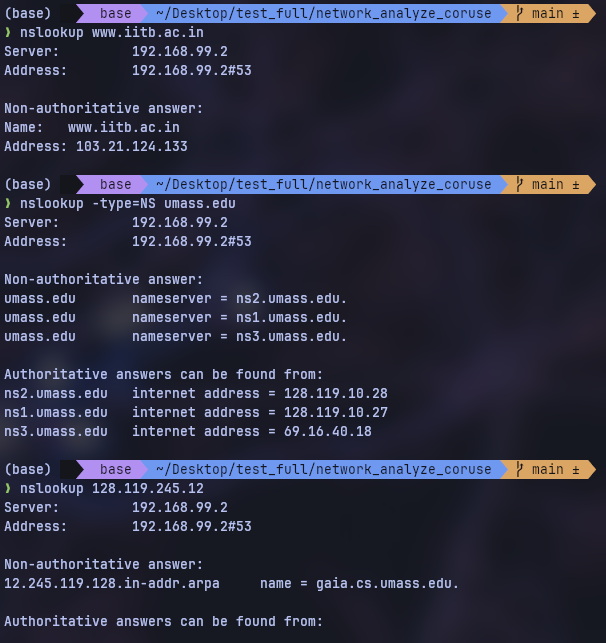
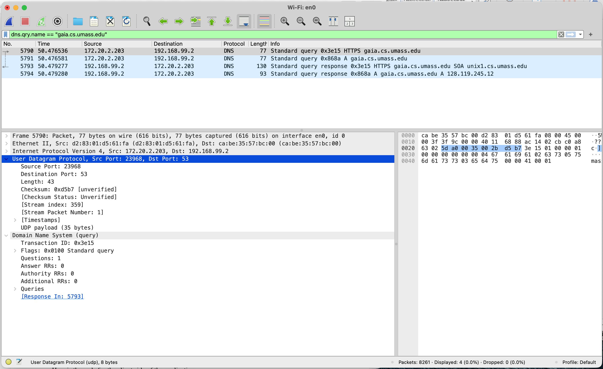
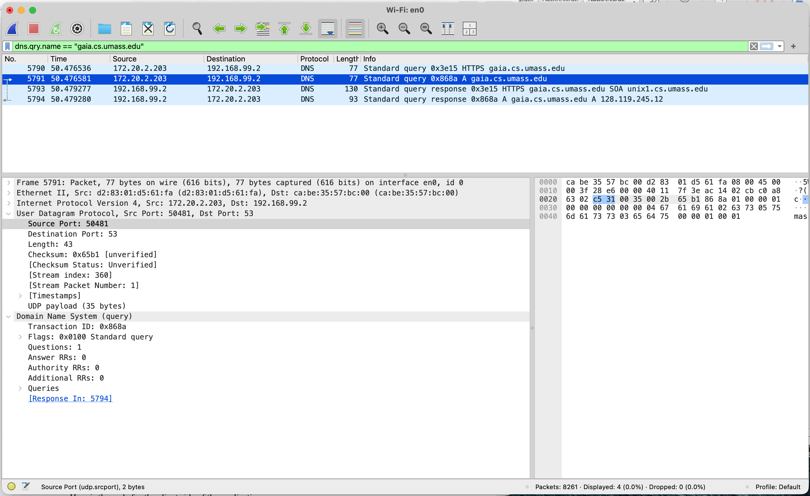
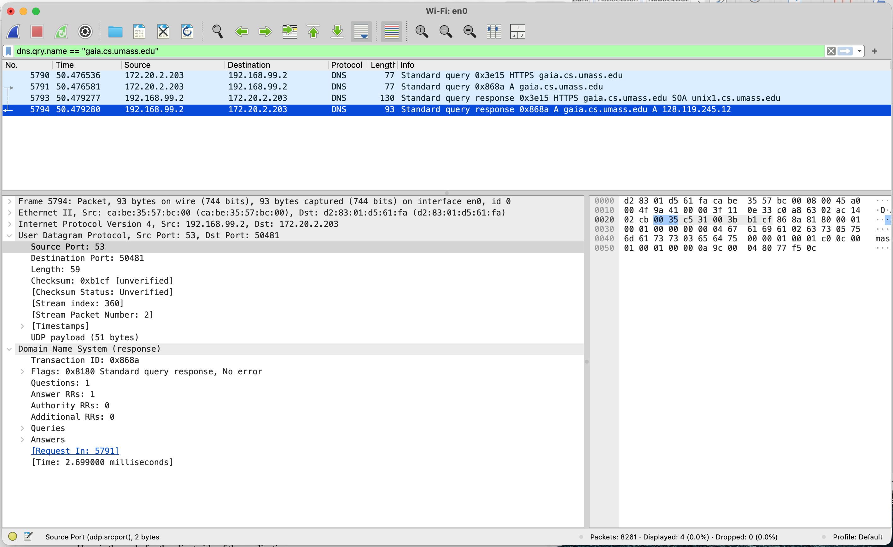
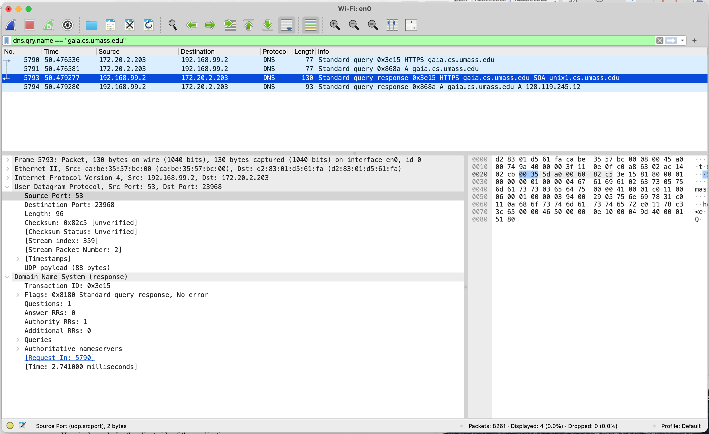

## Wireshark — Lab A: DHCP & DNS Analysis

> 🌐 **English** | [日本語](./WIRESHARK_GUIDE.ja.md)

> Companion guide to [Session 3 — Network Services & Security](./README.md).
> Read this **before** doing **Lab A** in the [README](./README.md#hands-on-lab).
> New to Wireshark? Start with the [Session 1 Wireshark guide](../S1/WIRESHARK_GUIDE.md) for installation and the basics, and the [Session 2 guide](../S2/WIRESHARK_GUIDE.md) for filters & Follow-Stream.

---

- [Wireshark — Lab A: DHCP \& DNS Analysis](#wireshark--lab-a-dhcp--dns-analysis)
- [Lab A — DHCP \& DNS Analysis](#lab-a--dhcp--dns-analysis)
  - [Background: DORA \& name resolution](#background-dora--name-resolution)
  - [Step A1 — Gather a DHCP trace](#step-a1--gather-a-dhcp-trace)
  - [Step A2 — Read the four DORA messages](#step-a2--read-the-four-dora-messages)
  - [Step A3 — Explore names with nslookup](#step-a3--explore-names-with-nslookup)
  - [Step A4 — Capture DNS while browsing](#step-a4--capture-dns-while-browsing)
  - [Step A5 — Inspect the DNS query \& response](#step-a5--inspect-the-dns-query--response)
  - [Lab A Questions](#lab-a-questions)
  - [Practice Exercises](#practice-exercises)
- [Next Steps](#next-steps)

---

## Lab A — DHCP & DNS Analysis

**Objective:** capture a device **getting an address (DHCP/DORA)** and **resolving names (DNS)** — the two services that make "the network just work."

> *Adapted from "Wireshark Lab: DHCP v9" and "Wireshark Lab: DNS v9.0", supplements to* Computer Networking: A Top-Down Approach*, J.F. Kurose & K.W. Ross.*

### Background: DORA & name resolution

When a device joins a network it has no IP yet, so it asks for one. **DHCP** (Dynamic Host Configuration Protocol) answers in a four-step exchange remembered as **DORA**:

| # | Message | From → To | Purpose |
|:---:|:---|:---|:---|
| 1 | **D**iscover | Client → broadcast | "Is there a DHCP server out there?" |
| 2 | **O**ffer | Server → client | "Yes — here's an address you can have." |
| 3 | **R**equest | Client → broadcast | "I'll take that offered address." |
| 4 | **A**ck | Server → client | "It's yours — here's your lease, gateway, and DNS server." |

> Only **Request** and **ACK** are *mandatory* — Discover/Offer can be skipped when a host simply **renews** an address it already had. All four messages of one exchange share a single **Transaction ID (xid)**, which is how the client matches the Offer/ACK to its own Discover/Request.

<p align="center">
  <br>
  <em>Fig. 1 — The DORA exchange between a DHCP server and an arriving client: each message carries the offered address (<code>yiaddr</code>), the shared transaction ID, and the lease lifetime.</em>
</p>

DHCP runs over **UDP** — server port **67**, client port **68**. Once addressed, the device uses **DNS** (Domain Name System, **UDP port 53**) to turn names like `gaia.cs.umass.edu` into IP addresses via a **query → response** to its **local DNS server**.

---

**Part 1 — DHCP: watch a host get an address**

### Step A1 — Gather a DHCP trace

To capture *all four* DORA messages you must force a full **release + renew**. First find your interface name in Wireshark via **Capture → Options**, then run the de-configure command, **start the capture**, and run the renew command:

```sh
# macOS  (en0 = your interface)
sudo ipconfig set en0 none      # ← de-configure, THEN start Wireshark
sudo ipconfig set en0 dhcp      # ← triggers Discover→Offer→Request→ACK

# Windows
ipconfig /release               # ← give up the address, THEN start Wireshark
ipconfig /renew                 # ← triggers DORA

# Linux  (eth0 = your interface)
sudo ip addr flush dev eth0 && sudo dhclient -r   # ← THEN start Wireshark
sudo dhclient eth0                                # ← triggers DORA
```

Wait a few seconds after the renew, then **stop** the capture.

> Can't capture live (or didn't catch all four)? Use the author's trace **`dhcp-wireshark-trace1-1.pcapng`** from `gaia.cs.umass.edu/wireshark-labs/wireshark-traces-9e.zip`.

Apply the **`dhcp`** filter and you should see the four messages in order — all sharing **one Transaction ID** (here `0x184eabb6`):

<p align="center">
  <br>
  <em>Fig. 2 — The <code>dhcp</code> filter showing <strong>Discover → Offer → Request → ACK</strong>. Note the addresses: Discover and Request come <strong>from <code>0.0.0.0</code> to the <code>255.255.255.255</code> broadcast</strong> (the client has no IP yet); Offer and ACK come <strong>from the server <code>172.20.0.1</code> to the client <code>172.20.2.203</code></strong> — and all four share xid <code>0x184eabb6</code>.</em>
</p>

### Step A2 — Read the four DORA messages

Type **`dhcp`** (older builds: **`bootp`**) in the filter, then click each message and read its key fields:

| Message | Source IP | Dest IP | Notable fields to read |
|:---|:---|:---|:---|
| **Discover** | `0.0.0.0` *(no address yet!)* | `255.255.255.255` *(broadcast)* | **Transaction ID**; the **Parameter Request List** in Options — the list of settings the client *wants* (subnet mask, router, DNS server, domain…) |
| **Offer** | the DHCP server's IP | client / broadcast | same Transaction ID; the offered address + options |
| **Request** | `0.0.0.0` | `255.255.255.255` | UDP **source port 68 → destination port 67**; same Transaction ID |
| **ACK** | the DHCP server's IP | client | **Your (client) IP Address**, **IP Address Lease Time**, **Router** (gateway), **Domain Name Server** |

Here is each of the four, expanded in Wireshark (all share Transaction ID `0x184eabb6`):

**① Discover** — the client (`0.0.0.0`) broadcasts "is anyone a DHCP server?" — a *Boot Request* over UDP **68 → 67**, with a **Parameter Request List** naming the options it wants.

<p align="center">
  <br>
  <em>Fig. 3 — <strong>Discover</strong>: Boot Request, Client IP <code>0.0.0.0</code>, Message Type = Discover, plus the <strong>Parameter Request List</strong> (subnet mask, router, DNS…).</em>
</p>

**② Offer** — a server replies (*Boot Reply*, UDP **67 → 68**) proposing an address in the **Your (client) IP address** field, with the lease, mask, router, and DNS options attached.

<p align="center">
  <br>
  <em>Fig. 4 — <strong>Offer</strong>: <strong>Your (client) IP address <code>172.20.2.203</code></strong>, DHCP Server Identifier <code>192.168.99.2</code>, with Lease Time, Subnet Mask, Router, and Domain Name Server options.</em>
</p>

**③ Request** — the client broadcasts that it accepts that offer, echoing the chosen address in **Option 50 (Requested IP Address)** and the chosen server in **Option 54**.

<p align="center">
  <br>
  <em>Fig. 5 — <strong>Request</strong>: Message Type = Request, <strong>Option 50 Requested IP <code>172.20.2.203</code></strong>, Option 54 DHCP Server Identifier <code>192.168.99.2</code>.</em>
</p>

**④ ACK** — the server confirms (UDP **67 → 68**); the lease is now official. Expand its **Options** to read the **lease time**, **Router (gateway)**, **Subnet Mask**, and **Domain Name Server** — the values that let your host reach the rest of the network.

<p align="center">
  <br>
  <em>Fig. 6 — <strong>ACK</strong>: Message Type = ACK, Your IP <code>172.20.2.203</code>, plus Lease Time, Subnet Mask <code>255.255.240.0</code>, Router, and Domain Name Server.</em>
</p>

---

**Part 2 — DNS: turn names into addresses**

### Step A3 — Explore names with nslookup

Before capturing, get a feel for DNS with **`nslookup`** (built into Windows, macOS, and Linux). It asks a DNS server for a specific **record type**:

```sh
nslookup www.iitb.ac.in        # Type=A  — a name → its IPv4 (and IPv6/AAAA) address
nslookup -type=NS umass.edu    # Type=NS — the domain's authoritative name servers
nslookup 128.119.245.12        # reverse — an IP → its name (gaia.cs.umass.edu)
```

The output names **which DNS server answered** and whether the answer is **authoritative** (from the domain's own server) or **non-authoritative** (served from a cache). *(More on the nslookup output in the [Session 2 UDP lab](../S2/WIRESHARK_GUIDE.md#what-nslookup-is-and-why-it-uses-udp).)*

<p align="center">
  <br>
  <em>Fig. 7 — <code>nslookup www.iitb.ac.in</code> (A record → <code>103.21.124.133</code>), <code>nslookup -type=NS umass.edu</code> (the <code>ns1/ns2/ns3.umass.edu</code> name servers), and a reverse lookup of <code>128.119.245.12</code> → <code>gaia.cs.umass.edu</code>.</em>
</p>

### Step A4 — Capture DNS while browsing

1. **Clear your DNS cache** so the lookup actually hits the network (a cached record sends *no* query):
   ```sh
   sudo killall -HUP mDNSResponder        # macOS
   ipconfig /flushdns                     # Windows
   sudo resolvectl flush-caches           # Linux (Ubuntu 22.04+)
   ```
2. Clear your **browser** cache, then **start a capture**.
3. Visit **`http://gaia.cs.umass.edu/kurose_ross/`** and **stop** the capture.
4. Filter on **just this name** so every other lookup disappears:
   ```text
   dns.qry.name == "gaia.cs.umass.edu"
   ```
   (Plain **`dns`** works too, but `dns.qry.name == "…"` shows *only* the packets asking about this one host — far easier to read.)

**Reading the packet list.** Each row is one DNS message; the **Info** column says which is which. Match the colours to the screenshot below:

| In the **Info** column | What it is |
|:---|:---|
| `Standard query 0x8d6a A gaia.cs.umass.edu` | a **query** — your PC *asking* for the **A** (IPv4) record |
| `Standard query response 0x8d6a A … 128.119.245.12` | the **response** — the server *answering* with the address |
| the matching **`0x8d6a`** | the **Transaction ID** that pairs a query with its response |
| **Source / Destination** | your PC (`172.20.2.203`) ↔ your DNS server (`192.168.99.2`) |

Wireshark even cross-links the pair: click the **query** and the DNS layer shows **`[Response In: 5794]`**; click the **response** and it shows **`[Request In: 5791]`**.

<p align="center">
  <br>
  <em>Fig. 8 — Filtered by <code>dns.qry.name == "gaia.cs.umass.edu"</code>: the <strong>Standard query</strong> rows and their matching <strong>Standard query response</strong> rows, paired by Transaction ID. (You'll see two pairs — the browser sends an <strong>A</strong> query <em>and</em> an <strong>HTTPS</strong>-type query.)</em>
</p>

### Step A5 — Inspect the DNS query & response

Click a packet and expand its layers in the middle pane. Read it top-down (Frame → Ethernet → IP → UDP → DNS); the two parts that matter are **UDP** (the ports) and **Domain Name System** (the question and answer).

**The query — Fig. 9.** Expand **User Datagram Protocol**: the **Destination Port is `53`** (the well-known DNS port); the source is a random high port your PC picked. Then expand **Domain Name System (query)**:

- **Transaction ID `0x8d6a`** — the tag the response must echo back.
- **Flags `0x0100 Standard query`** — the "this is a question" marker.
- **Questions: 1 · Answer RRs: 0** — one thing asked, nothing answered yet.
- **Queries → `gaia.cs.umass.edu: type A`** — the exact name and record type requested.
- **`[Response In: 5794]`** — Wireshark's clickable link to the reply.

<p align="center">
  <br>
  <em>Fig. 9 — The <strong>query</strong> for <code>gaia.cs.umass.edu</code>: <strong>UDP → Dst Port 53</strong>, Transaction ID <code>0x8d6a</code>, <strong>Questions: 1, Answer RRs: 0</strong> — you're asking, not telling.</em>
</p>

**The response — Fig. 10.** Select the matching reply (same `0x8d6a`). In **UDP**, the **Source Port is now `53`** — the ports have **swapped** (server → you). In **Domain Name System (response)**:

- Same **Transaction ID `0x8d6a`** — proof it answers *your* query.
- **Flags `0x8180 Standard query response, No error`**.
- **Questions: 1 · Answer RRs: 1** — it repeats your question and adds **one answer**.
- **Answers → `gaia.cs.umass.edu: type A, addr 128.119.245.12`** — the actual **name → IPv4** mapping. *This is the line that lets your browser connect.*
- **`[Request In: 5791]`** and **`[Time: … ms]`** — the matching query, and how long the lookup took.

<p align="center">
  <br>
  <em>Fig. 10 — The <strong>response</strong> (Transaction ID <code>0x8d6a</code>): UDP <strong>Src Port 53</strong>, <strong>Answer RRs: 1</strong> — an <strong>A</strong> record resolving <code>gaia.cs.umass.edu → 128.119.245.12</code>.</em>
</p>

> 💡 **Not every response carries an address.** Modern browsers also fire an **HTTPS-type** query (an HTTP/3 hint). Because this host has no `HTTPS` record, the reply comes back with **Answer RRs: 0** plus an **Authority** (**SOA**) record — the zone's authority info instead of an address. It's perfectly normal; the **A** response in Fig. 10 is the one that actually resolved the name.

<p align="center">
  <br>
  <em>Fig. 11 — The browser's <strong>HTTPS-type</strong> query response (Transaction ID <code>0x3e15</code>): <strong>Answer RRs: 0, Authority RRs: 1</strong> — an SOA record, no address.</em>
</p>

### Lab A Questions

**Try each one first, then click "Show answer".**

**Q1.** Is the **DHCP Discover** sent over UDP or TCP? What is special about its **source** and **destination** IP addresses?

<details>
<summary>💡 Show answer</summary>

**UDP** (server port 67, client port 68). The **source IP is `0.0.0.0`** — the client has *no address yet*, so it can't use a real one. The **destination is `255.255.255.255`** — the limited broadcast address, because the client doesn't know any DHCP server's address and must reach every host on the segment.
</details>

**Q2.** What field ties the **Discover, Offer, Request, and ACK** together as one exchange?

<details>
<summary>💡 Show answer</summary>

The **Transaction ID (xid)** — a random number the client puts in the Discover/Request, which the server copies into the Offer/ACK. It lets the client match replies to its own request even when several clients (or servers) are active at once.
</details>

**Q3.** In the **DHCP Request**, what are the **UDP source and destination ports**? Why are they that way?

<details>
<summary>💡 Show answer</summary>

**Source port 68 (client) → destination port 67 (server).** DHCP fixes these "well-known" ports so the server always listens on 67 and the client on 68 — necessary because the client has no other way to be addressed before it owns an IP. (The Offer/ACK travel the opposite way, 67 → 68.)
</details>

**Q4.** In the **DHCP ACK**, which field carries the **assigned client IP**, and which options give the **lease time** and the **default gateway**?

<details>
<summary>💡 Show answer</summary>

The assigned address is in the **"Your (client) IP Address"** field. The **IP Address Lease Time** option says how long the lease is valid, and the **Router** option is the **default gateway** (first-hop router). The **Domain Name Server** option lists the DNS resolver(s).
</details>

**Q5.** Is the **DNS** query/response over UDP or TCP? What is the query's **destination port** and the response's **source port**?

<details>
<summary>💡 Show answer</summary>

**UDP**, both on port **53** — the query is sent *to* destination port 53, and the response comes *from* source port 53 (the ports swap on the way back). DNS uses UDP for these small, single-shot lookups; it only falls back to TCP for large responses (e.g. zone transfers).
</details>

**Q6.** To what **IP address** is your DNS query sent, and what server is that?

<details>
<summary>💡 Show answer</summary>

To your **local / default DNS server** — the resolver address your host was given in the DHCP **ACK** (Domain Name Server option). Your computer always asks *its* resolver, which then does the recursive/iterative work of contacting root, TLD, and authoritative servers on your behalf.
</details>

**Q7.** How many **"questions"** and **"answers"** are in the DNS **query** versus the **response**?

<details>
<summary>💡 Show answer</summary>

The **query** has **1 question and 0 answers** (you're asking, not telling). The **response** repeats that **1 question** and adds **one or more answers** (e.g. the A record, often an AAAA too, sometimes a CNAME chain). Wireshark shows these counts in the DNS header's *Questions* / *Answer RRs* fields.
</details>

**Q8.** What record type maps a name → **IPv4**? What does a **`-type=NS`** query return, and how does **DNS caching** change a repeated lookup?

<details>
<summary>💡 Show answer</summary>

An **`A`** record maps name → IPv4 (**`AAAA`** → IPv6). A **`-type=NS`** query returns the **authoritative name servers** for a domain (and usually their IPs "for free"). With **caching**, a second lookup of a name you just resolved sends **no DNS query at all** — your host (or the local server) answers from its **resolver cache** until the record's TTL expires, which is why clearing the cache (Step A4) is needed to *see* the query on the wire.
</details>

---

### Practice Exercises

Work through these on your own to lock in DHCP and DNS. **Tick each box** as you finish it, and save a screenshot or note of the result.

- [ ] **1. Capture your own DORA.** Force a release + renew while capturing, then filter **`dhcp`**. *Record:* the **Transaction ID** shared by all four messages, and confirm Discover/Request are `0.0.0.0 → 255.255.255.255` while Offer/ACK come from the server.
- [ ] **2. Read the ACK.** Open the **DHCP ACK** and expand its **Options**. *Record:* the **assigned IP** (Your client IP), the **lease time**, the **Router** (gateway), and the **Domain Name Server** — these are what your host now uses.
- [ ] **3. Three nslookups.** Run `nslookup <a-name>`, `nslookup -type=NS <a-domain>`, and a **reverse** lookup of an IP. *Record:* the A address returned, the domain's name servers, and which DNS server answered (authoritative or not).
- [ ] **4. Catch a live DNS lookup.** Flush your DNS cache, capture, browse to a fresh site, then filter `dns.qry.name == "<that host>"`. *Record:* the **query's destination port** and the **response's source port**, and the **Questions/Answer RRs** counts in each.
- [ ] **5. Find the answer.** In the matching **response**, open **Answers**. *Record:* the **record type** (A / AAAA / CNAME) and the **IP address** the name resolved to.
- [ ] **Stretch — Prove caching.** Run the same `nslookup` (or browse the same name) **twice** while capturing. *Record:* why the **second** lookup sends **no DNS packet** — and what clears the cache so it does.

> [!TIP]
> Treat each *Record* line as your deliverable — together they prove you can read a full **DORA** exchange, decode the **ACK options**, and follow a **DNS query → response** to the address that lets a connection happen.

---

## Next Steps

- Build the **server side** in [Packet Tracer Labs B & C](./PACKET_TRACER_GUIDE.md): secure the router with **SSH** + an **FTP** service (Lab B), then run your own **DHCP & DNS server** so PCs auto-configure and browse by name (Lab C).
- **Homework (from the README):** complete the Kurose & Ross **DNS** Wireshark lab and write a one-paragraph summary of **DNS poisoning/spoofing**.
- Revisit the [Session 2 Wireshark guide](../S2/WIRESHARK_GUIDE.md) and contrast the **TCP** handshake (HTTP) with the **connectionless UDP** you saw in DHCP/DNS here.
