## Cisco Packet Tracer — ラボA：スモールオフィスネットワーク（VLANとルーティング）

> 🌐 [English](./PACKET_TRACER_GUIDE.md) | **日本語**

> [セッション4 — ルーティング・スイッチング・VLAN](./README.ja.md) のコンパニオンガイド。
> [README](./README.ja.md#ハンズオンラボ) の **ラボA** または **ラボB** に取り組む**前**に読んでください。
> Packet Tracer が初めて？ インストール・ウィンドウ案内・CLI基礎は [セッション1 Packet Tracer ガイド](../S1/PACKET_TRACER_GUIDE.ja.md) から。本セッションは、セッション2〜3であえて後回しにしたVLAN／Router-on-a-Stick の概念を使います。

---

- [Cisco Packet Tracer — ラボA：スモールオフィスネットワーク（VLANとルーティング）](#cisco-packet-tracer--ラボaスモールオフィスネットワークvlanとルーティング)
- [ラボA — 「スモールオフィスネットワーク」メガラボ](#ラボa--スモールオフィスネットワークメガラボ)
  - [アドレッシングとVLAN計画](#アドレッシングとvlan計画)
  - [ステップA1 — トポロジを構築する](#ステップa1--トポロジを構築する)
  - [ステップA2 — VLANを作成する（両スイッチ）](#ステップa2--vlanを作成する両スイッチ)
  - [ステップA3 — アクセスポートを割り当てる](#ステップa3--アクセスポートを割り当てる)
  - [ステップA4 — スイッチ間・スイッチ-ルータ間リンクをトランク化する](#ステップa4--スイッチ間スイッチ-ルータ間リンクをトランク化する)
  - [ステップA5 — Router-on-a-Stick（インターVLANルーティング）](#ステップa5--router-on-a-stickインターvlanルーティング)
  - [ステップA6 — VLANごとのDHCP](#ステップa6--vlanごとのdhcp)
  - [ステップA7 — テストと確認](#ステップa7--テストと確認)
  - [ラボA 確認問題](#ラボa-確認問題)
- [演習プラクティス](#演習プラクティス)
  - [演習1 — 4つ目のVLAN（Guest）を追加する](#演習1--4つ目のvlanguestを追加する)
  - [演習2 — 「サーバ」ネットワークへのスタティックルート](#演習2--サーバネットワークへのスタティックルート)
  - [演習3 — ポートセキュリティ（アクセスポートあたりMAC 1つ）](#演習3--ポートセキュリティアクセスポートあたりmac-1つ)
  - [演習4 — ACL：Guest VLANを隔離する](#演習4--aclguest-vlanを隔離する)
  - [演習5 — 壊して直す（トラブルシューティング演習）](#演習5--壊して直すトラブルシューティング演習)
- [ラボB — ルーティング比較（スタティック vs RIP vs OSPF）](#ラボb--ルーティング比較スタティック-vs-rip-vs-ospf)
  - [アドレッシング計画](#アドレッシング計画)
  - [ステップB1 — トポロジを構築する](#ステップb1--トポロジを構築する)
  - [ステップB2 — 基本アドレッシング（一度だけ実施）](#ステップb2--基本アドレッシング一度だけ実施)
  - [ステージ1 — スタティックルーティング](#ステージ1--スタティックルーティング)
  - [ステージ2 — RIP（ダイナミック、ディスタンスベクタ）](#ステージ2--ripダイナミックディスタンスベクタ)
  - [ステージ3 — OSPF（ダイナミック、リンクステート）＋ 再収束](#ステージ3--ospfダイナミックリンクステート-再収束)
  - [スタティック vs RIP vs OSPF — 横並び比較](#スタティック-vs-rip-vs-ospf--横並び比較)
  - [ラボB 確認問題](#ラボb-確認問題)
  - [ラボB — 演習プラクティス](#ラボb--演習プラクティス)
    - [演習1 — 2本のスタティックルートの代わりにデフォルトルート](#演習1--2本のスタティックルートの代わりにデフォルトルート)
    - [演習2 — ADのタイブレークを観察する（1台のルータでスタティック vs OSPF）](#演習2--adのタイブレークを観察する1台のルータでスタティック-vs-ospf)
    - [演習3 — OSPFにR2経由の経路を*優先*させる](#演習3--ospfにr2経由の経路を優先させる)
    - [演習4 — ループバック「サーバ」を追加して広告する](#演習4--ループバックサーバを追加して広告する)
    - [演習5 — 再収束の時間を測る（RIP vs OSPF）](#演習5--再収束の時間を測るrip-vs-ospf)
- [次のステップ](#次のステップ)

---

## ラボA — 「スモールオフィスネットワーク」メガラボ

**目的:** 現実的なオフィスネットワークをゼロから構築する — 3つのVLAN、トランク、**Router-on-a-Stick** によるインターVLANルーティング、VLANごとのDHCP。

> [!IMPORTANT]
> これは本コースの**中核となるインフララボ**です。ここにあるすべて — VLAN、トランキング、サブインターフェース — は、現実のスイッチとルータが毎日行っていることそのものです。

### アドレッシングとVLAN計画

| VLAN | 名前 | サブネット | ゲートウェイ（ルータのサブインターフェース） | PC数 |
|:---:|:---|:---|:---|:---|
| 10 | Admin | `192.168.10.0/24` | `192.168.10.1` | 2 |
| 20 | Sales | `192.168.20.0/24` | `192.168.20.1` | 2 |
| 30 | IT | `192.168.30.0/24` | `192.168.30.1` | 2 |

**トポロジ:** PC6台 → スイッチ1台 → ルータ1台。以下のリファレンス構成では**1台**の `2960` スイッチを使います（3つのVLANすべてがそこに乗ります）。現実のオフィスでは、PCを**2台**のスイッチに分け、トランクでつなぐでしょう — その派生は [ステップA4](#ステップa4--スイッチ間スイッチ-ルータ間リンクをトランク化する) で任意の拡張として扱います。

### ステップA1 — トポロジを構築する

**PC6台**、**スイッチ1台**（`2960`）、**ルータ1台**（`2911`）を配置します。各PCをスイッチのアクセスポートにケーブルし、スイッチをルータに接続します — すべてのリンクに **Copper Straight-Through（ストレート）** を使ってください（PC↔スイッチ、スイッチ↔ルータは異種機器なのでストレートが正しく、クロスが必要なのは非常に古い機器でのスイッチ↔スイッチだけです）。

部署ごとにPCをまとめ、トポロジがアドレッシング計画を反映するようにします: **PC0/PC1 → Admin（VLAN 10）**、**PC2/PC3 → Sales（VLAN 20）**、**PC4/PC5 → IT（VLAN 30）**。

> 💡 新しいリンクは、ポート初期化中は両端に**橙色の点**を示し、リンクが上がると**緑**に変わります。スイッチ↔ルータのリンクは、ステップA5でルータのインターフェースを `no shutdown` するまで橙／赤のままかもしれません — これは想定どおりです。

<p align="center">
  <br>
  <em>図1 — オフィストポロジ：Admin/Sales/IT にまとめた6台のPCが、すべて1台の <code>2960-24TT</code> スイッチに収容され、その上の <code>2911</code> ルータがインターVLANルーティングを提供します。</em>
</p>

機器を設定するには、それをクリックして **CLI** タブを開きます。新品のスイッチ／ルータでは、**Enter** を押して初期セットアップウィザードをスキップし（設定ダイアログを聞かれたら **no** と答える）、`enable` と入力して特権EXECモード（`Switch>` → `Switch#`）に入ります。

<p align="center">
  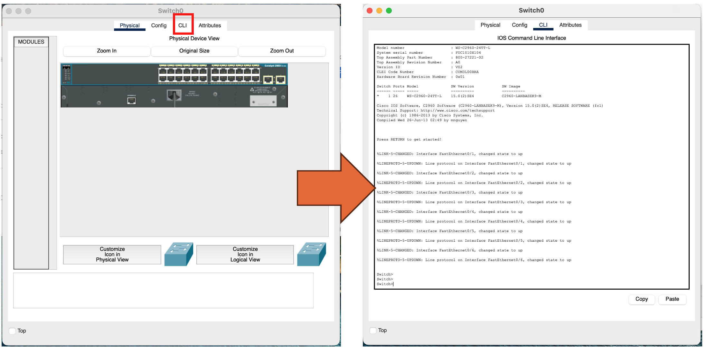<br>
  <em>図1b — スイッチ → <strong>CLI</strong> タブをクリックしてIOSコマンドラインに入ります。ステップA2〜A4はすべてここで入力します。</em>
</p>

### ステップA2 — VLANを作成する（両スイッチ）

**VLAN**（Virtual LAN）は、1台の物理スイッチを複数の独立したレイヤ2ネットワークに分割します — 各VLANはそれぞれが1つのブロードキャストドメインです。VLANを作成すると、それがスイッチの **VLANデータベース** に追加されます。`name` は人間向けのラベル（Admin/Sales/IT）にすぎず、スイッチとルータが実際にトラフィックのタグ付けに使うのは**番号**（10/20/30）です。

スイッチのCLIで次を入力します（2スイッチ構成を作る場合は、両スイッチがすべてのVLANを把握するよう、まったく同じブロックを**各**スイッチで繰り返します）:

```ios
Switch> enable
Switch# configure terminal
Switch(config)# vlan 10
Switch(config-vlan)# name Admin
Switch(config-vlan)# exit
Switch(config)# vlan 20
Switch(config-vlan)# name Sales
Switch(config-vlan)# exit
Switch(config)# vlan 30
Switch(config-vlan)# name IT
Switch(config-vlan)# end
```

<p align="center">
  <br>
  <em>図2 — 3つのVLANの作成。各 <code>vlan &lt;id&gt;</code> で <code>config-vlan</code> モードに入り、そこで <code>name</code> を設定します。<code>exit</code> でグローバルコンフィグに戻ります。</em>
</p>

`show vlan brief` で存在を確認します。この時点で、新しい3つのVLANは**active**ですが、**まだポートがありません** — すべてのアクセスポートは、ステップA3で割り当てるまで既定の **VLAN 1** にあります。

<p align="center">
  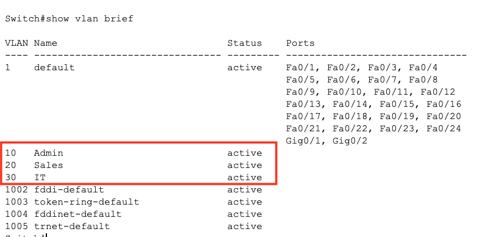<br>
  <em>図2b — <code>show vlan brief</code>：VLAN 10/20/30 は **active** です。すべての <code>Fa</code> ポートがまだVLAN 1 の下にあることに注目 — 次でそれらを移します。</em>
</p>

### ステップA3 — アクセスポートを割り当てる

**アクセスポート** はちょうど**1つ**のVLANを運びます — PCを差し込むポートです。アクセスポート上のフレームは**タグなし**で流れ、スイッチは内部的にそのポートがどのVLANに属するかを覚えています。`interface range` で複数ポートをまとめて設定でき、`switchport mode access` はポートをエンド機器用ポートとして固定します（トランクをネゴシエートしようとしなくなります）。各PCのポートを、アドレッシング計画に合う正しいVLANに入れます:

```ios
Switch(config)# interface range fa0/1-2
Switch(config-if-range)# switchport mode access
Switch(config-if-range)# switchport access vlan 10
Switch(config-if-range)# exit
Switch(config)# interface range fa0/3-4
Switch(config-if-range)# switchport mode access
Switch(config-if-range)# switchport access vlan 20
Switch(config-if-range)# exit
Switch(config)# interface range fa0/5-6
Switch(config-if-range)# switchport mode access
Switch(config-if-range)# switchport access vlan 30
```

<p align="center">
  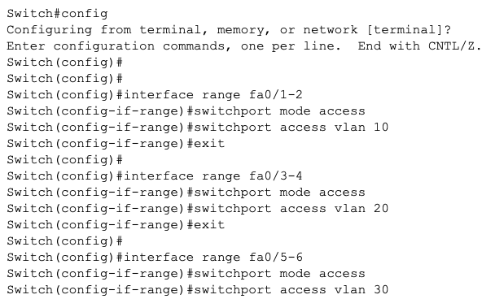<br>
  <em>図3 — アクセスポートの割り当て：<code>fa0/1-2</code>→VLAN 10、<code>fa0/3-4</code>→VLAN 20、<code>fa0/5-6</code>→VLAN 30。<code>show vlan brief</code> を再実行すると、それらのポートがVLAN 1 ではなく各VLANの下に表示されます。</em>
</p>

### ステップA4 — スイッチ間・スイッチ-ルータ間リンクをトランク化する

**トランクポート** は**すべて**のVLANを同時に運び、各フレームに **802.1Q** でVLAN IDを付けます。この単一スイッチ構成では、トランクにすべき唯一のリンクは **スイッチ → ルータ** のアップリンク（`Gig0/1`）です — Router-on-a-Stick が乗るケーブルです:

```ios
Switch(config)# interface gig0/1
Switch(config-if)# switchport mode trunk
```

> 💡 **アクセスポート** = 1つのVLAN（エンド機器向け）。**トランクポート** = 複数のVLAN（ここではスイッチ→ルータ、大規模設計ではスイッチ→スイッチも）。トランクのおかげで、1本のケーブルが Admin・Sales・IT のトラフィックを同時に運べます — 各フレームに802.1Qタグが押され、相手側がどのVLANに属するか分かるようになります。

> **2スイッチ拡張:** PCを2台のスイッチに分ける場合、**スイッチ間**のケーブルも*トランクにする必要があります* — **両**側のスイッチ間ポートで同じ `switchport mode trunk` を実行し、VLAN 10/20/30 が一方のスイッチから他方へ渡れるようにします。

<p align="center">
  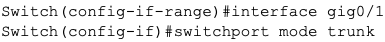<br>
  <em>図4 — スイッチ→ルータのアップリンク <code>Gig0/1</code> をトランクにする。</em>
</p>

`show interfaces trunk` で確認します。`Gig0/1` がカプセル化 **802.1q** で **trunking** になり、VLAN **1,10,20,30** が *allowed and active* として表示されるはずです。**ネイティブVLAN** は 1（タグなしフレームはVLAN 1 に落ちます）— このラボでは問題ありません。

<p align="center">
  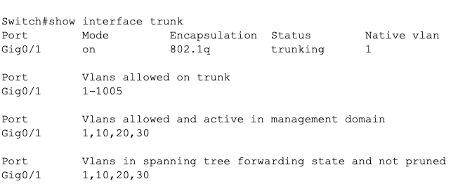<br>
  <em>図4b — <code>show interfaces trunk</code> が、<code>Gig0/1</code> がトランクとして VLAN 10/20/30（＋ネイティブVLAN 1）を実際に運んでいることを確認します。</em>
</p>

### ステップA5 — Router-on-a-Stick（インターVLANルーティング）

VLANは別々のネットワークなので、**ルータなしでは通信できません**。1本の物理リンク上で、ルータに **VLANごとに1つのサブインターフェース** を与えます — **Router-on-a-Stick（RoaS）** です。物理インターフェース（`g0/0`）自体はIPを持たず、`no shutdown` で起動するだけです。各**サブインターフェース**（`g0/0.10`、`g0/0.20`、`g0/0.30`）は `encapsulation dot1Q <vlan>` でタグ付けし、そのVLANの**ゲートウェイIP** — 各PCがデフォルトゲートウェイとして使うアドレス — を持ちます。

> ### 📡 このラボでルーティングがどう動くか
>
> **ルーティング = 宛先IPに基づいて、パケットをどのインターフェースから送り出すかを選ぶこと。** 2つのレイヤが2つの異なる仕事をしています:
>
> - **スイッチはレイヤ2。** 単一VLAN *内*のフレームをMACアドレスで動かすだけです。`192.168.10.x` から `192.168.20.x` へパケットを運ぶ手段はありません。
> - **ルータはレイヤ3。** サブネット（VLAN）*間*でパケットを動かすのがその仕事です。これがなければ、3つのVLANは3つの孤立した島です。
>
> **ルータが「地図」を得る場所:** 各サブインターフェースがVLANのサブネット*内*のIPを持つため、ルータは3つのネットワークすべてを**接続（`C`）ルート**として自動的に学習します — 手動の `ip route` は不要です。後で `show ip route`（図7）で確認できます。
>
> **VLANをまたぐ1回のping（Admin PC0 → Sales PC2）の経路:**
> 1. PC0 は宛先が別サブネットだと分かる → パケットを**デフォルトゲートウェイ** `192.168.10.1`（ルータの `g0/0.10`）へ送る。*（PC0がゲートウェイのMACをARPで解決する間、最初のpingはここでタイムアウトしがちです。）*
> 2. フレームは **VLAN 10** のタグが付いて**トランク** `Gig0/1` を渡る。
> 3. ルータはタグを外し、宛先 `192.168.20.3` で**ルーティング** → 接続ルート → `g0/0.20` から出す。
> 4. パケットを **VLAN 20** で再タグしてトランクへ戻し、スイッチがPC2へ届ける。
>
> **証拠 — `TTL=127`:** PCはTTL 128 で送信し、**ルータを1ホップ越えるごとに1減ります**。ステップA7の応答が127を示すのは、パケットがルータを**ちょうど1ホップ分ルーティングされた**動かぬ証拠です。同一VLANのトラフィック（ルーティングされずスイッチングされる）なら、依然として128のままです。

**ルータ**のCLIも同じ手順で開き（図1b）、セットアップダイアログをスキップします:

<p align="center">
  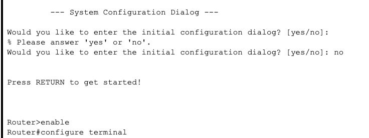<br>
  <em>図5a — 初期設定ダイアログに <code>no</code> と答え、RETURN を押し、<code>enable</code> → <code>configure terminal</code>。</em>
</p>

ではサブインターフェースを構築します:

```ios
Router> enable
Router# configure terminal
Router(config)# interface g0/0
Router(config-if)# no shutdown
Router(config-if)# exit

Router(config)# interface g0/0.10
Router(config-subif)# encapsulation dot1Q 10
Router(config-subif)# ip address 192.168.10.1 255.255.255.0
Router(config-subif)# exit
Router(config)# interface g0/0.20
Router(config-subif)# encapsulation dot1Q 20
Router(config-subif)# ip address 192.168.20.1 255.255.255.0
Router(config-subif)# exit
Router(config)# interface g0/0.30
Router(config-subif)# encapsulation dot1Q 30
Router(config-subif)# ip address 192.168.30.1 255.255.255.0
Router(config-subif)# end
```

> **`encapsulation dot1Q 10`** はサブインターフェースに「ここのフレームはVLAN 10 に属する — それに従って802.1Qタグを読み書きせよ」と伝えます。これが、1本の物理線が3つのゲートウェイを兼ねる仕組みです。サブインターフェース番号（`.10`）は慣習上のラベルにすぎず、実際にVLANへ結び付けているのは `encapsulation dot1Q` の値です。

<p align="center">
  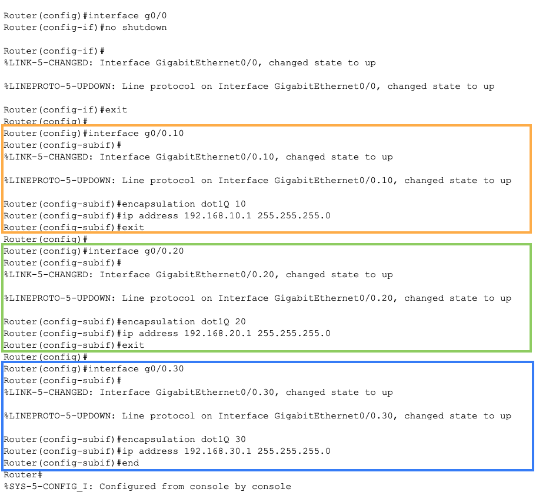<br>
  <em>図5 — 作成中の3つのサブインターフェース：それぞれ独自の <code>encapsulation dot1Q</code> タグとゲートウェイIPを持ち、すべて単一の物理 <code>g0/0</code> 上にあります。</em>
</p>

`show ip interface brief` で確認します: 物理 `GigabitEthernet0/0` は **up/up**（ただしアドレス未割り当て）、`g0/0.10/.20/.30` はそれぞれゲートウェイIPを持ち **up/up** と表示されます。

<p align="center">
  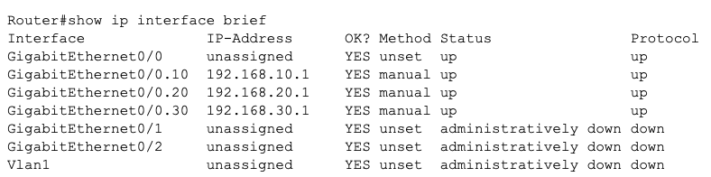<br>
  <em>図5b — <code>show ip interface brief</code>：各サブインターフェースが <code>.1</code> ゲートウェイアドレスで up です。サブインターフェースが <strong>down/down</strong> と表示されたら、物理 <code>g0/0</code> の <code>no shutdown</code> を忘れています。</em>
</p>

### ステップA6 — VLANごとのDHCP

IPを手入力する代わりにPCが自動アドレッシングするよう、各VLANに専用のDHCPプールを与えます。同じ `ip dhcp pool` のパターンをVLANごとに1つずつ: `network` は配布するサブネットを定義し、`default-router` はクライアントが受け取るゲートウェイ — まさにステップA5で設定したサブインターフェースのIPです。（任意で、DNSアドレス用に `dns-server` を、リースしたくないIPを予約する `ip dhcp excluded-address` を追加できます。）

```ios
Router(config)# ip dhcp pool VLAN10
Router(dhcp-config)# network 192.168.10.0 255.255.255.0
Router(dhcp-config)# default-router 192.168.10.1
Router(dhcp-config)# exit
Router(config)# ip dhcp pool VLAN20
Router(dhcp-config)# network 192.168.20.0 255.255.255.0
Router(dhcp-config)# default-router 192.168.20.1
Router(dhcp-config)# exit
Router(config)# ip dhcp pool VLAN30
Router(dhcp-config)# network 192.168.30.0 255.255.255.0
Router(dhcp-config)# default-router 192.168.30.1
Router(dhcp-config)# end
```

<p align="center">
  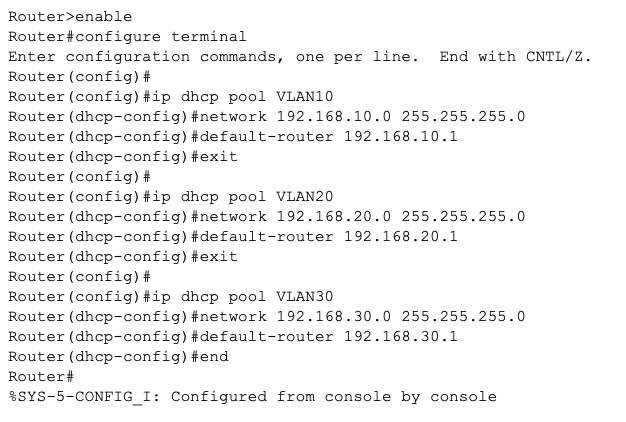<br>
  <em>図6 — ルータ上の3つのDHCPプール（VLAN10/20/30）。それぞれ自分のサブネットを配り、対応するゲートウェイを <code>default-router</code> として渡します。</em>
</p>

次に各PCを **DHCP** に設定します: PCをクリック → **Config** タブ → **FastEthernet0**（または **Desktop → IP Configuration**）→ **DHCP** を選択。PCが要求をブロードキャストし、ルータが正しいプールから応答し、アドレス＋ゲートウェイが自動で現れます。

<p align="center">
  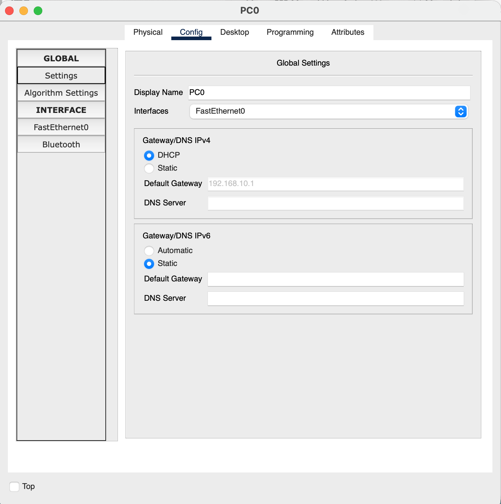<br>
  <em>図6b — PC0 を <strong>DHCP</strong> に切り替え：デフォルトゲートウェイ <code>192.168.10.1</code> 付きで <code>192.168.10.0/24</code> 内のアドレスを取得 — VLAN 10 のプールとゲートウェイが正しく配線されている証拠です。</em>
</p>

### ステップA7 — テストと確認

1. **インターVLAN ping:** **Admin** のPCから **Sales** のPCへ `ping` → *ルータ経由で*成功するはず。
2. スイッチ／ルータで次の `show` コマンドにより構成を確認します:

   | コマンド | 何を確認するか |
   |:---|:---|
   | `show vlan brief` | どのポートがどのVLANにあるか |
   | `show interfaces trunk` | どのリンクがトランクか＋許可VLAN |
   | `show ip interface brief` | サブインターフェースがゲートウェイIPで up か |
   | `show ip route` | 3つの接続VLANサブネット |

<p align="center">
  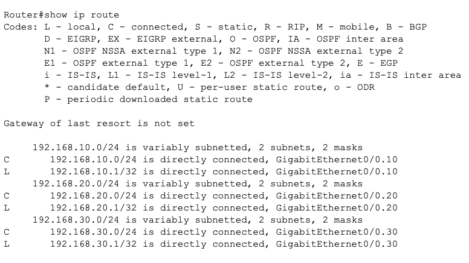<br>
  <em>図7 — <code>show ip route</code>：ルータは各VLANサブネットについて、サブインターフェース経由の <strong>C</strong>（connected）と <strong>L</strong>（local）ルートを持ちます。これら接続ルートこそが、VLAN間転送を可能にしています。</em>
</p>

いよいよ本番のテスト — VLANを**またいで**pingします。**Admin** のPC（VLAN 10）から **Sales** のPC（VLAN 20）へ:

<p align="center">
  <br>
  <em>図7b — Admin <code>→</code> Sales の ping。**最初**の要求は、PCがゲートウェイをARPする間タイムアウトしがちですが、残りは **0% loss** で応答します。<code>TTL=127</code>（128ではない）は、パケットが**1ホップ ルーティングされた**ことを示し — ルータがTTLを1減らした、つまりインターVLANルーティングが効いた証拠です。</em>
</p>

<p align="center">
  <br>
  <em>図7c — 逆方向 Sales <code>→</code> Admin も 0% loss — トラフィックは双方向に流れます。</em>
</p>

<p align="center">
  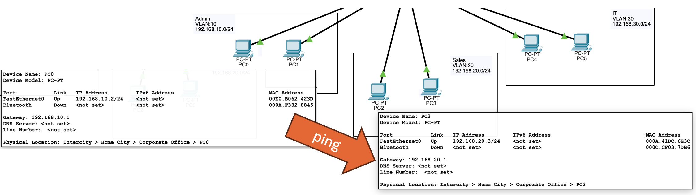<br>
  <em>図7d — 同じpingをトポロジ上で見たもの：2台のPCは別々のVLAN／サブネットにありながら、Router-on-a-Stick を通じて互いに到達します。</em>
</p>

> 💡 **なぜ最初のpingが落ちるか:** 送信元PCはまだゲートウェイのMACを持たないため、ARP要求を送り、最初のICMPエコーは応答到着前に期限切れになります。これは正常で、*継続的*な失敗だけが設定ミスを意味します（[Q4 のトラブルシューティング解答](#ラボa-確認問題)を参照）。

### ラボA 確認問題

**まず自分で考え、それから「解答を見る」をクリック。**

**Q1.** **アクセスポート** と **トランクポート** の違いは？

<details>
<summary>💡 解答を見る</summary>

**アクセスポート** は**1つのVLAN**に属し、エンド機器（PC）に接続します — フレームは**タグなし**で出ます。**トランクポート** はスイッチ間（およびスイッチ→ルータ）で**複数のVLAN**を運び、各フレームに802.1Q VLAN IDを**タグ付け**して、相手側がどのVLANに属するか分かるようにします。
</details>

**Q2.** 同じスイッチ群上にあるのに、なぜ Admin のPCは**ルータなしで** Sales のPCに到達できないのか？

<details>
<summary>💡 解答を見る</summary>

VLANは**別々のブロードキャストドメイン＝別々のIPサブネット**です。レイヤ2スイッチングはVLAN *内*でしかフレームを動かしません。VLAN 10 のサブネットからVLAN 20 のサブネットへ越えるには**レイヤ3ルーティング**が必要で、それを提供するのがルータのサブインターフェース（VLANごとのゲートウェイ）です。ルータがなければ、インターVLANトラフィックはありません。
</details>

**Q3.** サブインターフェース `g0/0.20` 上の **`encapsulation dot1Q 20`** は何をするのか？

<details>
<summary>💡 解答を見る</summary>

そのサブインターフェースを **VLAN 20** に結び付け、トランク上でVLAN 20 の **802.1Qタグを付与／読み取り** するよう指示します。これにより、**単一の物理インターフェース**が複数VLANのゲートウェイを同時に務められます（Router-on-a-Stick）— 各サブインターフェースが1つのVLANのタグ付きトラフィックを扱います。
</details>

**Q4.** `show vlan brief` で、あるPCがゲートウェイに到達できない。まず確認すべきは？

<details>
<summary>💡 解答を見る</summary>

PCの**スイッチポートが正しいVLANにあるか**（かつ `access` モードか）を確認します。よくあるミスは、ポートがVLAN 1 に既定のままだったり、トランクのまま残っていたりすることです。あわせて、ルータへの**トランク**が up で**そのVLANを許可**しているか、ルータのそのVLAN用サブインターフェースが設定され `no shutdown` されているかも確認します。
</details>

---

## 演習プラクティス

まず基本ラボが完成していることを確認 — スモールオフィスネットワークが既に次をできるはずです:

- [ ] スイッチに3つのVLANを作成済み；PCポートが正しいVLANにある（`show vlan brief`）
- [ ] スイッチ→ルータのアップリンクがVLAN 10/20/30 を運ぶ**トランク**である（`show interfaces trunk`）
- [ ] Router-on-a-Stick のサブインターフェースが up；**インターVLAN pingが成功する**
- [ ] 各VLANがDHCPアドレスを自動で取得する

ではこれを拡張します。各演習はいま作ったラボの上に積み上がります — **試してから、記載の `show`／ping コマンドで結果を確認**してください。

### 演習1 — 4つ目のVLAN（Guest）を追加する

**VLAN 40「Guest」、`192.168.40.0/24`、ゲートウェイ `192.168.40.1`** を端から端まで追加します: VLANを作成し、`fa0/7` をそれに入れ（アクセスモード）、ルータのサブインターフェース `g0/0.40` を `encapsulation dot1Q 40` で追加し、DHCPプール `VLAN40` を追加。DHCP設定の新しいPCを差し込みます。

> ✅ **確認:** 新しいPCが `192.168.40.x` のアドレスを取得し、Admin のPCにpingできる。`show ip route` に4つ目の接続サブネットが載る。
>
> 💡 *ヒント:* これは既にやった**同じ4ステップ**（A2 → A3 → A5 → A6）を、番号40でやるだけです。

### 演習2 — 「サーバ」ネットワークへのスタティックルート

サーバサブネット `10.0.0.0/24` を表す2台目のルータ（またはループバック）を追加し、メインのルータにそこへの**スタティックルート**を与えます:

```ios
Router(config)# ip route 10.0.0.0 255.255.255.0 <next-hop-ip>
```

> ✅ **確認:** `show ip route` に `10.0.0.0/24` の **`S`**（static）エントリが表示され、VLANのPCからそのネットワークへpingできる。
>
> 💡 *ヒント:* スタティックルートは「*この*宛先に届けるには、*あの*ネクストホップへパケットを送れ」と言います。VLANが既に持つ自動の **`C`** 接続ルートと比べてみましょう。

### 演習3 — ポートセキュリティ（アクセスポートあたりMAC 1つ）

不正な機器がポートを乗っ取れないよう、各 Admin アクセスポートを単一のMACアドレスにロックします:

```ios
Switch(config)# interface range fa0/1-2
Switch(config-if-range)# switchport port-security
Switch(config-if-range)# switchport port-security maximum 1
Switch(config-if-range)# switchport port-security violation shutdown
```

> ✅ **確認:** `show port-security interface fa0/1`。PCを別のものに交換（またはMACを変更）し、ポートが **err-disabled** になることを確認します。

### 演習4 — ACL：Guest VLANを隔離する

**Guest VLAN（40）** がインターネット／サーバネットワークには到達できるが Admin（10）には**到達できない**よう、標準／拡張ACLを書き、`g0/0.40` に適用します。

> ✅ **確認:** Guest のPCはサーバサブネットにはpingできるが、Admin のPCへのpingは**失敗**する（「Destination host unreachable」）。一方で Admin↔Sales は引き続き動作する。
>
> 💡 *ヒント:* ルールの定義に `access-list`、サブインターフェースへの適用に `ip access-group <n> in`。末尾の暗黙の `deny any` を忘れずに。

### 演習5 — 壊して直す（トラブルシューティング演習）

同級生（または未来の自分）に**1つ**だけ障害を仕込んでもらい、`show` コマンドだけで診断します:

| 仕掛け | 現れる症状 | 見つける `show` |
|:---|:---|:---|
| `fa0/1` を誤ったVLANに入れる | PCがゲートウェイに届かない | `show vlan brief` |
| ルータの `g0/0` を `shutdown` | *すべて*のインターVLAN pingが失敗 | `show ip interface brief` |
| サブインターフェースの `encapsulation` 番号を変える | 1つのVLANがルーティングできない | `show running-config` |
| アップリンクを `access` モードに戻す | トランク越しに1つのVLANしか動かない | `show interfaces trunk` |

> ✅ **ゴール:** 何が変えられたかを**見ずに**障害を見つけて直す — これがまさに現実のネットワークトラブルシューティングのやり方です。

---

📸 各演習の確認出力のスクリーンショットを、レポート用に [`S4/img/`](./img/) に保存しましょう。

---

## ラボB — ルーティング比較（スタティック vs RIP vs OSPF）

**目的:** **1つ**の小さな3ルータネットワークを構築し、`PC1` から `PC3` へ**3通りの方法**で到達させる — 手入力の**スタティック**ルート、次に **RIP**、次に **OSPF** — を*同じ*トポロジ上で行う。配線もIPも同じで、変わるのはルーティング方式だけ。だから各方式のトレードオフを直接体感できます。

> [!IMPORTANT]
> 肝心なのは**比較**です。ステージ間でラボを壊さないでください — 同じルータ上で、前の方式を*削除*し次の方式を*追加*して、`show ip route` と `traceroute` を再実行し、何が変わったかを見ます。

> [!TIP]
> ルーティングテーブルの左端の**コード文字**がスコアボードです: **`C`** connected、**`S`** static、**`R`** RIP、**`O`** OSPF。方式を切り替えるたびに、2つのリモートLANのコードが `S` → `R` → `O` と変わるのを見ましょう。

### アドレッシング計画

3台のルータを**三角形**に（各ルータが他の2台とリンク — その冗長性が後でOSPFの再収束をデモできる理由です）。`PC1` は `R1` の背後、`PC3` は `R3` の背後にあり、`R2` は中継ルータです。

| 機器 | インターフェース | IP / マスク | 接続先 |
|:---|:---|:---|:---|
| **R1** | `Gig0/0` | `192.168.1.1 /24` | PC1 LAN |
| | `Gig0/1` | `10.0.12.1 /30` | R2 |
| | `Gig0/2` | `10.0.13.1 /30` | R3 |
| **R2** | `Gig0/1` | `10.0.12.2 /30` | R1 |
| | `Gig0/2` | `10.0.23.1 /30` | R3 |
| **R3** | `Gig0/0` | `192.168.3.1 /24` | PC3 LAN |
| | `Gig0/1` | `10.0.23.2 /30` | R2 |
| | `Gig0/2` | `10.0.13.2 /30` | R1 |
| **PC1** | `Fa0` | `192.168.1.10 /24`、GW `192.168.1.1` | R1 |
| **PC3** | `Fa0` | `192.168.3.10 /24`、GW `192.168.3.1` | R3 |

> `/30` リンクは `255.255.255.252`（使用可能ホストは2つ — ポイントツーポイントのルータ間リンクに最適）を使います。到達したい2つのLANは **`192.168.1.0/24`**（PC1）と **`192.168.3.0/24`**（PC3）です。

### ステップB1 — トポロジを構築する

**ルータ3台**（`2911`）と**PC2台**を配置します。`2911` にはGigabitポートが3つ（`Gig0/0–0/2`）あり — 三角形＋LANにちょうど足ります。**Copper Straight-Through（ストレート）** でケーブルします:

- PC1 ↔ R1 `Gig0/0`、PC3 ↔ R3 `Gig0/0`
- R1 `Gig0/1` ↔ R2 `Gig0/1`（R1–R2リンク）
- R2 `Gig0/2` ↔ R3 `Gig0/1`（R2–R3リンク）
- R1 `Gig0/2` ↔ R3 `Gig0/2`（直結のR1–R3リンク — これがバックアップ経路）

> 💡 ルータのインターフェースは**既定で管理ダウン**です。ステップB2で `no shutdown` するまで、すべてのリンクは**赤**のままです — これは配線不良ではなく想定どおりです。

<p align="center">
  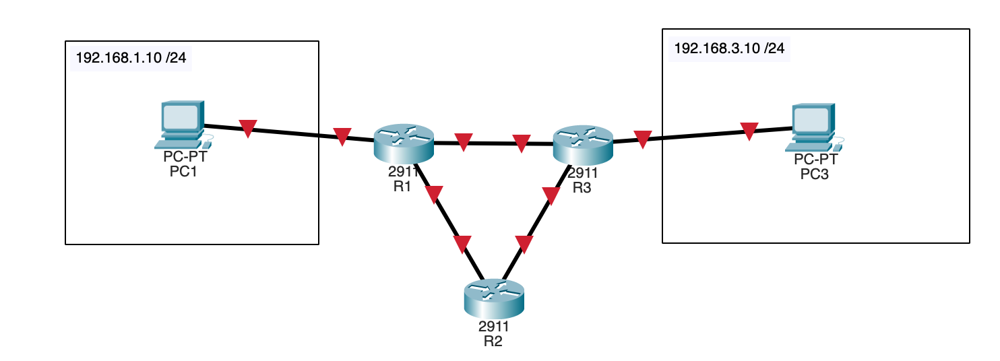<br>
  <em>図B1 — ラボBのトポロジ。<code>PC1</code>（<code>192.168.1.10/24</code>）は <code>R1</code> の背後、<code>PC3</code>（<code>192.168.3.10/24</code>）は <code>R3</code> の背後にあり、<code>R2</code> は中継ルータです。3台のルータは**三角形**をなすので、R1からR3への道は**2つ** — 直結の <code>10.0.13.0/30</code> リンクと、R2を回る長い道があります。この冗長性こそ、ステージ3でOSPFの再収束をデモできる理由です。ここではインターフェースがまだシャットダウン中なので、すべてのリンクが**赤**で表示されています。</em>
</p>

📸 *トポロジと各ステージの `show ip route` / `traceroute` 出力を、レポート用に [`S4/img/`](./img/) にキャプチャしましょう。*

### ステップB2 — 基本アドレッシング（一度だけ実施）

この部分は**3ステージすべてで同一**です — インターフェースをIP付きで起動するだけ。ルーティングはその*後*。各ルータの **CLI** タブを開き、そのブロックを入力します。

**R1:**
```ios
Router> enable
Router# configure terminal
Router(config)# hostname R1
R1(config)# interface g0/0
R1(config-if)# ip address 192.168.1.1 255.255.255.0
R1(config-if)# no shutdown
R1(config-if)# exit
R1(config)# interface g0/1
R1(config-if)# ip address 10.0.12.1 255.255.255.252
R1(config-if)# no shutdown
R1(config-if)# exit
R1(config)# interface g0/2
R1(config-if)# ip address 10.0.13.1 255.255.255.252
R1(config-if)# no shutdown
R1(config-if)# end
```

**R2:**
```ios
Router(config)# hostname R2
R2(config)# interface g0/1
R2(config-if)# ip address 10.0.12.2 255.255.255.252
R2(config-if)# no shutdown
R2(config-if)# exit
R2(config)# interface g0/2
R2(config-if)# ip address 10.0.23.1 255.255.255.252
R2(config-if)# no shutdown
R2(config-if)# end
```

**R3:**
```ios
Router(config)# hostname R3
R3(config)# interface g0/0
R3(config-if)# ip address 192.168.3.1 255.255.255.0
R3(config-if)# no shutdown
R3(config-if)# exit
R3(config)# interface g0/1
R3(config-if)# ip address 10.0.23.2 255.255.255.252
R3(config-if)# no shutdown
R3(config-if)# exit
R3(config)# interface g0/2
R3(config-if)# ip address 10.0.13.2 255.255.255.252
R3(config-if)# no shutdown
R3(config-if)# end
```

**PC1**（`192.168.1.10`、マスク `255.255.255.0`、ゲートウェイ `192.168.1.1`）と **PC3**（`192.168.3.10` / `255.255.255.0` / `192.168.3.1`）を **Desktop → IP Configuration** で固定設定します。

> ✅ **チェックポイント:** 各ルータの `show ip interface brief` で、使用中の全インターフェースが **up/up**。`show ip route` を実行すると、そのルータ*自身*のリンクに対する **`C`/`L`**（connected/local）ルートだけが見えます。**PC1 → PC3 のpingはまだ失敗** — どのルータも*相手*側のLANへの到達方法を知らないからです。それが、次の3ステージがそれぞれ別の方法で解決する問題です。

<p align="center">
  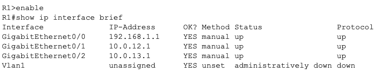<br>
  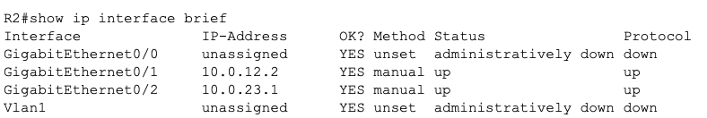<br>
  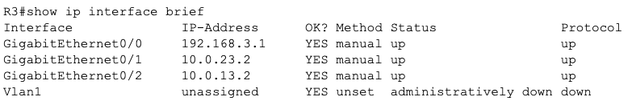<br>
  <em>図B2 — ステップB2後の R1・R2・R3 の <code>show ip interface brief</code>。ケーブルが付いた各インターフェースは、計画どおりのアドレスで **up / up** を表示します（R2は2本のリンクしか使わないので、<code>g0/0</code> は*管理ダウン*のまま）。常に存在する <code>Vlan1</code> はここでは未使用 — 無視してください。<strong>Status</strong> = レイヤ1（線が上がっているか）、<strong>Protocol</strong> = レイヤ2（線が使えるか）。ルーティングが動く前に、両方が <em>up</em> でなければなりません。</em>
</p>

<p align="center">
  <br>
  <em>図B2b — チェックポイントの失敗、そしてこれが*想定どおり*の結果です。PC1 からの <code>ping 192.168.3.10</code> は <strong>「Reply from 192.168.1.1: Destination host unreachable」</strong> を返します — 応答がPC3からではなく <strong>R1自身のゲートウェイIP</strong> から来ていることに注目。R1はパケットを受け取ったが、<code>192.168.3.0/24</code> LANへの<strong>ルートがない</strong>ので破棄し、その旨をPC1に伝えています。次の3ステージはそれぞれ別の方法でこれを直します。</em>
</p>

### ステージ1 — スタティックルーティング

各ルータに、すべてのリモートネットワークを `ip route <dest> <mask> <next-hop>` で**手作業**で教えます。PC1 ↔ PC3 を動かすため、各LANを相手側へ向けてルーティングします。**直結のR1–R3リンク**を経路に使います:

**R1** — PC3のLANへR3経由で到達:
```ios
R1(config)# ip route 192.168.3.0 255.255.255.0 10.0.13.2
```

**R3** — PC1のLANへR1経由で到達:
```ios
R3(config)# ip route 192.168.1.0 255.255.255.0 10.0.13.1
```

> ✅ **確認:** R1 の `show ip route` に **`S`** エントリ `192.168.3.0/24 [1/0] via 10.0.13.2` が載ります — **AD 1** に注目。**PC1 から 192.168.3.10 へ** の `ping`／`traceroute` が成功し、トレースは `10.0.13.2`（R3）からPC3 — 直結のR1→R3リンクを示します。

<p align="center">
  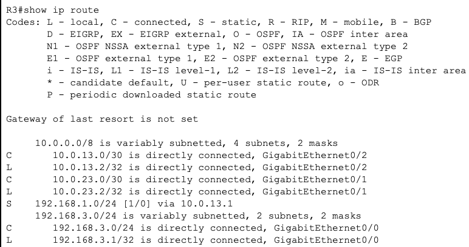<br>
  <em>図B3 — <strong>R3</strong> から見たスタティックルート：<code>S&nbsp;&nbsp;192.168.1.0/24 [1/0] via 10.0.13.1</code>。<strong>S</strong> コード = 手入力のスタティック。<code>[1/0]</code> = <strong>アドミニストレイティブディスタンス 1</strong>（スタティックは最も信頼される情報源）とメトリック 0。それ以外はすべて <strong>C</strong>/<strong>L</strong> のまま — 手で追加したのは1つのリモートLANだけです。R1 は鏡像の <code>S&nbsp;192.168.3.0/24 via 10.0.13.2</code> を持ちます。</em>
</p>

<p align="center">
  
  <br>
  <em>図B3b — <strong>左:</strong> 2回目の <code>ping</code> は **0% loss** でPC3に届きます（最初の試行は、ARPがネクストホップを解決する間に2パケット落とします）。<strong>TTL=126</strong> が証拠です: PC1は128で送り、**2台のルータ**（R1 → R3）がそれぞれ1ずつ減らします。<strong>右:</strong> <code>tracert</code> が経路を明示 — ホップ1 <code>192.168.1.1</code>（R1）、ホップ2 <code>10.0.13.2</code>（直結リンク上のR3）、ホップ3 <code>192.168.3.10</code>（PC3）。</em>
</p>

> 💡 **スタティックのコストを体感する:** これはたった*2つ*のネットワークなのに、もう正確なネクストホップを指す手入力の2行が必要でした。PC2のLANや4台目のルータを足せば、**すべて**のルータを手で編集することになり — しかも `10.0.13.0` リンクが死んでも何もフェイルオーバーしません。その苦痛こそ、ダイナミックルーティングが存在する理由のすべてです。

**ステージ2の前に、RIPが学習する内容を隠さないよう、スタティックルートを削除します:**
```ios
R1(config)# no ip route 192.168.3.0 255.255.255.0 10.0.13.2
R3(config)# no ip route 192.168.1.0 255.255.255.0 10.0.13.1
```

### ステージ2 — RIP（ダイナミック、ディスタンスベクタ）

今度はルータが**互いに自分のネットワークを広告し**、残りを自動で学習します。RIPのメトリックは**ホップカウント**（最大15；16 = 到達不能）、アドミニストレイティブディスタンスは **120** です。

> ### RIPv1 vs RIPv2 — そしてなぜ `version 2` を強制するか
>
> RIPには2つのバージョンがあり、このラボではその違いが効いてきます:
>
> | | **RIPv1**（1988年、RFC 1058） | **RIPv2**（RFC 2453） |
> |:---|:---|:---|
> | **更新内のサブネットマスク** | ❌ **なし** — クラスフルのみ | ✅ **あり** — プレフィックスを運ぶ（VLSM/CIDR） |
> | **更新の送り方** | **ブロードキャスト** `255.255.255.255` | **マルチキャスト** `224.0.0.9`（より静か） |
> | **認証** | なし | 任意（平文 / MD5） |
> | **位置づけ** | レガシー／旧式 | 実際に使うバージョン |
>
> 決定的な違いは**サブネットマスク**です。このラボのリンクはプレフィックスの混在 — `/24` のLANと `/30` のルータ間リンク — で、いずれもクラスフル境界に乗らないネットワークから切り出されています。**RIPv1 はマスクを運べない**ので、受信側ルータはクラスフルの既定値（`10.0.0.0` → `/8`、`192.168.x.0` → `/24`）を*推測*するだけで、`/30` リンクは壊れます。**RIPv2 はすべての経路に本物のマスクを付けて送る**ので、VLSMが機能します。だからこそ、各ルータに明示的な `version 2` を入れます。
>
> 2つの対になるコマンドがRIPv2を正しく振る舞わせます:
> - **`version 2`** — v2の更新のみ送受信する（既定ではCiscoルータはv1を*送り*、両方を*受ける*ため、気づかぬ不一致の元になります）。
> - **`no auto-summary`** — ネットワーク境界でRIPがクラスフル境界に自動集約するのを止めます。これがないと、3本の `10.0.x.x /30` リンクが1つの `10.0.0.0/8` 広告に潰れ、ルータが区別できなくなります。

3台すべてでRIPv2を有効化し、各ルータの*直接接続された*クラスフルネットワークを列挙します:

**R1:**
```ios
R1(config)# router rip
R1(config-router)# version 2
R1(config-router)# no auto-summary
R1(config-router)# network 192.168.1.0
R1(config-router)# network 10.0.0.0
```

**R2:**
```ios
R2(config)# router rip
R2(config-router)# version 2
R2(config-router)# no auto-summary
R2(config-router)# network 10.0.0.0
```

**R3:**
```ios
R3(config)# router rip
R3(config-router)# version 2
R3(config-router)# no auto-summary
R3(config-router)# network 192.168.3.0
R3(config-router)# network 10.0.0.0
```

> 💡 RIPの `network` コマンドは**クラスフル**アドレスを取るので、`network 10.0.0.0` は3本の `10.0.x.x /30` リンク*すべて*を1行でカバーします。`no auto-summary` は、クラスフル `10.0.0.0` 境界をまたいで `/30` と `/24` のプレフィックスをそのまま保ちます。

> ✅ **確認:** 約30秒待ってから R1 の `show ip route` を見ると、`192.168.3.0/24` が **`R`** ルート — `[120/1]` = **AD 120、1ホップ**（直結のR1→R3経路を学習；R2経由なら2ホップで負ける）— として現れます。`show ip protocols` がRIPの動作と広告ネットワークを確認します。PC1 → PC3 が再び通ります — ただし今回は**誰も経路を打っていません**。

<p align="center">
  <br>
  <em>図B4 — RIP下のR1のテーブル。2つのリモートネットワークが今や <strong>R</strong> コードを持ちます: <code>R&nbsp;192.168.3.0/24 [120/1] via 10.0.13.2</code> と、<strong>両方</strong>のアップリンク越しに学習した <code>R&nbsp;10.0.23.0/30 [120/1]</code>（RIPは等コスト経路をロードバランスします）。<code>[120/1]</code> = <strong>AD 120、1ホップ</strong>。<code>00:00:23</code> のフィールドは最後の更新からの経過時間 — RIPは<strong>30秒</strong>ごとに更新するので、30まで数えてリセットします。もし180秒（invalidタイマー）を超えたら、その経路は消えかけています。図B3と比べてください: 宛先は同じでも、手で打つ代わりに自動で学習されています。</em>
</p>

**ステージ3の前に、RIPをオフにします:**
```ios
R1(config)# no router rip
R2(config)# no router rip
R3(config)# no router rip
```

### ステージ3 — OSPF（ダイナミック、リンクステート）＋ 再収束

OSPFはトポロジの完全な**地図**を構築し、**コスト**（リンク帯域から導出）で経路を選びます。アドミニストレイティブディスタンスは **110**。ネットワークは**ワイルドカードマスク**で照合され、**エリア**に置かれます（バックボーンの `area 0` を使います）。3台すべてで有効化します:

**R1:**
```ios
R1(config)# router ospf 1
R1(config-router)# network 192.168.1.0 0.0.0.255 area 0
R1(config-router)# network 10.0.12.0 0.0.0.3 area 0
R1(config-router)# network 10.0.13.0 0.0.0.3 area 0
```

**R2:**
```ios
R2(config)# router ospf 1
R2(config-router)# network 10.0.12.0 0.0.0.3 area 0
R2(config-router)# network 10.0.23.0 0.0.0.3 area 0
```

**R3:**
```ios
R3(config)# router ospf 1
R3(config-router)# network 192.168.3.0 0.0.0.255 area 0
R3(config-router)# network 10.0.23.0 0.0.0.3 area 0
R3(config-router)# network 10.0.13.0 0.0.0.3 area 0
```

> 💡 **ワイルドカードマスク** はサブネットマスクの反転です: `/30` → `0.0.0.3`、`/24` → `0.0.0.255`。各 `network` 文に*どのインターフェース*が該当するかをOSPFに伝えます。コンソールを見てください — 近隣が互いを発見するにつれ、**隣接（adjacency）** メッセージ（`FULL`）が表示されます。

> ✅ **確認:** R1 の `show ip route` で `192.168.3.0/24` が **`O`** ルート `[110/2]` として現れます — **AD 110**、そして**コスト**2（直結R1→R3経路上の2本のGigEリンク：そのリンク＋R3のLAN）。`show ip ospf neighbor` が隣接を **FULL** 状態で列挙します。PC1 → PC3 は引き続き通ります。

<p align="center">
  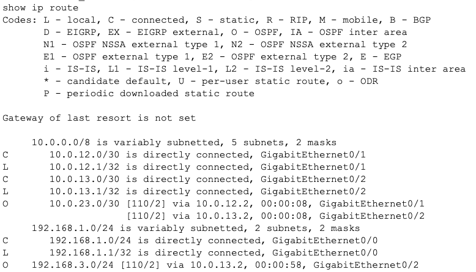<br>
  <em>図B5 — 同じR1のテーブルが、今度はOSPF下に。リモートネットワークが <strong>O</strong> コードに変わります: <code>O&nbsp;192.168.3.0/24 [110/2] via 10.0.13.2</code>。<code>[110/2]</code> = <strong>AD 110</strong>（RIPの120より小さいので、両方動けばOSPFが勝つ）とコスト2 — OSPFのメトリックはホップ数ではなく帯域由来です。3ステージを通じて、まさに同じ宛先のコードが <strong>S → R → O</strong> と進むのを見ましょう。変わったのは*方式*だけで、接続の <strong>C</strong>/<strong>L</strong> ルートは一度も動いていません。</em>
</p>

**ご褒美 — OSPFが再収束するのを見る。** 直結のR1↔R3リンクが現在のアクティブ経路です。では**それを壊して**、OSPFが自動で復旧するのを見ます:

```ios
R1(config)# interface g0/2
R1(config-if)# shutdown
```

> ✅ **確認:** 数秒以内に R1 の `show ip route` が `192.168.3.0/24` を **R2経由**で再インストールします（`[110/3]` — `10.0.12.2` 経由で今や3ホップ分のコスト）。PC1からPC3への `traceroute` は、以前はなかった**R2を通る余分なホップ**を示します。**誰もルーティングコマンドに触れていません** — OSPFが地図を再計算し、自力で再ルーティングしました。`no shutdown` でリンクを戻すと、直結経路に復帰します。*スタティックルーティングならここで単に通信が途絶えていたはずです。*

<p align="center">
  <br>
  <em>図B6 — 再収束の瞬間。<code>g0/2</code> をシャットすると <code>%OSPF-5-ADJCHG: ... Nbr 192.168.3.1 ... from FULL to DOWN</code> が出力 — R1は近隣が消えたことを即座に検知します。続く <code>do show ip route</code> は、コストが <code>O&nbsp;192.168.3.0/24 [110/<strong>3</strong>] via 10.0.12.2</code> に上がったことを示します: 経路は今やR1→R2→R3 を通り、死んだ <code>10.0.13.0/30</code> リンクはテーブルから完全に消えています。</em>
</p>

<p align="center">
  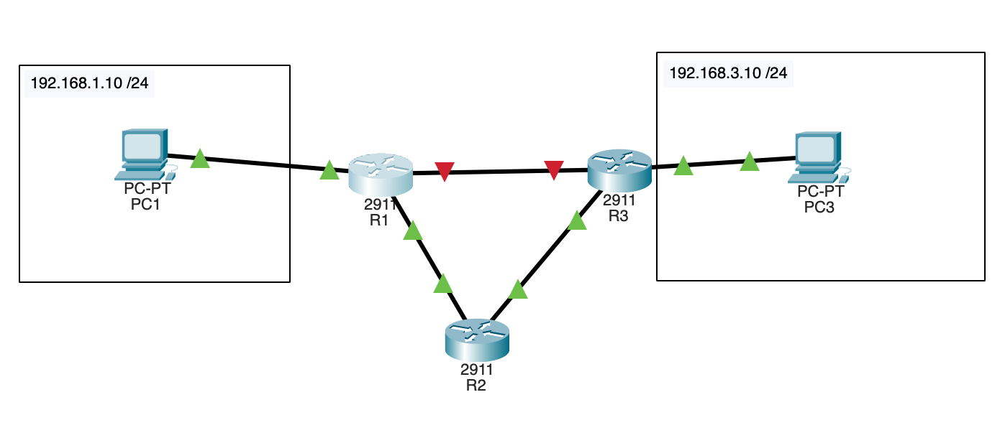<br>
  <em>図B6b — 復旧したトポロジ。直結のR1↔R3リンクは<strong>赤（ダウン）</strong>ですが、他のすべてのリンクは<strong>緑</strong>で、PC1は依然PC3に届きます — トラフィックは単にR2へ迂回します。この自己修復こそが<strong>再収束</strong>の意味で、設定コストはゼロでした。</em>
</p>

<p align="center">
  <br>
  <em>図B6c — PC1からの、破断前と後を1枚で示す証拠。<strong>上</strong>（直結リンク up）: 3ホップ — <code>192.168.1.1 → 10.0.13.2 → 192.168.3.10</code>。<strong>下</strong>（直結リンク down）: 4ホップ — <code>192.168.1.1 → 10.0.12.2 → 10.0.23.2 → 192.168.3.10</code>、R2を通る新しい迂回が可視化されています。この増えた1行*こそ*が再ルーティングです。</em>
</p>

### スタティック vs RIP vs OSPF — 横並び比較

| | **スタティック** | **RIP** | **OSPF** |
|:---|:---|:---|:---|
| **`show ip route` のコード** | `S` | `R` | `O` |
| **アドミニストレイティブディスタンス** | **1** | **120** | **110** |
| **メトリック** | なし（ネクストホップを自分で選ぶ） | **ホップカウント**（最大15） | **コスト**（帯域ベース） |
| **経路の設定方法** | ルータごとに手入力 | ルータが広告・学習 | ルータがリンクステートの地図をフラッド |
| **リンク障害への反応** | ❌ なし — 手動修正 | ✅ あり（遅い、〜数分） | ✅ あり（速い、数秒） |
| **設定の手間 / スケーリング** | ネットワークごとに増える | 低 | 低（初期設定は多いが、最もスケールする） |
| **適する規模** | 極小 / スタブネットワーク | 小規模ネットワーク | 中〜大規模ネットワーク |

> [!NOTE]
> 3つとも、各ルータには**同じ** `C`/`L` 接続ルートを置きます — それらは決して変わりません。違うのは、**リモート**LAN（`192.168.1.0` と `192.168.3.0`）がどう学習されるか、そしてリンクが落ちたとき何が起こるかです。それがこの表に詰まったレッスンのすべてです。

### ラボB 確認問題

**まず自分で考え、それから「解答を見る」をクリック。**

**Q1.** RIPを有効化した後、`192.168.3.0/24` への経路が `[120/1]` と表示される。**120** と **1** は何を意味するか？

<details>
<summary>💡 解答を見る</summary>

**120** はRIPの**アドミニストレイティブディスタンス**（*情報源*がどれだけ信頼できるか）、**1** は**メトリック** — ここでは**ホップカウント**で、ルータ1台分の距離です。ADはプロトコル*間*で比較され、メトリックは1つのプロトコル*内*のタイブレークに使われます。
</details>

**Q2.** `192.168.3.0/24` へのスタティックルートとOSPFルートを**同時に**有効化した。ルータはどちらをインストールし、それはなぜか？

<details>
<summary>💡 解答を見る</summary>

**スタティック**ルートです。情報源が食い違うときはアドミニストレイティブディスタンスが決めます — **スタティック = 1** が **OSPF = 110** に勝ち、**ADが小さいほうが勝ち**です。OSPFルートはデータベースに残りますが、ルーティングテーブルにはインストールされません。
</details>

**Q3.** OSPF下で直結のR1–R3リンクを `shutdown` しても、PC1はPC3に到達できる。**スタティック**ルーティングでは同じ破断で失敗する。なぜ違うのか？

<details>
<summary>💡 解答を見る</summary>

OSPFはトポロジ全体の**生きた地図**を保持しているので、リンクが落ちると各ルータが**再計算**し、次善の経路（R2経由）を自動でインストールします — **再収束**です。スタティックルートは固定の手入力された指示で、リンク状態を一切認識しないため、人が直すまで死んだネクストホップを指し続けるだけです。
</details>

**Q4.** なぜOSPFの `network` 文は `network 10.0.12.0 255.255.255.252` ではなく `network 10.0.12.0 0.0.0.3 area 0` と書くのか？

<details>
<summary>💡 解答を見る</summary>

OSPFはサブネットマスクそのものではなく、**ワイルドカードマスク**（サブネットマスクの反転）を使います。`/30` = `255.255.255.252`、その反転が `0.0.0.3` です。ワイルドカードは、この `network` 文にどのインターフェースアドレスが該当するかを正確にOSPFへ伝え、`area 0` がそれらをバックボーンエリアに置きます。
</details>

---

### ラボB — 演習プラクティス

まず基本ラボが動くことを確認 — ステージ3の終わりまでに、3ルータネットワークは既に次のすべてをできるはずです:

- [ ] 使用中の各インターフェースが **up/up**（R1/R2/R3 の `show ip interface brief`）
- [ ] **PC1 → PC3 のpingが成功**する、各方式を順番に（スタティック → RIP → OSPF）
- [ ] `show ip route` のリモートLANのコードが、方式の切り替えで **`S` → `R` → `O`** と変わる
- [ ] **OSPF**下で直結のR1–R3リンクを壊すとR2経由に再ルーティングされる（`traceroute` のホップが増える）；**スタティック**では通信が途絶える
- [ ] 次を追加する前に前の方式を削除した（`no ip route…` / `no router rip`）ので、何もマスクされていない

ではこれを拡張します。各演習は同じ三角形の上に積み上がります — **試してから、記載の `show`／`traceroute` コマンドで確認**してください。各結果をレポート用に [`S4/img/`](./img/) にキャプチャしましょう。

#### 演習1 — 2本のスタティックルートの代わりにデフォルトルート

R1で、PC3のLANへの個別スタティックルートを**デフォルトルート** `0.0.0.0/0` に置き換え、R3でも鏡像を行います。ルータの出口が1つしかない（スタブ）ときに便利です。

```ios
R1(config)# no ip route 192.168.3.0 255.255.255.0 10.0.13.2
R1(config)# ip route 0.0.0.0 0.0.0.0 10.0.13.2
```

> ✅ **確認:** `show ip route` に `S*  0.0.0.0/0 [1/0] via 10.0.13.2` が表示され、先頭に **`Gateway of last resort is 10.0.13.2`** が出ます。PC1 → PC3 は引き続きpingできます。`*` は**候補デフォルト**であることを示します。

#### 演習2 — ADのタイブレークを観察する（1台のルータでスタティック vs OSPF）

**OSPFを動かしたまま**、R1で*同じ*宛先へのスタティックルートを追加し、ルータがどちらをインストールするか確かめます:

```ios
R1(config)# ip route 192.168.3.0 255.255.255.0 10.0.13.2
```

> ✅ **確認:** `show ip route 192.168.3.0` は今や `O` ではなく **`S`** ルートを示します — **スタティック AD 1 がOSPF AD 110 に勝ち**、小さいほうが勝ちます。削除する（`no ip route 192.168.3.0 255.255.255.0 10.0.13.2`）と、数秒以内に **`O`** ルートが戻ります。これは [ラボB Q2](#ラボb-確認問題) の解答を実地で見たものです。

#### 演習3 — OSPFにR2経由の経路を*優先*させる

コストは帯域に従うので、何もシャットせずにOSPFを誘導できます。R1の直結R3リンクのコストを上げ、**両方のリンクが up のまま**R1→R2→R3 経路が勝つようにします:

```ios
R1(config)# interface g0/2
R1(config-if)# ip ospf cost 100
```

> ✅ **確認:** `show ip route` が `192.168.3.0/24` を `10.0.12.2`（R2）経由で再インストールし、PC1からの `traceroute` がR2のホップを示します — 直結リンクはまだ up なのに、です。`no ip ospf cost` で元に戻します。*これがトラフィックエンジニアリング：同じトポロジ、選んだ経路です。*

#### 演習4 — ループバック「サーバ」を追加して広告する

R3にサーバ代わりのループバックを与え、ルーティングプロトコルにそれを端から端まで運ばせます（スタティックルートなし）:

```ios
R3(config)# interface loopback 0
R3(config-if)# ip address 8.8.8.8 255.255.255.255
R3(config-if)# exit
R3(config)# router ospf 1
R3(config-router)# network 8.8.8.8 0.0.0.0 area 0
```

> ✅ **確認:** **R1** の `show ip route` に、ローカルで設定していない `O  8.8.8.8/32` が載り、PC1から `8.8.8.8` にpingできます。`/32` のワイルドカード `0.0.0.0` は、ちょうどその1つのホストアドレスだけを広告します。

#### 演習5 — 再収束の時間を測る（RIP vs OSPF）

「直結リンクを壊す」テストを**各**プロトコルで再実行し、PC1がPC3を失う時間を測ります。連続pingを開始し（PCで `ping 192.168.3.10 -t`、または繰り返しping）、`R1 g0/2` をシャットします。

> ✅ **確認:** **OSPF**下では接続性が**数秒**で戻ります；**RIP**下では**数十秒〜数分**かかることがあります（ホールドダウン＋更新タイマー）。これが、[比較表](#スタティック-vs-rip-vs-ospf--横並び比較) の「リンク障害への反応」行の実務上の意味です。

---

📸 各演習の確認出力（`show ip route`、`traceroute`、pingのタイミング）のスクリーンショットを、レポート用に [`S4/img/`](./img/) に保存しましょう — 変わっていく経路コードと経路が証拠です。

---

## 次のステップ

- 任意 — [Wireshark](./WIRESHARK_GUIDE.md) でトラフィックを解析: 802.1Qタグ付きフレームをキャプチャ／オープンし、ラボAのVLANタグとホップごとのTTL減算を見つけます。
- **宿題（READMEより）:** スモールオフィスの `.pkt` を保存し、**OSPF vs スタティックルーティング**について1段落書き、**ポートセキュリティ**（アクセスポートあたりMAC 1つ）を試します。
- スモールオフィスネットワークは後の実験の良い土台です — DMZの追加、VLANを制限するACL、冗長性のための2本目のスイッチリンク（STP）などを加えてみましょう。
