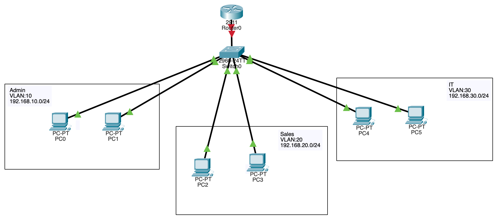
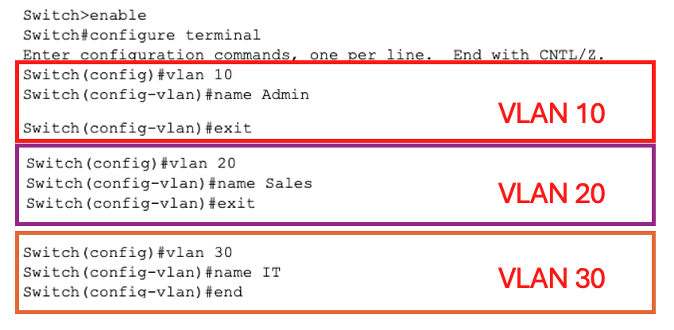

## Cisco Packet Tracer — Lab A + Workgroup Design Challenge: VLANs & Routing

> Companion guide to [Session 4 — Routing, Switching & VLANs](./README.md).
> Read this **before** doing **Lab A** and the **Workgroup Lab** in the [README](./README.md#️-hands-on-lab).
> New to Packet Tracer? Start with the [Session 1 Packet Tracer guide](../S1/PACKET_TRACER_GUIDE.md) for installation, the window tour, and CLI basics. This session uses the VLAN/Router-on-a-Stick concepts that Sessions 2–3 deliberately deferred.

---

- [Cisco Packet Tracer — Lab A + Workgroup Design Challenge](#cisco-packet-tracer--lab-a--workgroup-design-challenge-vlans--routing)
  - [🧪 Lab A — "Small Office Network" Mega-Lab](#-lab-a--small-office-network-mega-lab)
    - [🗺️ Addressing & VLAN plan](#️-addressing--vlan-plan)
    - [Step A1 — Build the topology](#step-a1--build-the-topology)
    - [Step A2 — Create the VLANs (both switches)](#step-a2--create-the-vlans-both-switches)
    - [Step A3 — Assign access ports](#step-a3--assign-access-ports)
    - [Step A4 — Trunk the switch-to-switch and switch-to-router links](#step-a4--trunk-the-switch-to-switch-and-switch-to-router-links)
    - [Step A5 — Router-on-a-Stick (inter-VLAN routing)](#step-a5--router-on-a-stick-inter-vlan-routing)
    - [Step A6 — DHCP per VLAN](#step-a6--dhcp-per-vlan)
    - [Step A7 — Test & verify](#step-a7--test--verify)
    - [📝 Lab A Questions](#-lab-a-questions)
  - [👥 Workgroup Design Challenge — Design It, Build It, Prove It](#-workgroup-design-challenge--design-it-build-it-prove-it)
    - [📋 The brief](#-the-brief)
    - [🎨 Deliverable 1 — The design (on paper first)](#-deliverable-1--the-design-on-paper-first)
    - [🔧 Deliverable 2 — The implementation](#-deliverable-2--the-implementation)
    - [✅ Deliverable 3 — The proof (acceptance test)](#-deliverable-3--the-proof-acceptance-test)
    - [📝 Design-Challenge Questions](#-design-challenge-questions)
  - [✅ Self-Check](#-self-check)
  - [➡️ Next Steps](#️-next-steps)

---

## 🧪 Lab A — "Small Office Network" Mega-Lab

**⏱️ ~55 min · Objective:** build a realistic office network from scratch — three VLANs, a trunk, **Router-on-a-Stick** inter-VLAN routing, and per-VLAN DHCP.

> [!IMPORTANT]
> This is the **core infrastructure lab** of the course. Everything here — VLANs, trunking, sub-interfaces — is what real switches and routers do every day.

### 🗺️ Addressing & VLAN plan

| VLAN | Name | Subnet | Gateway (router sub-int) | PCs |
|:---:|:---|:---|:---|:---|
| 10 | Admin | `192.168.10.0/24` | `192.168.10.1` | 2 |
| 20 | Sales | `192.168.20.0/24` | `192.168.20.1` | 2 |
| 30 | IT | `192.168.30.0/24` | `192.168.30.1` | 2 |

**Topology:** 6 PCs → 2 Switches → 1 Router (+ 1 Server optional).

### Step A1 — Build the topology

Drag on **6 PCs**, **2 switches** (`2960`), **1 router** (`2911`). Cable each PC to a switch access port, link the two switches together, and connect one switch to the router (Copper Straight-Through throughout).

<p align="center">
  <!--  -->
  <em>Fig. 1 — 📸 <code>img/labA-step1-topology.png</code>: the 6-PC, 2-switch, 1-router office topology.</em>
</p>

### Step A2 — Create the VLANs (both switches)

Do this on **each** switch so both know all three VLANs:

```ios
Switch> enable
Switch# configure terminal
Switch(config)# vlan 10
Switch(config-vlan)# name Admin
Switch(config-vlan)# exit
Switch(config)# vlan 20
Switch(config-vlan)# name Sales
Switch(config-vlan)# exit
Switch(config)# vlan 30
Switch(config-vlan)# name IT
Switch(config-vlan)# end
```

<p align="center">
  <!--  -->
  <em>Fig. 2 — 📸 <code>img/labA-step2-vlans.png</code>: the three VLANs created (verify with <code>show vlan brief</code>).</em>
</p>

### Step A3 — Assign access ports

An **access port** carries exactly **one** VLAN — the port a PC plugs into. Put each PC's port in the right VLAN:

```ios
Switch(config)# interface range fa0/1-2
Switch(config-if-range)# switchport mode access
Switch(config-if-range)# switchport access vlan 10
Switch(config-if-range)# exit
Switch(config)# interface range fa0/3-4
Switch(config-if-range)# switchport mode access
Switch(config-if-range)# switchport access vlan 20
Switch(config-if-range)# exit
Switch(config)# interface range fa0/5-6
Switch(config-if-range)# switchport mode access
Switch(config-if-range)# switchport access vlan 30
```

<p align="center">
  <!--  -->
  <em>Fig. 3 — 📸 <code>img/labA-step3-accessports.png</code>: PC ports assigned to their VLANs in access mode.</em>
</p>

### Step A4 — Trunk the switch-to-switch and switch-to-router links

A **trunk port** carries **all** VLANs at once, tagging each frame with its VLAN ID (802.1Q). The link **between the two switches** and the link **from the switch to the router** must both be trunks:

```ios
Switch(config)# interface gig0/1
Switch(config-if)# switchport mode trunk
```

> 💡 An **access port** = one VLAN (to end devices). A **trunk port** = many VLANs (between switches, and switch→router). The trunk is what lets one cable carry Admin, Sales, and IT traffic simultaneously.

<p align="center">
  <!--  -->
  <em>Fig. 4 — 📸 <code>img/labA-step4-trunk.png</code>: trunk links carrying all VLANs (verify with <code>show interfaces trunk</code>).</em>
</p>

### Step A5 — Router-on-a-Stick (inter-VLAN routing)

VLANs are separate networks, so they **can't talk without a router**. We give the router **one sub-interface per VLAN** on a single physical link — **Router-on-a-Stick**. Each sub-interface tags with `encapsulation dot1Q` and holds that VLAN's **gateway IP**:

```ios
Router> enable
Router# configure terminal
Router(config)# interface g0/0
Router(config-if)# no shutdown
Router(config-if)# exit

Router(config)# interface g0/0.10
Router(config-subif)# encapsulation dot1Q 10
Router(config-subif)# ip address 192.168.10.1 255.255.255.0
Router(config-subif)# exit
Router(config)# interface g0/0.20
Router(config-subif)# encapsulation dot1Q 20
Router(config-subif)# ip address 192.168.20.1 255.255.255.0
Router(config-subif)# exit
Router(config)# interface g0/0.30
Router(config-subif)# encapsulation dot1Q 30
Router(config-subif)# ip address 192.168.30.1 255.255.255.0
Router(config-subif)# end
```

> **`encapsulation dot1Q 10`** tells the sub-interface "frames here belong to VLAN 10 — read/write the 802.1Q tag accordingly." That's how one physical wire serves three gateways.

<p align="center">
  <!--  -->
  <em>Fig. 5 — 📸 <code>img/labA-step5-roas.png</code>: the router sub-interfaces, one gateway per VLAN.</em>
</p>

### Step A6 — DHCP per VLAN

Give each VLAN its own DHCP pool so PCs auto-address. *(Refresher on the pool commands: [Session 3 guide](../S3/PACKET_TRACER_GUIDE.md#step-b2--configure-the-routers-dhcp-pool).)*

```ios
Router(config)# ip dhcp pool VLAN10
Router(dhcp-config)# network 192.168.10.0 255.255.255.0
Router(dhcp-config)# default-router 192.168.10.1
Router(dhcp-config)# exit
Router(config)# ip dhcp pool VLAN20
Router(dhcp-config)# network 192.168.20.0 255.255.255.0
Router(dhcp-config)# default-router 192.168.20.1
Router(dhcp-config)# exit
Router(config)# ip dhcp pool VLAN30
Router(dhcp-config)# network 192.168.30.0 255.255.255.0
Router(dhcp-config)# default-router 192.168.30.1
Router(dhcp-config)# end
```

Then set each PC to **DHCP** (Desktop → IP Configuration → DHCP).

<p align="center">
  <!--  -->
  <em>Fig. 6 — 📸 <code>img/labA-step6-dhcp.png</code>: PCs receiving addresses from their VLAN's pool.</em>
</p>

### Step A7 — Test & verify

1. **Inter-VLAN ping:** from an **Admin** PC, `ping` a **Sales** PC → should succeed *via the router*.
2. Verify the build with these `show` commands on the switch/router:

   | Command | What it confirms |
   |:---|:---|
   | `show vlan brief` | which ports are in which VLAN |
   | `show interfaces trunk` | which links are trunks + allowed VLANs |
   | `show ip interface brief` | sub-interfaces up with their gateway IPs |
   | `show ip route` | the three connected VLAN subnets |

<p align="center">
  <!--  -->
  <em>Fig. 7 — 📸 <code>img/labA-step7-verify.png</code>: a successful cross-VLAN ping + verification output.</em>
</p>

### 📝 Lab A Questions

**Try each one first, then click "Show answer".**

**Q1.** What's the difference between an **access port** and a **trunk port**?

<details>
<summary>💡 Show answer</summary>

An **access port** belongs to **one VLAN** and connects to an end device (a PC) — frames leave it **untagged**. A **trunk port** carries **many VLANs** between switches (and switch→router), **tagging** each frame with its 802.1Q VLAN ID so the other end knows which VLAN it belongs to.
</details>

**Q2.** Why can't an Admin PC reach a Sales PC **without the router**, even though they're on the same switches?

<details>
<summary>💡 Show answer</summary>

VLANs are **separate broadcast domains = separate IP subnets**. Layer-2 switching only moves frames *within* a VLAN. To cross from VLAN 10's subnet to VLAN 20's subnet you need **Layer-3 routing** — that's what the router's sub-interfaces (the per-VLAN gateways) provide. No router, no inter-VLAN traffic.
</details>

**Q3.** What does **`encapsulation dot1Q 20`** do on sub-interface `g0/0.20`?

<details>
<summary>💡 Show answer</summary>

It binds that sub-interface to **VLAN 20** and tells it to **add/read the 802.1Q tag** for VLAN 20 on the trunk. This is what lets a **single physical interface** act as the gateway for multiple VLANs at once (Router-on-a-Stick) — each sub-interface handles one VLAN's tagged traffic.
</details>

**Q4.** In `show vlan brief`, a PC can't reach its gateway. What's the first thing to check?

<details>
<summary>💡 Show answer</summary>

Confirm the PC's **switch port is in the correct VLAN** (and in `access` mode). A very common mistake is the port defaulting to VLAN 1 or being left as a trunk. Also check the **trunk** to the router is up and **allows that VLAN**, and that the router sub-interface for the VLAN is configured and `no shutdown`.
</details>

---

## 👥 Workgroup Design Challenge — Design It, Build It, Prove It

**⏱️ ~40 min (in workgroups) · Objective:** given only a **business brief**, your group **designs an IP/VLAN scheme from scratch and implements it in Packet Tracer** — then demonstrates it passing a fixed **acceptance test**. This is the one activity that *proves* you can take everything from Sessions 2–4 (subnetting, VLANs, trunking, Router-on-a-Stick, DHCP) and turn requirements into a working network.

> [!IMPORTANT]
> This is a **proof-of-competency** activity, not a guided walkthrough. There are **no step-by-step CLI snippets here** — you decide the design and apply the skills from Lab A. The grade is simple: **does it pass the acceptance test?**

### 📋 The brief

> **Client: "BrightByte" — a startup moving into a new office.** They've handed you their requirements and the base network **`172.16.0.0/24`**. Design and build their network.

**Requirements:**
1. **Three user departments**, each isolated in its own VLAN/subnet, sized with room to grow:
   - **Engineering** — 40 hosts now (plan for ~60)
   - **Sales** — 20 hosts
   - **Management** — 8 hosts
2. **One Server VLAN** for an internal server (static IP) running DHCP-free.
3. **All user PCs get their addresses automatically** (DHCP); the server is static.
4. **Inter-department traffic must route** (any department can reach the server).
5. Use **one router (Router-on-a-Stick)** and as many switches as you need.

### 🎨 Deliverable 1 — The design (on paper first)

Before touching Packet Tracer, your group produces a **design document** — this *is* the engineering, and it's half the proof:

* **Subnet plan (VLSM):** pick the smallest block that fits each department from `172.16.0.0/24`. Record **CIDR, mask, network, usable range, broadcast, gateway** for each (Engineering, Sales, Management, Server).
* **VLAN table:** VLAN ID → name → subnet → gateway.
* **A topology diagram:** devices, switch ports, trunk links, and the router sub-interfaces.

> 💡 Apply the [Session 2 subnetting method](../S2/README.md#how-to-subnet-step-by-step): 60 hosts → needs `/26` (62 usable); 20 → `/27` (30); 8 → `/28` (14); server → `/29` or `/28`. **Lay them out so the blocks don't overlap.**

<p align="center">
  <!--  -->
  <em>Fig. 8 — 📸 <code>img/workgroup-design-plan.png</code>: the group's VLSM subnet table + VLAN plan + topology sketch.</em>
</p>

### 🔧 Deliverable 2 — The implementation

Build your design in Packet Tracer using the skills from **Lab A** — create the VLANs, assign access ports, trunk the links, configure the router sub-interfaces (one gateway per VLAN), set up a DHCP pool per user VLAN, and give the server its static address.

<p align="center">
  <!--  -->
  <em>Fig. 9 — 📸 <code>img/workgroup-build.png</code>: the BrightByte network built and addressed in Packet Tracer.</em>
</p>

### ✅ Deliverable 3 — The proof (acceptance test)

Your network is "done" only when it **passes every check below** — demonstrate each live (and screenshot it). This is the objective evidence that you can *implement*, not just describe:

| # | Test | Expected result | Proves you can… |
|:---:|:---|:---|:---|
| 1 | An Engineering PC runs **`ipconfig`** | Correct IP **in the Engineering range**, correct gateway, **from DHCP** | configure VLAN DHCP + access ports |
| 2 | **Ping within** Engineering (PC→PC) | Success | build a working L2 VLAN |
| 3 | **Ping across** VLANs (Eng → Management) | Success **via the router** | configure Router-on-a-Stick / inter-VLAN routing |
| 4 | **Ping the Server** from each department | Success | integrate a static host into a routed design |
| 5 | `show vlan brief` + `show ip interface brief` | Ports in correct VLANs; all sub-interfaces **up/up** | verify your own work |
| 6 | Pick any PC — its address **fits the subnet plan** with no overlap | Matches your design doc | translate a paper design into a real build |

<p align="center">
  <!--  -->
  <em>Fig. 10 — 📸 <code>img/workgroup-acceptance.png</code>: the acceptance tests passing (DHCP address + cross-VLAN ping + server reach).</em>
</p>

> [!TIP]
> **Stretch goals** (if you finish early): add a rule so **only Management** can reach the Server VLAN (a basic ACL); add a second switch and prove a PC keeps its VLAN when moved to it; add a guest VLAN with no route to the others.

### 📝 Design-Challenge Questions

**Discuss in your group, then click "Show answer".**

**Q1.** Engineering needs 40 hosts now but "plan for ~60." Which subnet size did you pick, and why not just `/27`?

<details>
<summary>💡 Show answer</summary>

**`/26`** (64 addresses, **62 usable**). A `/27` gives only **30 usable** — fine for 40? No: 30 < 40, it doesn't even fit *today*. `/26` fits 40 now **and** the projected 60 with headroom. Designing for **growth** (not just today's count) is the point — re-addressing a live department later is painful.
</details>

**Q2.** Test 3 (cross-VLAN ping) failed but Test 2 (same-VLAN) passed. Where do you look first?

<details>
<summary>💡 Show answer</summary>

Same-VLAN works, so switching/access ports are fine — the break is at **Layer 3 / the router**. Check: is the **trunk to the router up and allowing the VLANs**? Are the **sub-interfaces** configured with the right `encapsulation dot1Q` **and** gateway IP, and `no shutdown`? Do the PCs have the **correct default gateway** (matching the sub-interface IP)? `show ip interface brief` and `show ip route` confirm it fast.
</details>

**Q3.** How does this single activity prove you've mastered Sessions 2–4, more than a guided lab would?

<details>
<summary>💡 Show answer</summary>

A guided lab gives you the commands; here **you supply the design** (subnetting from S2), **the segmentation** (VLANs/trunking from S4), **the addressing services** (DHCP from S3), and **the routing** that ties them together — then prove it with an objective test. Producing a *correct, conflict-free, growth-aware design* and a build that **passes acceptance** is exactly what the job requires. If it passes, you can do it for real.
</details>

---

## ✅ Self-Check

- [ ] **Lab A:** 3 VLANs created on both switches; PC ports in the right VLANs (`show vlan brief`)
- [ ] **Lab A:** switch–switch and switch–router links are **trunks** (`show interfaces trunk`)
- [ ] **Lab A:** Router-on-a-Stick sub-interfaces up; **inter-VLAN ping succeeds**
- [ ] **Lab A:** each VLAN gets DHCP addresses automatically
- [ ] **Design Challenge:** VLSM subnet plan + VLAN table + topology produced **on paper first** (no overlaps, sized for growth)
- [ ] **Design Challenge:** network built in Packet Tracer from your own design
- [ ] **Design Challenge:** **all 6 acceptance tests pass** (DHCP address, same-VLAN ping, cross-VLAN ping, server reach, `show` verification, addresses match the plan)
- [ ] Screenshots saved into [`S4/img/`](./img/) and rendering in this guide

---

## ➡️ Next Steps

- Analyse your own VLAN traffic in [Wireshark Lab B](./WIRESHARK_GUIDE.md): capture/open 802.1Q-tagged frames and find the VLAN tag and per-hop TTL decrements you just engineered.
- **Homework (from the README):** save the Small Office `.pkt`, write a paragraph on **OSPF vs static routing**, and try **port security** (max 1 MAC per access port).
- The BrightByte design is a great base for later experiments — add a DMZ, an ACL restricting the Server VLAN, or a second switch link for redundancy (STP).
